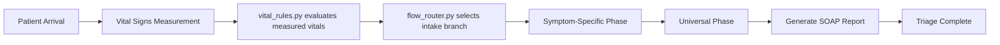

# Triage Question Design

## System Flow Chart



---

## (0) Vital-First Routing Boundary
**Question 0-1**
What is your biological gender? Male, Female, Other

**Question 0-2**
What is your age group?
Choice: Under 18, 18-39, 40-64, 65-79, 80 or older, Not sure / staff confirm
**Question 0-3**
What brings you here?
*Example: headache for 3 days*
Choice: headache, sore throat, abdominal pain, chest pain, shortness of breath, palpitation, fainting, fever, dizziness, trauma, skin problem, allergy, urinary symptoms, cough / cold symptoms, diarrhea, back pain, eye problem, ear / nose / throat problem, chronic follow-up, nausea / vomiting, weakness / fatigue, limb pain / swelling
**Question 0-4** *(if duration is not provided in the main concern)*
How long have you had {symptoms}?
Choice: Just started / within 1 hour, Today, 1-3 days, 4-7 days, More than 1 week, Long-term issue, Not sure

## (1) Vital Rules Phase

### Vital rule 1 Temperature

| Condition | Action / Question |
|-----------|-------------------|
| T > 37.5°C | Are you feeling chills? [ ] Yes [ ] No
               Have you taken any fever-reducing medicine in the last 4 hours? |

| T > 39.0°C | please notify staff. |
| T < 35.0°C | please notify staff. |

### Vital rule 2 SpO₂

| Condition | Action / Question |
|-----------|-------------------|
| SpO₂ < 94% | Please remeasure. Are you feeling short of breath or having trouble breathing? |
| SpO₂ < 90% | please notify staff. |

### Vital rule 3 Heart rate

| Condition | Action / Question |
|-----------|--------|
| HR < 50 |  Are you feeling dizzy or faint? Please notify staff.
| HR > 120 | Please sit for a while, then remeasure. Are you feeling palpitations (heart racing) or chest pain? |
| HR > 130 | ⚠ Tachycardia — please notify staff. |

### Vital rule 4 Blood pressure

| Condition | Action / Question |
|-----------|--------|
| SBP < 90 | ⚠ Low Blood Pressure — please notify staff. Are you feeling dizzy, weak, or faint? |
| SBP > 180 | ⚠ High Blood Pressure — please notify staff. Do you have a severe headache, blurred vision, or chest pain? |
| DBP > 110 | ⚠ High Diastolic Pressure — please notify staff. |

### Vital rule 5 Respiratory rate

| Condition | Action / Question |
|-----------|--------|
| RR > 24 or RR < 10 | please notify staff. Is it hard to catch your breath? |

---

---

## (2) Flow Router And Symptom-Specific Phase

The runtime first evaluates measured vitals in `python_api/triage_v1/vital_rules.py`, then `python_api/triage_v1/flow_router.py` selects the intake branch from review flags. Chief complaint text is a fallback only when measured vitals do not select a branch.

Detailed multi-answer question modules are stored in `Case_question/Symptom_module/`.

| Flow router branch or fallback concern | Symptom module file |
|-----------------------|---------------------|
| Abdominal pain | `Symptom_module/abdominal_pain.md` |
| Headache | `Symptom_module/Headache.md` |
| Chest tightness / chest pain | `Symptom_module/chest_pain.md` |
| Shortness of breath | `Symptom_module/shortness_of_breath.md` |
| Palpitation / tachycardia | `Symptom_module/palpitation.md` |
| Syncope / fainting | `Symptom_module/syncope.md` |
| Fever | `Symptom_module/fever.md` |
| Dizziness | `Symptom_module/dizziness.md` |
| Trauma | `Symptom_module/trauma.md` |
| Skin infection / skin problem | `Symptom_module/skin_infection.md` |
| Allergy | `Symptom_module/allergy.md` |
| UTI / urinary symptoms | `Symptom_module/urinary_symptoms.md` |
| URI / upper respiratory | `Symptom_module/upper_respiratory.md` |
| Diarrhea | `Symptom_module/diarrhea.md` |
| Back pain | `Symptom_module/back_pain.md` |
| Eye problem | `Symptom_module/eye.md` |
| ENT | `Symptom_module/ent.md` |
| Chronic disease follow-up | `Symptom_module/chronic_follow_up.md` |
| Nausea / vomiting | `Symptom_module/nausea_vomiting.md` |
| Weakness / fatigue | `Symptom_module/weakness_fatigue.md` |
| Limb pain / swelling | `Symptom_module/limb_pain_swelling.md` |

### Symptom module 1 Abdominal pain

| ID | Type | Question | Options / Note |
|----|------|----------|----------------|
| 1-1-1 | Location | Which part of the abdomen hurts? | Left/Right Upper, Left/Right Lower, Middle, General |
| 1-1-2 | Quality | Rate the pain from 1–10. | NRS (Numeric Rating Scale) |
| 1-1-3 | Association | Do you have nausea, vomiting, or diarrhea? | [ ] Nausea [ ] Vomiting [ ] Diarrhea [ ] None |

### Symptom module 2 Headache

| ID | Type | Question | Options / Note |
|----|------|----------|----------------|
| 1-2-1 | Location | Which part of the head hurts? | Frontal, Temporal, Occipital, Behind eyes, General |
| 1-2-2 | Quality | Did any of these happen? | [ ] Sudden severe headache [ ] Weakness / numbness [ ] Trouble speaking [ ] Vision change [ ] Fever [ ] Neck stiffness [ ] None |
| 1-2-3 | Association | Is this headache: | [ ] New [ ] Similar to before [ ] Gradually worsening |

### Symptom module 3 Chest tightness / chest pain

| ID | Type | Question | Options / Note |
|----|------|----------|----------------|
| 1-3-1 | Location | Where is the pain/tightness? | Left, Right, Middle, Radiating to arm/jaw |
| 1-3-2 | Quality | What does it feel like? | [ ] Pressure [ ] Tightness [ ] Sharp pain [ ] Burning [ ] Palpitation |
| 1-3-3 | Association | Do you have any of these? | [ ] Shortness of breath [ ] Sweating [ ] Dizziness [ ] Fainting [ ] None |

### Symptom module 4 Fever

| ID | Type | Question | Options / Note |
|----|------|----------|----------------|
| 1-4-1 | Association | Do you have other symptoms? | [ ] Sore throat [ ] Abdominal pain [ ] Dysuria [ ] Rash [ ] None |
| 1-4-2 | Quality | Are you experiencing chills? | [ ] Chills [ ] Shaking [ ] None |
| 1-4-3 | Red flags | Do you feel any of these? | [ ] Shortness of breath [ ] Confusion [ ] Severe weakness [ ] Unable to drink [ ] None |

### Symptom module 5 Dizziness

| ID | Type | Question | Options / Note |
|----|------|----------|----------------|
| 1-5-1 | Quality | What type of dizziness? | [ ] Room spinning (vertigo) [ ] Feeling faint [ ] Unsteady walking |
| 1-5-2 | Onset | Did it happen suddenly? | Yes / No |
| 1-5-3 | Association | Do you have other symptoms? | [ ] Hearing loss/ringing [ ] Headache [ ] Chest pain [ ] Weakness [ ] Head injury [ ] None |

### Symptom module 6 Trauma

| ID | Type | Question | Options / Note |
|----|------|----------|----------------|
| 1-6-1 | Mechanism | What happened? | [ ] Fall [ ] Traffic accident [ ] Sports injury [ ] Cut injury [ ] Hit by object |
| 1-6-2 | Location | Which body part is injured? | Head, Neck, Chest, Abdomen, Back, Limbs |
| 1-6-3 | Association | Do you have any of these? | [ ] Loss of consciousness [ ] Severe bleeding [ ] Unable to move limb [ ] Severe pain [ ] None |

### Symptom module 7 Skin infection

| ID | Type | Question | Options / Note |
|----|------|----------|----------------|
| 1-7-1 | Location | Where is the affected skin? | Face, Limbs, Trunk, etc. |
| 1-7-2 | Quality | How does it look or feel? | [ ] Redness / warmth [ ] Swelling [ ] Pus or discharge [ ] Pain [ ] Itching |
| 1-7-3 | Association | Any of these symptoms? | [ ] Fever [ ] Spreading redness [ ] Red streaks [ ] None |

### Symptom module 8 Allergy

| ID | Type | Question | Options / Note |
|----|------|----------|----------------|
| 1-8-1 | Trigger | What caused the reaction? | Food, Drug, Insect, Unknown |
| 1-8-2 | Quality | What symptoms do you have? | [ ] Rash / hives [ ] Swelling [ ] Itching [ ] Shortness of breath [ ] Wheezing [ ] Nausea [ ] None |
| 1-8-3 | Red flags | Any severe symptoms? | [ ] Trouble breathing [ ] Throat tightness [ ] Feeling faint [ ] None |

### Symptom module 9 UTI (urinary symptoms)

| ID | Type | Question | Options / Note |
|----|------|----------|----------------|
| 1-9-1 | Quality | What urinary symptoms? | [ ] Dysuria [ ] Frequency [ ] Urgency [ ] Blood in urine [ ] Flank pain |
| 1-9-2 | Association | Do you have other symptoms? | [ ] Fever [ ] Chills [ ] Nausea/Vomiting [ ] None |
| 1-9-3 | History | Is this similar to before? | Yes / No / First time |

### Symptom module 10 URI (upper respiratory)

| ID | Type | Question | Options / Note |
|----|------|----------|----------------|
| 1-10-1 | Quality | What symptoms do you have? | [ ] Runny nose [ ] Sore throat [ ] Cough [ ] Fever [ ] Body aches |
| 1-10-2 | Association | Any of these symptoms? | [ ] Shortness of breath [ ] Chest pain [ ] Wheezing [ ] None |
| 1-10-3 | Duration | How long have they lasted? | Days / Weeks |

### Symptom module 11 Diarrhea

| ID | Type | Question | Options / Note |
|----|------|----------|----------------|
| 1-11-1 | Quality | Frequency and content? | Episodes per day, [ ] Blood [ ] Mucus |
| 1-11-2 | Association | Do you have other symptoms? | [ ] Fever [ ] Vomiting [ ] Severe pain [ ] None |
| 1-11-3 | Hydration | Any signs of dehydration? | [ ] Dizziness [ ] Decreased urine [ ] Unable to keep fluids |

### Symptom module 12 Back pain

| ID | Type | Question | Options / Note |
|----|------|----------|----------------|
| 1-12-1 | Location | Where is the pain? | Upper, Middle, Lower, Radiating to leg |
| 1-12-2 | Quality | Onset and Intensity? | Sudden / Gradual, NRS 1-10 |
| 1-12-3 | Red flags | Do you have any of these? | [ ] Weakness in legs [ ] Incontinence [ ] Fever [ ] Recent trauma [ ] None |

### Symptom module 13 Eye

| ID | Type | Question | Options / Note |
|----|------|----------|----------------|
| 1-13-1 | Quality | Main problem and eye? | Left, Right, Both. [ ] Redness [ ] Pain [ ] Discharge [ ] Vision change |
| 1-13-2 | Association | Any other factors? | [ ] Injury [ ] Contact lenses [ ] Light sensitivity |
| 1-13-3 | Red flags | Emergency signs? | [ ] Sudden vision loss [ ] Severe pain [ ] Penetrating injury |

### Symptom module 14 ENT (ear / nose / throat)

| ID | Type | Question | Options / Note |
|----|------|----------|----------------|
| 1-14-1 | Location | Main problem area? | Ear, Nose, Throat |
| 1-14-2 | Quality | Describe the symptom. | [ ] Pain [ ] Hearing loss [ ] Congestion [ ] Sore throat [ ] Discharge |
| 1-14-3 | Association | Any of these symptoms? | [ ] Fever [ ] Difficulty swallowing [ ] Trouble breathing |

### Symptom module 15 Chronic disease (follow-up / medication refill)

| ID | Type | Question | Options / Note |
|----|------|----------|----------------|
| 1-15-1 | Purpose | Reason for visit? | [ ] Routine follow-up [ ] Medication refill [ ] Symptom flare-up |
| 1-15-2 | Condition | Which condition? | [ ] HTN [ ] DM [ ] Heart disease [ ] Asthma/COPD [ ] Other |
| 1-15-3 | Monitoring | Recent home readings? | (e.g., BP 130/80, Sugar 110) |

---

## (3) Universal Phase
*Ask all patients after symptom-specific questions.*

**Question 3-1** — Past medical history
(HTN / DM / Heart disease / Stroke / Cancer / Others)

**Question 3-2** — Previous surgery?

**Question 3-3** — Current medications?

**Question 3-4** — Drug allergy?

**Question 2-5** *(if childbearing age female)* — Are you pregnant? [ ] Yes [ ] Not sure [ ] No


## (4) Output Template (SOAP)

### Subjective (S)

```
<age> y/o <gender>
C.C.: <chief complaint> for <duration>
Detail: <symptom-specific answers from the selected module>
Past history: <2-1, 2-2>
Medications: <2-3>
Allergy: <2-4>
NRS: <from 1-1-2, 1-12-2, or similar>
Pregnancy: <2-5 if applicable>
```

### Objective (O)

```
Vital signs: T ___  P ___  R ___  SpO₂ ___%  BP ___/___
```

### Assessment (A)

```
- Potential Triage Level: <Level 1-5 based on symptoms and vitals>
```

### Plan (P)

```
-
```
