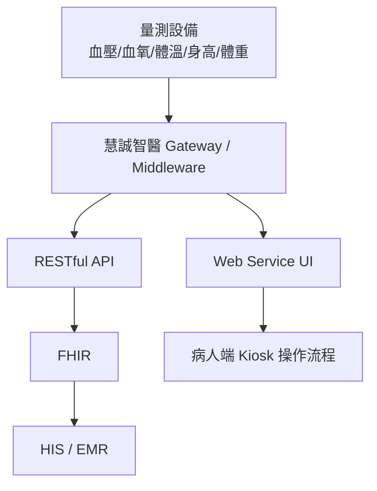
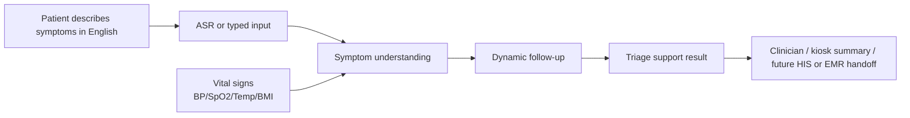

# AI Triage Kiosk Demo


This repo is the standalone execution home for the 慧誠智醫 / imedtac AI
triage kiosk demo lane.

## First Principle

- Scarce resource: demo execution bandwidth before the June US customer visit.
- First deliverable: an English AI triage market demo that can be embedded in or
  linked from 慧誠's existing Kiosk / web service flow.
- Product boundary: market demo / product capability demo, not production
  clinical triage, autonomous diagnosis, or a formal HIS / EMR integration.
- Planning home: `../planning-everything-track/data/projects/2026-05-huicheng-er-triage-ekg-asr.md`.

## Current Interpretation

慧誠智醫短期希望在六月前，基於現有 triage prototype，快速做出英文版
demo，能被放進既有 Kiosk / web service 產品流程中，展示「慧誠智醫 +
智德萬 / 吳老師團隊已具備 AI triage capability」。這個 demo 主要用途是
go-to-market 與美國客戶展示，還不是正式醫療決策產品。

## Repo Contents

| Path | Purpose |
| --- | --- |
| `source/2026-05-11-wu-huicheng-er-triage-ekg-asr/` | Prof. Wu kickoff source bundle copied from planning |
| `source/2026-05-12-huicheng-company-ai-triage-sync/` | Company sync source bundle, meeting record, cleaned transcript, and demo brief |
| `source/2026-05-12-wu-google-meet-ai-triage-510k/` | Prof. Wu 22:20 Google Meet transcript and analysis that reframed the Friday artifact around FDA 510(k), intended use, and conservative demo scope |
| `source/upstream-wu-context/` | Earlier Prof. Wu context copied from planning, including the 2026-04-16 Wu/Tomi meeting and 2026-04-20 CDE speech source |
| `docs/project-brief.md` | Working project brief and execution boundary |
| `docs/2026-05-12-huicheng-materials-analysis.md` | Detailed comparison of company follow-up minutes, iMVS product spec, and iMVS API attachment implications |
| `docs/architecture-insertion-and-clinical-grounding.md` | Core note on workflow insertion point, vital-aware dynamic triage, and clinical evidence mapping |
| `docs/source-index.md` | Complete index of copied source bundles and upstream context |
| `docs/wu-instruction-register.md` | Consolidated Prof. Wu instructions and company-side clarifications |
| `docs/repo-organization.md` | Directory map and folder ownership |
| `docs/repo-relationships.md` | Ownership split between this repo, planning, and related repos |
| `planning-bridge/2026-05-huicheng-er-triage-ekg-asr.md` | Snapshot copy of the planning project locator at repo creation |
| `planning-bridge/project-locators/` | Snapshots of related planning project locators: 慧誠, urology, TFDA/FDA advisor, and medical cybersecurity |
| `workstreams/` | Active workstream notes for insertion point, clinical evidence governance, MVP boundary, and urology-reference reuse |
| `handoff/` | Future handoff drafts for Prof. Wu, 慧誠, or internal collaborators |
| `decisions/` | Dated repo/product decisions |

## Current System Frame



## Target Demo Frame



## Core Architecture Note

The most important current note is:

```text
docs/architecture-insertion-and-clinical-grounding.md
```

Read it before coding. The next hard problem is finding the insertion point in
慧誠's existing measurement workflow and building traceable clinical grounding
for vital-aware dynamic questioning.

Also read:

```text
docs/source-index.md
docs/wu-instruction-register.md
docs/repo-organization.md
```

## Safety Boundary

- Do not use real patient data unless a separate approval, consent, and data
  governance path exists.
- Do not invent clinical thresholds for vital-sign triage.
- Do not claim diagnosis, autonomous medical advice, emergency medical
  replacement, or production readiness.
- Do not connect to HIS / EMR / FHIR write paths without an explicit integration
  plan and company / clinical approval.
- Keep patent-sensitive ASR + LLM workflow details private unless Prof. Wu or
  the project owner explicitly approves disclosure.
- This repo now includes upstream private Prof. Wu context and a CDE source copy;
  keep the repo local-only unless the user explicitly asks to publish after a
  privacy review.

## Immediate Next Actions

1. Prepare the Friday `2026-05-15` feasibility artifact requested in the
   company follow-up, starting with a FDA `510(k)` competitor / predicate-device
   scan and intended-use options, then modular method, vital-data impact,
   clinical-source strategy, and demo boundary.
2. Decide whether v0 is iframe/link integration, mocked kiosk handoff, or API
   handoff.
3. Clarify target device / OS and whether synthetic API-shaped vital signs are
   acceptable for the first demo.
4. Define the minimum English symptom flow and vital-sign fields for demo use.
5. Produce a safe architecture diagram that can be shared without exposing
   patent-sensitive internals.
6. Keep planning updated with status, blockers, and capacity impact only.
