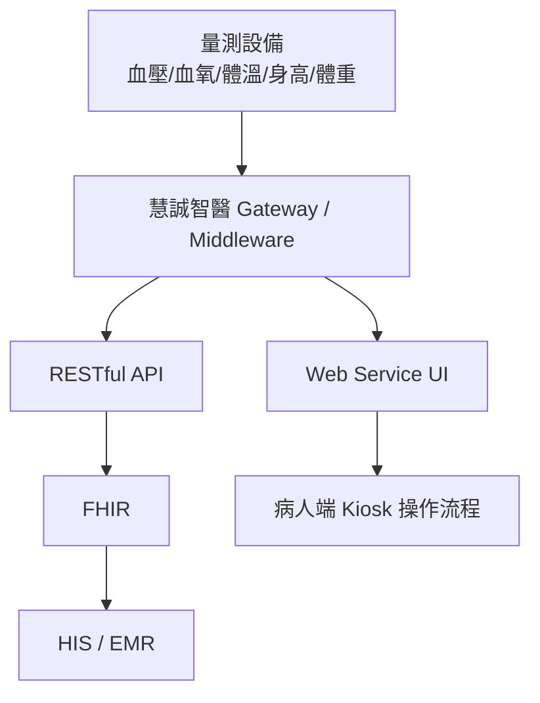
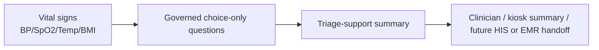

# AI Triage Kiosk Demo

<p>
  
  
  
  
  
  
  
  
  
</p>

This repo is the standalone execution home for the 慧誠智醫 / imedtac AI
triage kiosk demo lane.

## First Principle

- Scarce resource: demo execution bandwidth before the June US customer visit.
- First deliverable: an English AI triage market demo that can be embedded in or
  linked from 慧誠's existing Kiosk / web service flow.
- Product boundary: market demo / product capability demo, not production
  clinical triage, autonomous diagnosis, or a formal HIS / EMR integration.
- Planning home: `../planning-everything-track/data/projects/2026-05-huicheng-er-triage-ekg-asr.md`.

## Current Interpretation

慧誠智醫短期希望在六月前，基於現有 triage prototype，快速做出英文版
demo，能被放進既有 Kiosk / web service 產品流程中，展示「慧誠智醫 +
智德萬 / 吳老師團隊已具備 AI triage capability」。這個 demo 主要用途是
go-to-market 與美國客戶展示，還不是正式醫療決策產品。

## Repo Contents

| Path | Purpose |
| --- | --- |
| `app/triage-kiosk/` | English static AI triage kiosk demo adapted from the urology previsit demo pattern |
| `core/triage_engine/` | Pure JavaScript governed-question ranking and staff-summary logic |
| `scripts/checks/smoke-demo.js` | Runtime smoke check for the English demo |
| `tests/unit/triage-engine.test.js` | Focused tests for question ranking and demo-only safety boundaries |
| `docs/runtime-to-governance-map.md` | Map from runtime questions to registry/source-family coverage |
| `docs/demo-acceptance-criteria.md` | Functional, governance, data, and presentation gates for v0 |
| `docs/demo-script-for-presenter.md` | Safe presenter script and forbidden demo claims |
| `source/2026-05-11-wu-huicheng-er-triage-ekg-asr/` | Prof. Wu kickoff source bundle copied from planning |
| `source/2026-05-12-huicheng-company-ai-triage-sync/` | Company sync source bundle, meeting record, cleaned transcript, and demo brief |
| `source/2026-05-12-wu-google-meet-ai-triage-510k/` | Prof. Wu 22:20 Google Meet transcript and analysis that reframed the Friday artifact around FDA 510(k), intended use, and conservative demo scope |
| `source/2026-05-15-huicheng-second-sync-and-duobao-followup/` | Second 慧誠 sync, raw transcripts, LINE context, company-provided minutes, and 多寶 follow-up that narrowed the work to a June urgent-care intake demo |
| `source/upstream-wu-context/` | Earlier Prof. Wu context copied from planning, including the 2026-04-16 Wu/Tomi meeting and 2026-04-20 CDE speech source |
| `docs/project-brief.md` | Working project brief and execution boundary |
| `docs/2026-05-12-huicheng-materials-analysis.md` | Detailed comparison of company follow-up minutes, iMVS product spec, and iMVS API attachment implications |
| `docs/architecture-insertion-and-clinical-grounding.md` | Core note on workflow insertion point, vital-aware dynamic triage, and clinical evidence mapping |
| `docs/source-index.md` | Complete index of copied source bundles and upstream context |
| `docs/wu-instruction-register.md` | Consolidated Prof. Wu instructions and company-side clarifications |
| `docs/repo-organization.md` | Directory map and folder ownership |
| `docs/repo-relationships.md` | Ownership split between this repo, planning, and related repos |
| `planning-bridge/2026-05-huicheng-er-triage-ekg-asr.md` | Snapshot copy of the planning project locator at repo creation |
| `planning-bridge/project-locators/` | Snapshots of related planning project locators: 慧誠, urology, TFDA/FDA advisor, and medical cybersecurity |
| `workstreams/` | Active workstream notes for insertion point, clinical evidence governance, MVP boundary, and urology-reference reuse |
| `handoff/` | Future handoff drafts for Prof. Wu, 慧誠, or internal collaborators |
| `decisions/` | Dated repo/product decisions |

## Current System Frame



## Target Demo Frame



## Demo Mainline

Start the local static demo server:

```bash
npm start
```

Open the English kiosk demo:

```text
http://localhost:4183/app/triage-kiosk/
```

Run the verification checks:

```bash
npm run demo:ready
```

Build the sanitized Vercel frontend runtime:

```bash
npm run build
```

The Vercel build output is `dist/`. It intentionally contains only:

```text
app/
core/
demo/fixtures/
index.html
```

It must not contain private source bundles, handoff drafts, patent notes,
planning snapshots, workstream notes, or governance docs.

The runtime demo is intentionally narrow: synthetic vital payload -> governed
English choice-only follow-up questions -> staff-review summary. Single-choice
answers advance immediately after click; multi-choice answers show visible
selection order before saving. It does not diagnose, recommend treatment,
assign a final triage level, order emergency care, or write to HIS / EMR / FHIR.

Before showing the demo, read:

```text
docs/demo-script-for-presenter.md
docs/demo-acceptance-criteria.md
docs/runtime-to-governance-map.md
```

## Core Architecture Note

The most important current note is:

```text
docs/architecture-insertion-and-clinical-grounding.md
```

Read it before coding. The next hard problem is finding the insertion point in
慧誠's existing measurement workflow and building traceable clinical grounding
for vital-aware dynamic questioning.

Also read:

```text
docs/source-index.md
docs/wu-instruction-register.md
docs/repo-organization.md
```

## Safety Boundary

- Do not use real patient data unless a separate approval, consent, and data
  governance path exists.
- Do not invent clinical thresholds for vital-sign triage.
- Do not claim diagnosis, autonomous medical advice, emergency medical
  replacement, or production readiness.
- Do not connect to HIS / EMR / FHIR write paths without an explicit integration
  plan and company / clinical approval.
- Keep patent-sensitive ASR + LLM workflow details private unless Prof. Wu or
  the project owner explicitly approves disclosure.
- This repo now includes upstream private Prof. Wu context and a CDE source copy;
  keep the repo local-only unless the user explicitly asks to publish after a
  privacy review.

## Immediate Next Actions

1. Turn the `2026-05-15` second-sync decision into a June demo case pack:
   `3-5` synthetic urgent-care intake cases with vital signs, short question
   paths, and clinician-review summaries.
2. Implement the first case as a narrow demo path: vital payload -> guided
   questions -> staff-facing summary.
3. Ask 慧誠 for the smallest technical packet needed to wire the demo:
   kiosk UI insertion point, vital payload field names, demo room network,
   output display format, and software-team contact.
4. Keep ASR / free-text capture outside this clickable demo until the
   workflow, privacy, and clinical-review boundary are explicitly cleared.
5. Keep planning updated with status, blockers, and capacity impact only.
