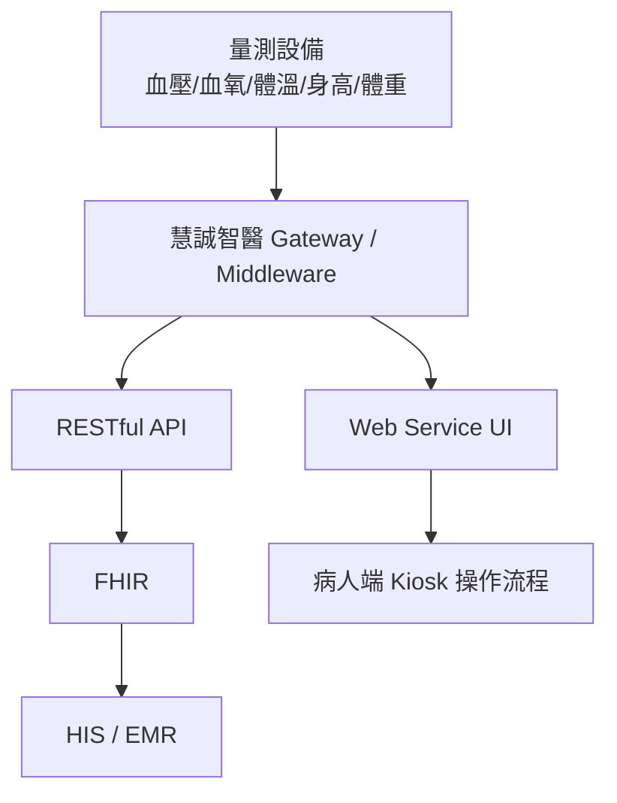
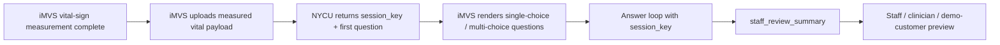

# AI Triage Kiosk Demo

<p>
  
  
  
  
  
  
  
  
  
</p>

This repo is the standalone execution home for the 慧誠智醫（imedtac Co., Ltd.）AI
triage kiosk demo lane.

## First Principle

- Scarce resource: demo execution bandwidth before the June US customer visit.
- First deliverable: an English AI triage market demo that can be embedded in or
  linked from imedtac's existing Kiosk / web service flow.
- Product boundary: market demo / product capability demo, not production
  clinical triage, autonomous diagnosis, or a formal HIS / EMR integration.
- Planning home: `../planning-everything-track/data/projects/2026-05-imedtac-er-triage-ekg-asr.md`.

## Current Interpretation

慧誠智醫短期希望在六月前，基於現有 triage prototype，快速做出英文版
demo，能被放進既有 Kiosk / web service 產品流程中，展示「慧誠智醫 +
智德萬 / 吳老師團隊已具備 AI triage capability」。這個 demo 主要用途是
go-to-market 與美國客戶展示，還不是正式醫療決策產品。

## Repo Contents

| Path | Purpose |
| --- | --- |
| `app/triage-kiosk/` | English static AI triage kiosk demo adapted from the urology previsit demo pattern |
| `core/triage_engine/` | Pure JavaScript governed-question ranking and staff-summary logic |
| `api/lib/dynamic-engine/` | Backend dynamic tachycardia engine: effects, derived flags, deterministic routing, answer candidates, trace, and summary assembly |
| `scripts/checks/smoke-demo.js` | Runtime smoke check for the English demo |
| `tests/unit/triage-engine.test.js` | Focused tests for question ranking and demo-only safety boundaries |
| `tests/contract/tachycardia-dynamic-path.test.js` | Backend dynamic-path, summary consistency, routing trace, and answer-candidate tests |
| `tests/contract/answer-candidates-api.test.js` | Current-question-only ASR/free-text candidate matching tests |
| `tests/contract/cloud-security-reliability.test.js` | Auth, CORS, TTL, persistence, rate limit, body limit, and audit tests |
| `tests/e2e/` | Path A / Path B tachycardia dynamic engine E2E tests |
| `docs/runtime-to-governance-map.md` | Map from runtime questions to registry/source-family coverage |
| `docs/demo-acceptance-criteria.md` | Functional, governance, data, and presentation gates for v0 |
| `docs/demo-script-for-presenter.md` | Safe presenter script and forbidden demo claims |
| `source/2026-05-11-wu-imedtac-er-triage-ekg-asr/` | Prof. Wu kickoff source bundle copied from planning |
| `source/2026-05-12-imedtac-company-ai-triage-sync/` | Company sync source bundle, meeting record, cleaned transcript, and demo brief |
| `source/2026-05-12-wu-google-meet-ai-triage-510k/` | Prof. Wu 22:20 Google Meet transcript and analysis that reframed the Friday artifact around FDA 510(k), intended use, and conservative demo scope |
| `source/2026-05-15-imedtac-second-sync-and-duobao-followup/` | Second 慧誠 sync, raw transcripts, LINE context, company-provided minutes, 多寶 follow-up, and 多寶's first demo-case draft for the June urgent-care intake demo |
| `source/2026-05-19-johnny-ai-triage-product-spec/` | Johnny Fang's product-spec email, Google Doc export, and API-contract source bundle for the mid-June iMVS demo integration |
| `source/2026-05-19-expert-review-scope-api-boundary/` | Expert reply confirming the June scope cut and required API/runtime/wording/privacy-security deltas before v0.2 |
| `source/2026-05-19-duobao-two-phase-vital-questioning/` | 多寶 two-phase workflow insight: ask non-vital-dependent questions during measurement, then vital-aware follow-up after values arrive |
| `source/2026-05-20-duobao-demo-cases-question-design/` | 多寶 structured demo cases and question-design draft; use as clinical/product design input, not direct runtime wording |
| `source/2026-05-21-imedtac-engineering-sync/` | Post-sync engineering source bundle: corrected transcript, user-provided meeting record, and repo-level meeting record confirming June `post_measurement_only` flow, Endpoint 1/3 merge, no voice, local fallback, and live-case performability decisions |
| `source/2026-05-21-imedtac-post-meeting-progress-record/` | Johnny's post-meeting Gmail record confirming measure-first flow, Endpoint 1/3 merge, single/multi-choice UI, no voice, tachycardia live-demo preference, and NYCU action items |
| `source/2026-05-21-imedtac-teams-api-followup/` | Microsoft Teams follow-up with Ben / Lauren / Johnny asking for the two-endpoint API document, preset questions/options, and not-sure answer-behavior guidance; includes Jason's `2026-05-22 12:24` reply confirming the email-sent API packet, Monday preset question/option target, and no-generic-skip direction |
| `source/2026-05-22-nycu-sent-api-reply-email/` | Jason's sent Gmail reply with the API packet, preserving the externally communicated small fixed June implementation baseline and `not_sure` answer-behavior position |
| `source/2026-05-21-duobao-post-imedtac-internal-sync/` | Internal Jason / 多寶 post-meeting sync: full corrected transcript and notes confirming no formal triage-level output, AI placement in vital-aware question selection / summary, UI template requirements, and need for an actual iMVS machine review |
| `source/2026-05-21-wu-line-ai-triage-patent-protection/` | Prof. Wu LINE instruction to discuss patents with Tomi and protect NYCU's patent/IP position before teaching imedtac the full reusable method |
| `source/2026-05-21-wu-ai-triage-ip-and-career-call/` | Prof. Wu phone call confirming lab API as know-how boundary, idea-attribution requirements, product co-development contract questions, postdoc/personnel-cost runway, and June deep-cultivation proposal framing |
| `source/upstream-wu-context/` | Earlier Prof. Wu context copied from planning, including the 2026-04-16 Wu/Tomi meeting and 2026-04-20 CDE speech source |
| `docs/project-brief.md` | Working project brief and execution boundary |
| `docs/2026-05-12-imedtac-materials-analysis.md` | Detailed comparison of company follow-up minutes, iMVS product spec, and iMVS API attachment implications |
| `docs/2026-05-12-imvs-hardware-and-vital-units-baseline.md` | Canonical extraction of company-provided iMVS hardware specs, measurement modules, Vital Upload API fields, and vital-sign units |
| `docs/architecture-insertion-and-clinical-grounding.md` | Core note on workflow insertion point, vital-aware dynamic triage, and clinical evidence mapping |
| `docs/literature-matrix-workflow.md` | Question-first literature matrix workflow for AI-triage papers, guidelines, source families, and reviewer-style synthesis |
| `docs/2026-05-19-ai-triage-product-spec-api-analysis.md` | Product-spec interpretation and proposed iMVS / NYCU session API contract for the June demo |
| `docs/2026-05-19-expert-review-action-plan.md` | Expert-review action plan: keep scope narrow, add v0.2 fields, use `review_basis` / `review_action`, lock wording, and require owner/date closeout |
| `docs/2026-05-19-two-phase-question-flow-design.md` | Two-phase API/UI design for parallel measurement-time intake and post-vital follow-up |
| `docs/2026-05-20-duobao-demo-design-consistency-review.md` | Review of 多寶's structured cases/question design against current demo, API, and claim-boundary decisions |
| `docs/2026-05-22-future-complete-api-design-plan.md` | Future complete API roadmap for trace-friendly fields, lifecycle, fallback, provenance, and two-phase expansion beyond the June small fixed contract |
| `docs/ai-triage-dynamic-engine-sdd-implementation-test-spec.md` | 2026-06-08 dynamic engine SDD / implementation plan / test specification |
| `docs/2026-06-08-dynamic-engine-completion-audit.md` | Requirement-by-requirement completion audit for the dynamic-engine spec |
| `docs/2026-06-08-dynamic-engine-spec-coverage-audit.md` | Requirement-level coverage audit tying the dynamic-engine spec to implementation, tests, and external release gates |
| `handoff/2026-06-08-dynamic-engine-external-release-gate-closeout.md` | Operational closeout packet for clinical reviewer approval and imedtac deployment-notice confirmation |
| `decisions/2026-05-20-june-demo-question-budget.md` | Decision that June case flows follow the 慧誠 / iMVS product-spec cap of fewer than 8 visible patient-facing questions |
| `decisions/2026-06-08-dynamic-engine-cloud-backend-boundary.md` | First-principles decision to keep dynamic routing in the cloud/backend behind the stable session API |
| `handoff/2026-05-21-imedtac-two-endpoint-api-reply.md` | External-ready small fixed two-endpoint API contract for the June demo |
| `handoff/2026-05-21-imedtac-engineering-open-issues-checklist.md` | Engineering integration checklist for open issues not fully captured by the API field tables |
| `handoff/2026-05-21-to-2026-05-25-imedtac-response-plan.md` | Internal response plan for API, question templates, and `not_sure` answer behavior before Monday `2026-05-25` |
| `docs/writing-method-policy.md` | Repo-wide confident, affirmative, non-defensive writing policy for articles, handoff notes, pre-reads, meeting packets, and company-facing artifacts |
| `docs/version-control-policy.md` | Automated version-control policy for SemVer runtime, API/schema/flow versions, and demo-readiness checks |
| `data/version_manifest.json` | Canonical version manifest checked against runtime files and API examples |
| `docs/source-index.md` | Complete index of copied source bundles and upstream context |
| `docs/wu-instruction-register.md` | Consolidated Prof. Wu instructions and company-side clarifications |
| `docs/repo-organization.md` | Directory map and folder ownership |
| `docs/repo-relationships.md` | Ownership split between this repo, planning, and related repos |
| `planning-bridge/2026-05-imedtac-er-triage-ekg-asr.md` | Snapshot copy of the planning project locator at repo creation |
| `planning-bridge/project-locators/` | Snapshots of related planning project locators: 慧誠, urology, TFDA/FDA advisor, and medical cybersecurity |
| `workstreams/` | Active workstream notes for insertion point, clinical evidence governance, MVP boundary, and urology-reference reuse |
| `handoff/` | Future handoff drafts for Prof. Wu, 慧誠, or internal collaborators, including the `2026-05-20` 慧誠 API v0.2 pre-read, the 多寶 normalized case pack, the `2026-05-21` iMVS / NYCU API v0.2 draft, and JSON examples |
| `decisions/` | Dated repo/product decisions |

## Current System Frame

The hardware and vital-unit baseline for this frame is now recorded in
`docs/2026-05-12-imvs-hardware-and-vital-units-baseline.md`. It captures the
company-provided iMVS Product Spec `V2.0.4` and iMVS API `V1.4` details,
including `NBP/SPO2/HR/Temp/Glucose/Height/Weight` fields and units.



## Post-Sync June Demo Frame



The earlier two-phase design remains a future optimized path. After the
`2026-05-21` imedtac engineering sync, the June integration default is
post-measurement-only to minimize iMVS UI changes before the customer demo.

## Backend Dynamic Engine Frame

The `2026-06-08` dynamic-engine slice keeps the imedtac-facing session API
stable while moving answer effects, derived flags, routing policy,
`routing_trace`, answer-candidate matching, approved summary-template
retrieval, and summary assembly into the NYCU backend.

```text
iMVS frontend
-> POST /api/triage-demo/sessions
-> POST /api/triage-demo/sessions/{session_key}/answers
-> optional GET /summary or POST /answer-candidates helper
-> backend dynamic engine v0.3
-> staff_review_summary
```

Internal v0.3 dynamic-engine files:

```text
data/question_manifest.tachycardia.v0.3.json
data/answer_effects.tachycardia.v0.3.json
data/routing_policy.tachycardia.v0.3.json
data/summary_templates.tachycardia.v0.3.json
api/lib/dynamic-engine/
```

The external v0.2 API version fields remain unchanged because those were
already communicated as the June demo baseline. The v0.3 label is internal to
the dynamic routing implementation until a recorded change request promotes it.

## Demo Mainline

Start the local static demo server:

```bash
npm start
```

Open the English kiosk demo:

```text
http://localhost:4183/app/triage-kiosk/
```

Run the verification checks:

```bash
npm run demo:ready
python3 scripts/check_governance_registries.py
```

Check or bump the synchronized project version:

```bash
npm run version:check
python3 scripts/bump_version.py --set 1.2.5
```

Build the sanitized Vercel frontend runtime:

```bash
npm run build
```

The Vercel build output is `dist/`. It intentionally contains only:

```text
app/
core/
demo/fixtures/
index.html
```

It must not contain private source bundles, handoff drafts, patent notes,
planning snapshots, workstream notes, or governance docs.

Run the backend rehearsal API in Docker:

```bash
docker compose up --build
```

Useful backend environment variables:

```text
DEMO_BEARER_TOKEN        optional bearer-token gate
DEMO_ALLOWED_ORIGINS     comma-separated CORS allowlist, defaults to localhost origins
DEMO_REDIS_URL           optional Redis session-store URL for cloud restart continuity
DEMO_REDIS_KEY_PREFIX    optional Redis key prefix, default ai-triage-demo:session:
DEMO_SESSION_STORE_FILE  optional persistent session-store JSON file
DEMO_AUDIT_LOG_PATH      optional append-only JSONL audit log
DEMO_MAX_JSON_BODY_BYTES request body size limit, default 32768
DEMO_AI_FORCE_FAILURE    set to 1 to rehearse deterministic AI fallback
```

`docker-compose.yml` starts Redis and configures `DEMO_REDIS_URL` for the API
container. The JSON session-store file remains a local/demo fallback for runs
that do not enable Redis.

The runtime demo is intentionally narrow: synthetic measurement-time intake ->
synthetic vital payload -> governed English choice-only follow-up questions ->
staff-review summary. Single-choice answers advance immediately after click;
multi-choice answers show visible selection order before saving. It does not
diagnose, recommend treatment, assign a final triage level, order emergency
care, or write to HIS / EMR / FHIR.

The contract API now also supports backend dynamic tachycardia routing: same
vitals plus different associated-symptom answers can select different next
questions and produce different staff-review summary content. The optional
answer-candidate helper only maps ephemeral transcript text to the current
question's allowed option ids and still requires confirmation through
`/answers`.

Current runnable case set: chest pressure, fever / urinary symptoms, and the
Duobao-aligned respiratory early-handoff flow. The respiratory runtime still
contains the pre-sync two-phase `Vitals ready` transition; the post-sync June
integration docs now identify `post_measurement_only` as the current imedtac
default.

Before showing the demo, read:

```text
docs/demo-script-for-presenter.md
docs/demo-acceptance-criteria.md
docs/runtime-to-governance-map.md
docs/vercel-frontend-runtime.md
docs/version-control-policy.md
```

Current Vercel production runtime:

```text
https://ai-triage-kiosk-demo-3f64jx3kx-jasonln0711s-projects.vercel.app/app/triage-kiosk/
```

## Core Architecture Note

The most important current note is:

```text
docs/architecture-insertion-and-clinical-grounding.md
```

Read it before coding. The next hard problem is finding the insertion point in
慧誠's existing measurement workflow and building traceable clinical grounding
for vital-aware dynamic questioning.

Also read:

```text
docs/source-index.md
docs/wu-instruction-register.md
docs/repo-organization.md
```

## Safety Boundary

- Do not use real patient data unless a separate approval, consent, and data
  governance path exists.
- Do not invent clinical thresholds for vital-sign triage.
- Do not claim diagnosis, autonomous medical advice, emergency medical
  replacement, or production readiness.
- Do not connect to HIS / EMR / FHIR write paths without an explicit integration
  plan and company / clinical approval.
- Keep patent-sensitive ASR + LLM workflow details private unless Prof. Wu or
  the project owner explicitly approves disclosure.
- This repo now includes upstream private Prof. Wu context and a CDE source copy;
  keep the repo local-only unless the user explicitly asks to publish after a
  privacy review.

## Immediate Next Actions

1. Update API v0.2 after the `2026-05-21` sync:
   `post_measurement_only` as June default, Endpoint 1/3 merged for June,
   `idempotency_key` explained, and two-phase kept as future optimized mode.
2. Use the closeout handoff as the next action sheet:
   `handoff/2026-05-21-imedtac-engineering-sync-closeout.md`.
3. Continue the Microsoft Teams follow-up from the recorded `2026-05-22 12:24`
   reply: the API packet has been sent by email, the first preset question /
   option template is due Monday `2026-05-25`, and user uncertainty should be
   represented by explicit `not_sure` option IDs rather than a generic skip
   button.
4. Use `handoff/2026-05-21-imedtac-two-endpoint-api-reply.md` as the small fixed
   June API response baseline and
   `docs/2026-05-22-future-complete-api-design-plan.md` as the future complete
   API roadmap.
5. Use `handoff/2026-05-21-imedtac-engineering-open-issues-checklist.md` to
   track the engineering issues that are not solved by API field tables:
   change-control, session lifecycle, timeout / retry / idempotency, error /
   fallback UI, mock / contract test needs, observability, and rehearsal
   acceptance criteria.
6. Ask 慧誠 for the smallest technical packet needed to wire the demo:
   kiosk UI insertion point, vital payload field names / example payload,
   session-key expectation, demo room network, output display format, and
   software-team contact.
7. Ask Ben / engineering whether imedtac can render generic question templates:
   `single_choice`, `multi_choice`, numeric / scale input, variable option
   counts, and no-scroll limits.
8. Schedule an actual iMVS machine review with 許醫師 next week.
9. Prepare the AI-Triage patent-protection brief for Prof. Wu / Tomi before
   sharing deeper reusable method details with imedtac.
10. Add idea-attribution labels to high-value meeting records before the next
   deep imedtac technical handoff.
11. Decide whether the first customer-visible case is respiratory synthetic,
   tachycardia live-performance, or a healthy/unhealthy contrast script.
12. Prepare Remote REST API Mode plus clearly labeled Local Scripted Demo Mode.
13. Adapt the runnable respiratory flow or API examples to the post-sync
   post-measurement default before the next imedtac rehearsal.
14. Turn the `2026-05-15` second-sync decision into a June demo case pack:
   `3-5` synthetic urgent-care intake cases with vital signs, short question
   paths, and clinician-review summaries.
15. Keep the runtime pragmatic for June: networked / external compute is allowed
   for demo if local CPU-only ASR / LLM behavior is too slow or hot.
16. Keep ASR / free-text capture outside this clickable demo until the
   workflow, privacy, and clinical-review boundary are explicitly cleared.
17. Use `docs/literature-matrix-workflow.md` for the next AI-triage paper /
   guideline sprint so literature work produces source-backed decisions and
   gaps, not isolated summaries.
18. Keep planning updated with status, blockers, and capacity impact only.
