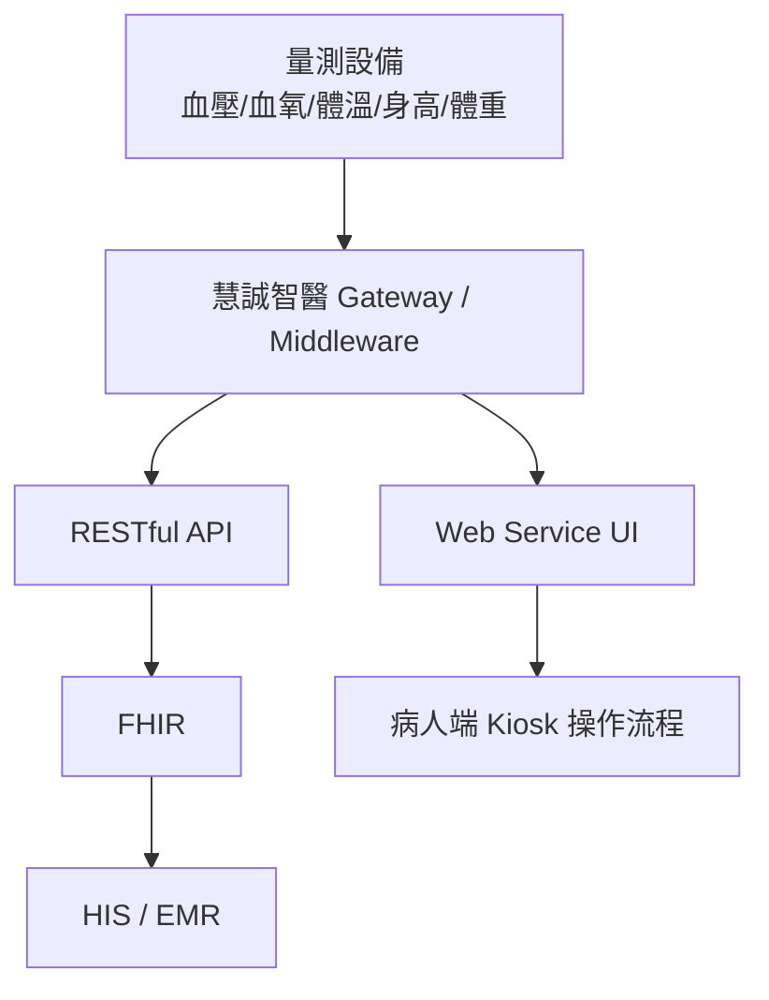
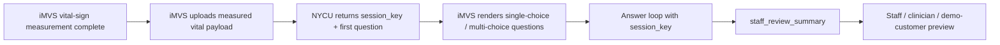

# AI Triage Kiosk Demo

<p>
  
  
  
  
  
  
  
  
</p>

This repo is the standalone execution home for the 慧誠智醫（imedtac Co., Ltd.）
AI triage kiosk demo lane. It provides a synthetic-data, vital-aware intake
loop that returns structured choice questions and a `staff_review_summary` for
staff-review workflow demonstration.

The current implementation is a contract-compatible Python/FastAPI backend
deployed on Render. The externally discussed imedtac integration remains the
same two-endpoint June MVP contract; the backend runtime and doebow
`Question_DB/` question source have been upgraded behind that stable API.

## First Principle

- Scarce resource: demo execution bandwidth before the June US customer visit.
- First deliverable: an English AI triage market demo that can be embedded in or
  linked from imedtac's existing Kiosk / web service flow.
- Product boundary: market demo / product capability demo, not production
  clinical triage, autonomous diagnosis, or a formal HIS / EMR integration.
- Planning home: `../planning-everything-track/data/projects/2026-05-imedtac-er-triage-ekg-asr.md`.

## Related But Separate Projects

| Project | Canonical home | Boundary |
| --- | --- | --- |
| Smart Health Cabin collaboration | `../imedtac-smart-health-cabin-v0` | Owns the hearing, vision, questionnaire, Avatar interaction, adult preventive health form, HPA / WHO STEPS questionnaire MVP, and Smart Health Cabin feasibility lane. This repo references it only when the separate lane affects AI Triage API consistency, demo compatibility, or IP-safe coordination. |

## Current Interpretation

慧誠智醫短期希望在六月前，基於現有 triage prototype，快速做出英文版
demo，能被放進既有 Kiosk / web service 產品流程中，展示「慧誠智醫 +
智德萬 / 吳老師團隊已具備 AI triage capability」。這個 demo 主要用途是
go-to-market 與美國客戶展示，還不是正式醫療決策產品。

## Live Rehearsal Surface

| Surface | Current value |
| --- | --- |
| Render service | `https://nycu-imedtac-triage-demo-api.onrender.com` |
| API base | `https://nycu-imedtac-triage-demo-api.onrender.com/api/triage-demo` |
| Health check | `GET /healthz` |
| Start session | `POST /api/triage-demo/sessions` |
| Submit answer | `POST /api/triage-demo/sessions/{session_key}/answers` |
| Demo review page | `GET /demo-ui/summary-review/` |
| Browser origins enabled by default | `http://localhost`, `http://localhost:5174`, `http://127.0.0.1`, `http://127.0.0.1:5174` |
| Auth | `Authorization: Bearer <demo token>` for POST endpoints when `DEMO_BEARER_TOKEN` is configured |

## 2026-06-25 Update

`main` now includes the latest `origin/doebow` branch content through a
contract-preserving merge. The merged runtime keeps the same two POST endpoints
and terminal `staff_review_summary` behavior while adding doebow's no-number-pad
question-bank updates, local LLM summary service, and additive summary-review
demo page.

The default summary path remains deterministic. `LLM_SUMMARY_URL` is empty by
default, so the FastAPI runtime does not call a local LLM server unless that URL
is intentionally configured for a controlled demo. The local API tester displays
the summary inline by default and offers the summary-review page through an
explicit button; it does not automatically replace the imedtac display surface.

Current QR/report-summary status: the API does not yet provide `report_url` or
QR-code content. The current mechanism is still response-payload based:
`status=summary` plus `staff_review_summary`. A QR flow would be an additional
change-controlled design covering URL lifetime, payload storage, privacy,
expiration, auth, and whether imedtac or NYCU renders the QR code.

Verified local evidence:

- Python API tests: `50 passed`.
- LLM API tests: `2 passed`.
- JS tests: `33` unit tests and `41` contract tests passed.
- `npm run smoke`, `npm run build`, and `git diff --check` passed.

## 2026-06-17 Update

The current `main` branch includes the Render/FastAPI deployment record, the
online smoke-test tooling, and the doebow `Question_DB/` route smoke gate.

| Commit | Update |
| --- | --- |
| `d41d7fc` | Added environment-driven CORS origin support for exact imedtac browser origins. |
| `774358e` | Added CORS preflight coverage for local imedtac origins. |
| `c86a269` / `7d349dd` | Documented Render CORS verification and the origin-configuration boundary. |
| `f17e1e1` | Refreshed Python MVP verification count and compatibility evidence. |
| `eec928f` | Added `npm run smoke:online` for Render health, CORS, bearer-gate, idempotency, and answer-loop checks. |
| `279d70b` | Recorded the successful Render deploy and smoke-test evidence. |
| `bad9894` | Added `npm run smoke:online:doebow` for online doebow `Question_DB/` route verification. |
| `51de694` | Recorded the doebow online smoke gate and remaining private-token Render gate. |

Verified evidence now recorded in this repo:

- Render is live and serving FastAPI/Uvicorn.
- `/healthz` returns HTTP `200`.
- CORS preflight for `http://localhost:5174` passes.
- Unknown origins are not echoed.
- No-token POST returns HTTP `401` / `demo_bearer_token_required`.
- Python tests pass: `50` tests.
- JS tests pass: `33` unit tests and `41` contract tests.
- Local authenticated doebow route reaches:

```text
INIT-1 -> INIT-2 -> INIT-3 -> INIT-3A-* -> INIT-4 -> PAL-1 -> PAL-2 -> PAL-6
-> UNIV-1 -> UNIV-3 -> UNIV-4 -> summary
```

The remaining Render gate is authenticated full-loop testing with the real
private bearer token. The token must stay outside Git, Markdown, screenshots,
and public logs.

## Repo Contents

| Path | Purpose |
| --- | --- |
| `python_api/` | Canonical Python/FastAPI imedtac demo API runtime for the unchanged two-endpoint contract |
| `Question_DB/` | Canonical doebow question bank for initial, symptom-specific, and universal questions |
| `LLM_api/` | Optional local Hugging Face summary service; disabled by default unless `LLM_SUMMARY_URL` is configured |
| `JS/app/triage-kiosk/` | English static AI triage kiosk viewer adapted from the urology previsit demo pattern |
| `JS/core/triage_engine/` | Legacy/static JavaScript governed-question viewer logic retained for frontend reference and tests |
| `JS/api/` | Legacy JavaScript mock API path; not the canonical imedtac backend after the Python MVP transition |
| `JS/scripts/checks/smoke-demo.js` | Runtime smoke check for the English demo |
| `JS/scripts/checks/online-api-smoke.js` | Live Render smoke check for health, CORS, bearer auth, idempotency, and answer loop |
| `JS/scripts/checks/online-doebow-question-db-smoke.js` | Live doebow `Question_DB/` route smoke for initial, symptom-specific, universal, and summary phases |
| `tests/unit/triage-engine.test.js` | Focused tests for question ranking and demo-only safety boundaries |
| `tests/contract/tachycardia-dynamic-path.test.js` | Backend dynamic-path, summary consistency, routing trace, and answer-candidate tests |
| `tests/contract/answer-candidates-api.test.js` | Current-question-only ASR/free-text candidate matching tests |
| `tests/contract/cloud-security-reliability.test.js` | Auth, CORS, TTL, persistence, rate limit, body limit, and audit tests |
| `tests/e2e/` | Path A / Path B tachycardia dynamic engine E2E tests |
| `docs/runtime-to-governance-map.md` | Map from runtime questions to registry/source-family coverage |
| `docs/demo-acceptance-criteria.md` | Functional, governance, data, and presentation gates for v0 |
| `docs/demo-script-for-presenter.md` | Safe presenter script and forbidden demo claims |
| `source/2026-05-11-wu-imedtac-er-triage-ekg-asr/` | Prof. Wu kickoff source bundle copied from planning |
| `source/2026-05-12-imedtac-company-ai-triage-sync/` | Company sync source bundle, meeting record, cleaned transcript, and demo brief |
| `source/2026-05-12-wu-google-meet-ai-triage-510k/` | Prof. Wu 22:20 Google Meet transcript and analysis that reframed the Friday artifact around FDA 510(k), intended use, and conservative demo scope |
| `source/2026-05-15-imedtac-second-sync-and-duobao-followup/` | Second 慧誠 sync, raw transcripts, LINE context, company-provided minutes, 多寶 follow-up, and 多寶's first demo-case draft for the June urgent-care intake demo |
| `source/2026-05-19-johnny-ai-triage-product-spec/` | Johnny Fang's product-spec email, Google Doc export, and API-contract source bundle for the mid-June iMVS demo integration |
| `source/2026-05-19-expert-review-scope-api-boundary/` | Expert reply confirming the June scope cut and required API/runtime/wording/privacy-security deltas before v0.2 |
| `source/2026-05-19-duobao-two-phase-vital-questioning/` | 多寶 two-phase workflow insight: ask non-vital-dependent questions during measurement, then vital-aware follow-up after values arrive |
| `source/2026-05-20-duobao-demo-cases-question-design/` | 多寶 structured demo cases and question-design draft; use as clinical/product design input, not direct runtime wording |
| `source/2026-05-21-imedtac-engineering-sync/` | Post-sync engineering source bundle: corrected transcript, user-provided meeting record, and repo-level meeting record confirming June `post_measurement_only` flow, Endpoint 1/3 merge, no voice, local fallback, and live-case performability decisions |
| `source/2026-05-21-imedtac-post-meeting-progress-record/` | Johnny's post-meeting Gmail record confirming measure-first flow, Endpoint 1/3 merge, single/multi-choice UI, no voice, tachycardia live-demo preference, and NYCU action items |
| `source/2026-05-21-imedtac-teams-api-followup/` | Microsoft Teams follow-up with Ben / Lauren / Johnny asking for the two-endpoint API document, preset questions/options, and not-sure answer-behavior guidance; includes Jason's `2026-05-22 12:24` reply confirming the email-sent API packet, Monday preset question/option target, and no-generic-skip direction |
| `source/2026-05-22-nycu-sent-api-reply-email/` | Jason's sent Gmail reply with the API packet, preserving the externally communicated small fixed June implementation baseline and `not_sure` answer-behavior position |
| `source/2026-06-09-to-2026-06-17-duobao-line-architecture-mvp-sync/` | Internal LINE sync with 多寶 / doebow covering repo privacy, the Python/FastAPI branch, broader fixed-question coverage, staged AI release, the V1/V1.5/V2/V2.5/V3 MVP ladder, and the need to keep imedtac testing contract-compatible |
| `source/2026-06-16-imedtac-teams-question-option-adjustment/` | Microsoft Teams follow-up confirming the current imedtac UI stays within single-choice / multi-choice questions, duration content should be converted into selectable options, the high-heart-rate demo should show data-dependent question flow, and the final staff-review summary should use measured vital data |
| `source/2026-05-21-duobao-post-imedtac-internal-sync/` | Internal Jason / 多寶 post-meeting sync: full corrected transcript and notes confirming no formal triage-level output, AI placement in vital-aware question selection / summary, UI template requirements, and need for an actual iMVS machine review |
| `source/2026-05-21-wu-line-ai-triage-patent-protection/` | Prof. Wu LINE instruction to discuss patents with Tomi and protect NYCU's patent/IP position before teaching imedtac the full reusable method |
| `source/2026-05-21-wu-ai-triage-ip-and-career-call/` | Prof. Wu phone call confirming lab API as know-how boundary, idea-attribution requirements, product co-development contract questions, postdoc/personnel-cost runway, and June deep-cultivation proposal framing |
| `source/upstream-wu-context/` | Earlier Prof. Wu context copied from planning, including the 2026-04-16 Wu/Tomi meeting and 2026-04-20 CDE speech source |
| `docs/project-brief.md` | Working project brief and execution boundary |
| `docs/2026-05-12-imedtac-materials-analysis.md` | Detailed comparison of company follow-up minutes, iMVS product spec, and iMVS API attachment implications |
| `docs/2026-05-12-imvs-hardware-and-vital-units-baseline.md` | Canonical extraction of company-provided iMVS hardware specs, measurement modules, Vital Upload API fields, and vital-sign units |
| `docs/architecture-insertion-and-clinical-grounding.md` | Core note on workflow insertion point, vital-aware dynamic triage, and clinical evidence mapping |
| `docs/literature-matrix-workflow.md` | Question-first literature matrix workflow for AI-triage papers, guidelines, source families, and reviewer-style synthesis |
| `docs/2026-05-19-ai-triage-product-spec-api-analysis.md` | Product-spec interpretation and proposed iMVS / NYCU session API contract for the June demo |
| `docs/2026-05-19-expert-review-action-plan.md` | Expert-review action plan: keep scope narrow, add v0.2 fields, use `review_basis` / `review_action`, lock wording, and require owner/date closeout |
| `docs/2026-05-19-two-phase-question-flow-design.md` | Two-phase API/UI design for parallel measurement-time intake and post-vital follow-up |
| `docs/2026-05-20-duobao-demo-design-consistency-review.md` | Review of 多寶's structured cases/question design against current demo, API, and claim-boundary decisions |
| `docs/2026-05-22-future-complete-api-design-plan.md` | Future complete API roadmap for trace-friendly fields, lifecycle, fallback, provenance, and two-phase expansion beyond the June small fixed contract |
| `docs/ai-triage-dynamic-engine-sdd-implementation-test-spec.md` | 2026-06-08 dynamic engine SDD / implementation plan / test specification |
| `docs/2026-06-08-dynamic-engine-completion-audit.md` | Requirement-by-requirement completion audit for the dynamic-engine spec |
| `docs/2026-06-08-dynamic-engine-spec-coverage-audit.md` | Requirement-level coverage audit tying the dynamic-engine spec to implementation, tests, and external release gates |
| `handoff/2026-06-08-dynamic-engine-external-release-gate-closeout.md` | Operational closeout packet for clinical reviewer approval and imedtac deployment-notice confirmation |
| `decisions/2026-05-20-june-demo-question-budget.md` | Decision that June case flows follow the 慧誠 / iMVS product-spec cap of fewer than 8 visible patient-facing questions |
| `decisions/2026-06-08-dynamic-engine-cloud-backend-boundary.md` | First-principles decision to keep dynamic routing in the cloud/backend behind the stable session API |
| `decisions/2026-06-09-render-lab-gpu-inference-bridge.md` | Decision record for using Render as the public API orchestrator while calling a lab GPU FastAPI service for embedding/reranker inference |
| `handoff/2026-06-09-lab-gpu-cloudflare-tunnel-runbook.md` | Operations runbook for reboot-stable Cloudflare Tunnel + systemd setup between Render and the lab GPU FastAPI service |
| `handoff/2026-05-21-imedtac-two-endpoint-api-reply.md` | External-ready small fixed two-endpoint API contract for the June demo |
| `handoff/2026-05-21-imedtac-engineering-open-issues-checklist.md` | Engineering integration checklist for open issues not fully captured by the API field tables |
| `handoff/2026-05-21-to-2026-05-25-imedtac-response-plan.md` | Internal response plan for API, question templates, and `not_sure` answer behavior before Monday `2026-05-25` |
| `docs/writing-method-policy.md` | Repo-wide confident, affirmative, non-defensive writing policy for articles, handoff notes, pre-reads, meeting packets, and company-facing artifacts |
| `docs/version-control-policy.md` | Automated version-control policy for SemVer runtime, API/schema/flow versions, and demo-readiness checks |
| `data/version_manifest.json` | Canonical version manifest checked against runtime files and API examples |
| `docs/source-index.md` | Complete index of copied source bundles and upstream context |
| `docs/wu-instruction-register.md` | Consolidated Prof. Wu instructions and company-side clarifications |
| `docs/repo-organization.md` | Directory map and folder ownership |
| `docs/repo-relationships.md` | Ownership split between this repo, planning, and related repos |
| `planning-bridge/2026-05-imedtac-er-triage-ekg-asr.md` | Snapshot copy of the planning project locator at repo creation |
| `planning-bridge/project-locators/` | Snapshots of related planning project locators: 慧誠, urology, TFDA/FDA advisor, and medical cybersecurity |
| `workstreams/` | Active workstream notes for insertion point, clinical evidence governance, MVP boundary, and urology-reference reuse |
| `handoff/` | Future handoff drafts for Prof. Wu, 慧誠, or internal collaborators, including the `2026-05-20` 慧誠 API v0.2 pre-read, the 多寶 normalized case pack, the `2026-05-21` iMVS / NYCU API v0.2 draft, and JSON examples |
| `decisions/` | Dated repo/product decisions |

## Current System Frame

The hardware and vital-unit baseline for this frame is now recorded in
`docs/2026-05-12-imvs-hardware-and-vital-units-baseline.md`. It captures the
company-provided iMVS Product Spec `V2.0.4` and iMVS API `V1.4` details,
including `NBP/SPO2/HR/Temp/Glucose/Height/Weight` fields and units.



## Post-Sync June Demo Frame



The earlier two-phase design remains a future optimized path. After the
`2026-05-21` imedtac engineering sync, the June integration default is
post-measurement-only to minimize iMVS UI changes before the customer demo.

## Canonical Backend Frame

The `2026-06-17` Python MVP keeps the imedtac-facing session API stable while
moving the canonical backend runtime to FastAPI. The runtime reads doebow's
`Question_DB/` CSV question bank, preserves the two externally discussed
endpoints, converts unsupported MVP question types into selectable buckets, and
returns staff-review summaries using the measured vital payload and selected
answers.

```text
iMVS frontend
-> POST /api/triage-demo/sessions
-> POST /api/triage-demo/sessions/{session_key}/answers
-> Python FastAPI contract adapter
-> Question_DB-backed triage_v1 engine
-> staff_review_summary
```

Canonical Python runtime files:

```text
python_api/main.py
python_api/triage_contract.py
python_api/triage_v1/
Question_DB/
```

The older JavaScript dynamic-engine files remain historical / static-viewer
references during the transition. They are not the canonical imedtac backend
runtime after the Python MVP transition.

The external v0.2 API version fields remain unchanged because those were already
communicated as the June demo baseline. Internal routing metadata stays behind
the Python adapter unless a recorded change request promotes it.

## Demo Mainline

Start the canonical local FastAPI API server:

```bash
npm start
```

Open the local API test page:

```text
http://127.0.0.1:8000/
```

Start the legacy/static English kiosk viewer when needed:

```bash
npm run static:start
```

Open the static viewer:

```text
http://localhost:4183/app/triage-kiosk/
```

Run the verification checks:

```bash
npm run test:python
npm test
npm run demo:ready
npm run smoke:online
npm run smoke:online:doebow
python3 JS/scripts/check_governance_registries.py
```

Check or bump the synchronized project version:

```bash
npm run version:check
npm run version:bump:patch
```

Build the sanitized Vercel frontend runtime:

```bash
npm run build
```

The Vercel build output is `dist/`. It intentionally contains only:

```text
app/
core/
demo/fixtures/
index.html
```

It must not contain private source bundles, handoff drafts, patent notes,
planning snapshots, workstream notes, or governance docs.

Run the backend rehearsal API in Docker:

```bash
docker compose up --build
```

Useful backend environment variables:

```text
DEMO_BEARER_TOKEN        optional bearer-token gate
DEMO_ALLOWED_ORIGINS     optional comma-separated exact browser Origin allowlist
LLM_SUMMARY_URL          optional local LLM subjective-summary endpoint; empty by default
```

`docker-compose.yml` starts the Python FastAPI container on port `8000`. The
current MVP uses in-memory synthetic demo sessions; persistent cloud session
storage remains a future production validation layer.

The backend CORS allowlist defaults include local test origins:
`http://localhost`, `http://localhost:5174`, `http://127.0.0.1`, and
`http://127.0.0.1:5174`. Render or imedtac rehearsal deployments should add
the exact frontend origin through `DEMO_ALLOWED_ORIGINS`, using explicit
scheme/host/port values and no wildcard.

Run the live Render public smoke checks:

```bash
npm run smoke:online
npm run smoke:online:doebow
```

Run the private-token live checks only from a shell with the agreed token:

```bash
DEMO_BEARER_TOKEN='<private token from agreed channel>' npm run smoke:online
DEMO_BEARER_TOKEN='<private token from agreed channel>' npm run smoke:online:doebow
```

The doebow route smoke proves the deployed API can move from initial intake
questions into symptom-specific questions, then universal questions, and finally
`staff_review_summary`, while preserving imedtac-compatible
`single_choice` / `multi_choice` payloads.

The runtime demo is intentionally narrow: synthetic measurement-time intake ->
synthetic vital payload -> governed English choice-only follow-up questions ->
staff-review summary. Single-choice answers advance immediately after click;
multi-choice answers show visible selection order before saving. It does not
diagnose, recommend treatment, assign a final triage level, order emergency
care, or write to HIS / EMR / FHIR.

The contract API now uses the Python `triage_v1` engine: measured vitals select
the contract-compatible question branch, doebow's `Question_DB/` provides the
fixed question bank, and unsupported MVP question types are rendered as
single-choice option buckets before they reach the imedtac-facing API.

Current runnable backend coverage includes the tachycardia compatibility lane,
normal-vital initial intake, doebow `Question_DB/` symptom routing, universal
questions, and vital-rule branches such as fever, low SpO2, bradycardia,
hypertension, and respiratory-rate cues. The June imedtac integration path
remains `post_measurement_only`; the earlier measurement-time two-phase design
is preserved as a future optimized workflow, not the current rehearsal
contract.

Before showing the demo, read:

```text
docs/demo-script-for-presenter.md
docs/demo-acceptance-criteria.md
docs/runtime-to-governance-map.md
docs/vercel-frontend-runtime.md
docs/version-control-policy.md
```

Legacy/static viewer route, retained as a frontend reference and demo preview
surface:

```text
https://ai-triage-kiosk-demo-3f64jx3kx-jasonln0711s-projects.vercel.app/app/triage-kiosk/
```

## Core Architecture Note

The most important current note is:

```text
docs/architecture-insertion-and-clinical-grounding.md
```

Read it before coding. The next hard problem is finding the insertion point in
慧誠's existing measurement workflow and building traceable clinical grounding
for vital-aware dynamic questioning.

Also read:

```text
docs/source-index.md
docs/wu-instruction-register.md
docs/repo-organization.md
```

## Safety Boundary

- Do not use real patient data unless a separate approval, consent, and data
  governance path exists.
- Do not invent clinical thresholds for vital-sign triage.
- Do not claim diagnosis, autonomous medical advice, emergency medical
  replacement, or production readiness.
- Do not connect to HIS / EMR / FHIR write paths without an explicit integration
  plan and company / clinical approval.
- Keep patent-sensitive ASR + LLM workflow details private unless Prof. Wu or
  the project owner explicitly approves disclosure.
- This repo now includes upstream private Prof. Wu context and a CDE source copy;
  keep the repo local-only unless the user explicitly asks to publish after a
  privacy review.

## Current Next Gates

1. Share a concise imedtac engineering update: Render is live, the two endpoint
   paths are unchanged, the backend now uses FastAPI and doebow `Question_DB/`
   behind the stable contract, and duration-like content is returned as
   selectable options.
2. Run the real-token Render checks:
   `DEMO_BEARER_TOKEN='<private token>' npm run smoke:online` and
   `DEMO_BEARER_TOKEN='<private token>' npm run smoke:online:doebow`.
3. Ask imedtac to validate the iMVS frontend loop from the actual browser
   origin: start session, render choices, submit option ids, show progress from
   `progress.expected_total`, and display `staff_review_summary`.
4. If CORS blocks recur, collect the exact DevTools `Origin` and add it through
   `DEMO_ALLOWED_ORIGINS` only if it is outside the default local origins.
5. Decide with imedtac whether summary display stays payload-rendered by iMVS
   or moves to a separate report URL / QR flow. Keep QR/report URLs, AI ranking,
   LLM summary activation, ASR/free-text matching, additional endpoints, and
   broader clinical branches behind explicit change control until the current
   two-endpoint rehearsal is stable.
