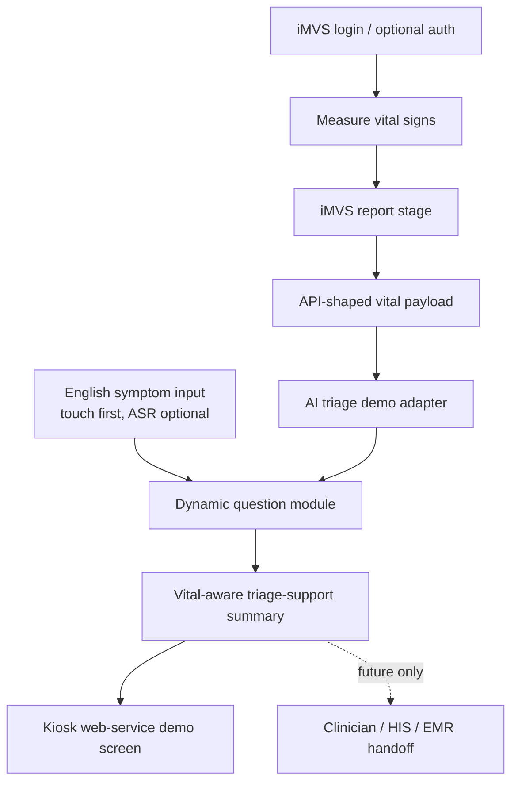

# 2026-05-12 imedtac Materials Analysis

## Source Package

Company follow-up materials from Johnny Fang were moved into:

```text
source/2026-05-12-imedtac-company-ai-triage-sync/
```

Original files:

- `assets/2026-05-12-imedtac-ai-triage-followup-email.pdf`
- `assets/2026-05-12-imvs-product-spec-v2.0.4.docx`
- `assets/2026-05-12-imvs-api-v1.4-eng.pdf`

Searchable text:

- `extracted/2026-05-12-imedtac-ai-triage-followup-email.txt`
- `extracted/2026-05-12-imvs-product-spec-v2.0.4.txt`
- `extracted/2026-05-12-imvs-api-v1.4-eng.txt`

External references named in the email:

- Product page: `https://www.imedtac.com/service/%e6%99%ba%e6%85%a7%e7%94%9f%e7%90%86%e9%87%8f%e6%b8%ac%e7%ab%99/`
- Demo video: `https://www.youtube.com/watch?v=mlCrYgIGrIc`
- Comparator product: `https://www.careroute.ai/`

## Executive Read

The company-side minutes mostly confirm our existing interpretation, but they
add one operationally important thing: the follow-up is now a short-deadline
research / feasibility task, not just passive source capture.

Because the email was sent on Tuesday `2026-05-12`, "this Friday" means
`2026-05-15` Asia/Taipei. The requested short-term output is an initial research
result on:

- AI model integration methods for all-specialty triage;
- modular specialty structure;
- how physiological data can be integrated into triage analysis;
- examples from FDA or medical-society guidance showing how specific vital data
  affects the analysis.

The best working response is therefore not to start a broad product build. The
best response is to prepare a scoped Friday discussion artifact: architecture,
vital-to-question impact table, clinical-source strategy, demo boundary, and
open integration questions.

## Differences From Our Internal Record

| Topic | Our internal record | Company follow-up adds | Practical implication |
| --- | --- | --- | --- |
| Immediate deadline | Wait for product/API materials before implementation scope. | Initial research results expected by Friday `2026-05-15`. | Treat this as an active W20 dependency, but keep it bounded to feasibility research. |
| Owner | Jason / 阿聖 side should study medical/vital-sign side. | Action item explicitly names Kevin Lin / 阿聖. | Prepare a response artifact that can be discussed with Johnny/Jason/Ken/Prof. Wu. |
| Product integration | Kiosk / web-service integration is likely. | "Use existing architecture" and adjust product process after feasibility. | First deliverable should recommend insertion points, not a finished app. |
| Technical constraint | CPU-only / low-cloud-cost direction captured from meeting. | Company minutes explicitly want operation on basic hardware and avoidance of public-cloud / high licensing costs. | Default v0 architecture should be local or low-cost, with ASR optional or fallback. |
| Market story | June US customer visit and multi-country opportunities captured. | Email repeats US / Middle East / Singapore opportunities as database expansion sources. | Demo story can be market-facing, but clinical database claims must stay future-tense. |
| Comparator | Company showed symptom checker. | Email names CareRoute. | Use CareRoute as comparator for symptom triage UX, not as a source for clinical logic. |
| Product evidence | We were waiting for exact materials. | Product spec and API docs arrived. | The blocker changes from "no materials" to "need sample payload, integration mode, target SKU, and clinical source scope." |
| Safety boundary | Our record clearly says not diagnosis / not production triage. | Company AI minutes do not strongly state this boundary. | Any reply or demo brief should explicitly keep "triage support, not diagnosis." |

## Company Expectations And Needs

The company appears to need four layers from us.

First, a credible short-term demo story. They want to show that their existing
vital-sign kiosk can become part of an AI-assisted triage workflow before the
June US customer visit. The value is capability proof, not clinical deployment.

Second, a technical architecture opinion. They want to know how our current
ASR / LLM / dynamic-questioning direction could fit their web-service kiosk
product under basic hardware and low cloud/licensing constraints.

Third, a clinical-source strategy. They are asking for FDA or medical-society
examples, but FDA should be treated primarily as a software-risk / validation /
intended-use boundary unless specific FDA source text is verified. Symptom and
triage logic likely needs emergency medicine, specialty society, public-health,
or clinician-approved protocol sources.

Fourth, a modular long-term path. They are thinking beyond one specialty:
English-first, ASR-capable, all-specialty, vital-sign-aware triage, with future
database growth from US / Middle East / Singapore and other markets.

## Meeting Email Analysis

The follow-up email is a company-side AI-generated meeting record sent by
Johnny Fang at `2026-05-12 15:10`, with Ken Yu and Prof. Wu copied.

Key points:

- Vision: cooperate with imedtac on an English-country-focused AI triage
  classification system with ASR, all-specialty coverage, and physiological
  data analysis.
- Hardware / deployment constraint: run on basic hardware where possible and
  avoid dependence on public cloud or expensive licenses.
- Integration target: existing web-service UI, touch operation, measurement
  report, and Kiosk product.
- Market pressure: June US customer visit; initial collaboration output would
  help market promotion.
- Future data opportunity: imedtac has potential international cases that could
  support future triage-database expansion.
- Action item for 阿聖: initial research on modular all-specialty AI triage
  methods and vital-data impact, with Friday discussion target.
- Company-side contribution: product page, use-case demo video, product spec,
  API doc, and CareRoute reference.

What the email omits compared with our fuller note:

- no explicit "not diagnosis" / "triage support only" wording;
- no patent-sensitive ASR + LLM boundary;
- no detailed distinction between embedding routing, full LLM generation, ASR,
  and structured questionnaire logic;
- no sign-off owner for vital thresholds;
- no decision on v0 integration mode;
- no sample endpoint or real payload beyond the API definition.

## iMVS Product Spec Analysis

The product spec frames iMVS as a smart physiological-measurement station for
self-health management, health screening, cloud analysis, personal record
tracking, and easier operation through health-card / IC-card / barcode-style
login.

Important product facts:

- The user-facing workflow is measurement-centered: identify -> measure ->
  finish/report.
- The system has voice guidance and a clear touch UI, useful for elderly users.
- The software supports login, measurement item selection, guided measurement,
  normal/abnormal reference display, re-measure / next actions, measurement
  report, QR code access, and exit reminder.
- The report screen can display SpO2, blood pressure, body temperature, blood
  glucose, heart rate, height, weight, and BMI.
- The product architecture image shows iMVS-HCC as a cloud health management
  platform between HIS and long-term care facility contexts, with iMVS-AIO,
  iMVS-DKP, and iMVS-MOB device lines below it.
- The hardware table names AIO / DKP / MOB variants and device families such as
  A&D TM2657 blood pressure, Rossmax HC700 BT forehead thermometer, Nagata
  height/weight sensors, optional Rossmax SB-210 SpO2, and optional Rossmax
  HT-100B glucose.

Product implications for the demo:

- The AI layer should probably start after measurement, because iMVS already
  has a strong "measure first" workflow and the final report is the natural
  handoff point.
- The demo should visually respect the existing iMVS UI language: step progress,
  light touch-screen flow, clear cards, re-measure / next / leave actions, and
  patient-friendly prompts.
- The AI output should look like an extension of the report / summary flow, not
  like a disconnected chatbot.

Clarification needed:

- The meeting record says Windows-based all-in-one, but the product spec's
  recommended hardware section includes a `21.5" Tablet` with `Android 8.1`.
  Ask which target device / OS should represent the June demo.
- The spec says OS `windows` in the hardware quantity table, but the later
  hardware recommendation says Android. This is a real integration ambiguity.
- The product spec describes cloud analysis and smartphone apps, while the
  meeting/email emphasize avoiding public-cloud dependency. Ask what deployment
  mode they want for demo versus future product.
- SpO2 and glucose are marked optional in parts of the hardware table; ask which
  fields are guaranteed for the target SKU.

## API Analysis

The API document has two main functions.

Authentication:

- Optional API provided by the hospital.
- iMVS sends an `ID` by POST when a user logs in by manual input, NFC, or card.
- If the response is `Result = F`, iMVS rejects login.
- If the API is not implemented, all users can log in.
- Response fields include `Result`, `Err`, `ID`, `IdDisplay`, and optional
  `Payload`.
- The `Payload` can be carried back to the hospital through the vital-sign
  upload API.

Vital-sign upload:

- POSTs vital-sign data after all measurements are done.
- URL is provided by the hospital.
- Response fields are `success`, `errorCode`, and `message`.
- Request fields include `CHART_NO`, `SAVE_DATETIME`, `UPLOAD_DATETIME`,
  `STATION_NAME`, `Payload`, `SPO2`, `HR`, `Temp`, `Glucose`, `NBP`, `Height`,
  and `Weight`.
- Vital values are structured as nested objects with string values and units.

API implications:

- The existing API is hospital-facing upload, not yet an AI-triage API.
- For v0, use a synthetic API-shaped vital-sign payload and do not touch real
  hospital authentication or upload.
- A useful demo contract is: consume an iMVS-shaped vital payload, run symptom
  questioning, return a triage-support summary for display.
- If integration happens later, the safer early path is read-only / report-only;
  no HIS / EMR writeback should be claimed.

API ambiguities to clarify:

- The doc says datetime format is `yyyy-MM-dd HH:mm:ss`, but the JSON sample
  uses slashes like `2019/10/30 09:40:24`.
- `errorCode` is typed as `Int`, but the sample uses an empty string.
- The HR field is named `BP_Value`, apparently because heart rate comes from
  the blood-pressure measurement.
- The HR unit has a typo-like `bmp`; likely `bpm`.
- The JSON sample includes curly quote characters in the response example.
- All measurement values are strings, so validation / parsing belongs in the
  adapter layer.
- It is unclear whether iMVS can call an AI service before the hospital upload,
  after the upload, or only by opening a linked/embedded page.

## Recommended V0 Architecture



Recommended demo boundary:

- Use synthetic identifiers and synthetic vital signs.
- Touch input first; ASR can be a visible optional layer or fallback demo.
- Small symptom scope first, not true all-specialty coverage.
- Output wording: "triage support summary" or "recommended review level", not
  diagnosis or emergency medical replacement.
- Cite each branch as demo-only until clinical sources and reviewers are named.

## Friday `2026-05-15` Discussion Artifact

Prepare a compact artifact with five parts:

1. Architecture insertion diagram: where AI starts, what data it receives, and
   what it returns.
2. Modular triage method map: specialty modules, shared symptom ontology,
   vital-sign adapter, question router, and summary generator.
3. Vital-to-question impact matrix: BP, SpO2, temperature, HR, BMI/glucose, and
   which follow-up categories each can influence.
4. Source-governance plan: which authorities can support triage questions and
   which items require clinician/company sign-off.
5. Demo scope recommendation: English, one kiosk flow, synthetic payload,
   touch-first, ASR optional, no diagnosis, no HIS/EMR writeback.

Internal schedule update:

- The company asked for a Friday `2026-05-15` discussion, but the internal
  completion deadline should be Thursday `2026-05-14 11:30` because the Rao
  consultation starts at `13:00`.
- The detailed Thursday execution plan lives in
  `workstreams/05-thursday-vital-sign-research-gate.md`.
- This work is now a bounded W20 must-output, not an implementation sprint.

## Questions To Ask 慧誠

- Which device is the June demo target: AIO, DKP, MOB, or another SKU?
- What OS / browser runtime should we assume: Windows kiosk, Android tablet, or
  web-only environment?
- Is v0 expected to be a link, iframe, same web app, API handoff, or mocked
  screen-to-screen flow?
- Can the first demo use synthetic vital-sign values shaped like the API sample?
- Which fields are guaranteed on the target device: BP, SpO2, temperature,
  heart rate, height/weight/BMI, glucose?
- Should the AI triage demo run before or after the vital-sign upload API?
- What exact output wording is acceptable for a customer-facing demo?
- Which CareRoute behaviors do they want to emulate: question flow, care-level
  routing, cost estimate, UX, or general market positioning?
- For Friday, do they expect slides, a short memo, architecture diagram, or an
  interactive prototype?
- Who signs off on clinical source choices and vital-threshold interpretation?

## Bottom Line

The new materials sharpen the task. 慧誠 is not only asking whether we can build
an AI symptom chatbot. They are testing whether we can turn their measurement
kiosk into a credible, low-cost, vital-sign-aware triage-support workflow while
keeping clinical evidence, integration boundaries, and market-demo claims under
control.
