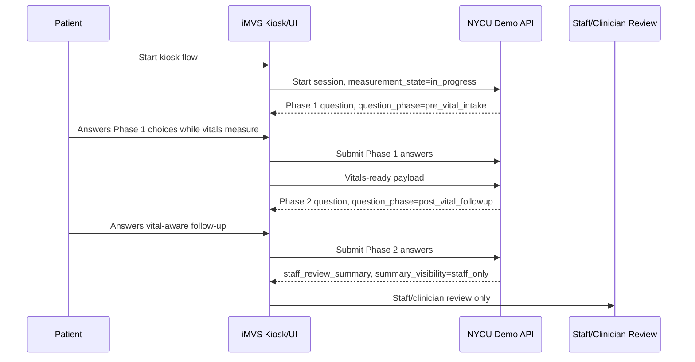

# Two-Phase Question Flow Design

## Decision

Adopt 多寶's two-phase question-flow idea as the preferred June demo workflow:

```text
Phase 1: pre-vital intake while iMVS is measuring
-> vitals-ready event / payload
-> Phase 2: vital-aware follow-up
-> staff_review_summary
```

This should become the recommended v0.2 API and UI flow, while preserving the
existing post-measurement-only flow as fallback if 慧誠 cannot render questions
during measurement.

Expert freeze-gate update: `measurement_state=in_progress` is not enough to
prove it is safe to ask questions. The API should include an explicit
`safe_to_ask_phase1_question` or equivalent UI/measurement-step signal, and
慧誠 must identify which measurement steps allow touch interaction without
degrading measurement quality.

## Why This Is Better

This workflow can save patient time and improve perceived efficiency because
the system uses the measurement window instead of waiting until all vital signs
are complete.

It is also safer than asking vital-aware questions too early:

- Phase 1 only asks questions that do not depend on vital numbers.
- Phase 2 starts only after the system receives measured vital values.
- The summary remains staff-only and non-diagnostic.

## Flow



## Phase 1: Pre-Vital Intake

Phase 1 questions can be asked during blood pressure, SpO2, temperature,
height/weight, or other measurements because they do not require numeric vital
interpretation.

Recommended Phase 1 fields:

| Field | Question intent | Why safe before vitals |
| --- | --- | --- |
| `chief_concern` | Main reason for kiosk use. | Patient-reported context only. |
| `onset` / `duration` | When the problem started. | Does not require measured values. |
| `patient_severity` | Patient's own severity feeling. | Subjective report, not triage level. |
| `current_breathing_symptom` | Whether patient feels short of breath. | Patient-reported symptom, not SpO2 interpretation. |
| `chest_pain_or_pressure` | Whether chest pain / pressure is present. | Patient-reported symptom. |
| `medication_allergy_context` | Medications and allergies available for staff. | Handoff context only. |
| `support_needed` | Help reading, typing, interpreter, mobility. | Kiosk usability / safety support. |

Phase 1 should not ask:

- "Your SpO2 is low; do you..."
- "Your heart rate is high; do you..."
- "Are you emergency severity..."
- anything that interprets vital values before they are available.

## Phase 2: Post-Vital Follow-Up

Phase 2 begins only after iMVS provides the vital payload and quality status.
This phase can use measured values to choose the next safe follow-up question.

Recommended Phase 2 routing examples:

| Vital / context pattern | Phase 2 follow-up | Safe output boundary |
| --- | --- | --- |
| Fever + dyspnea + lower oxygen saturation in demo scenario | Dyspnea duration/severity, chest pain/pressure, chronic lung disease/baseline oxygen, medication context. | Early staff-review summary; no pneumonia/COVID/ESI claim. |
| High BP + chest pressure | Chest descriptors, neurologic symptoms, staff-review context. | Staff review of symptoms and measured vitals; no emergency order. |
| Fever + urinary symptoms | Fever duration, flank/back pain, pregnancy context, inability to urinate. | Staff-review summary; no infection diagnosis or antibiotic advice. |
| Very fast HR + palpitations/chest tightness | Symptom duration, chest pressure, dizziness/weakness, medication context. | Conservative handoff; no arrhythmia diagnosis. |

## API v0.2 Additions

Add these fields to question responses:

| Field | Values |
| --- | --- |
| `workflow_mode` | `parallel_measurement_intake` |
| `measurement_state` | `not_started`, `in_progress`, `complete`, `failed` |
| `vitals_ready` | boolean |
| `safe_to_ask_phase1_question` | boolean; true only for a confirmed safe measurement interaction window |
| `question_phase` | `pre_vital_intake`, `post_vital_followup`, `summary` |
| `phase_reason` | short explanation for why this phase/question is allowed |

Recommended new endpoint:

```http
POST /api/triage-demo/sessions/{session_key}/vitals
```

Use it when iMVS starts Phase 1 before all measurements are finished. If 慧誠
cannot add this endpoint for June, fallback to the original post-measurement
flow:

```text
vital payload -> question loop -> staff_review_summary
```

## UI Requirements For 慧誠

Ask the engineering/UI team:

- Can the kiosk show Phase 1 questions while BP / SpO2 / temperature are still
  measuring?
- Which measurement steps have safe idle time for touch questions?
- Does answering questions interfere with posture or measurement quality?
- Can the UI mark `Measurement in progress` and later `Vitals ready`?
- Can iMVS send a vitals-ready event or call a separate vitals endpoint?
- Can progress display separate Phase 1 and Phase 2, for example `1/3 intake`
  and `1/2 follow-up`?

If answering could disrupt measurement quality, Phase 1 should be limited to
the idle parts of the measurement flow or moved after measurement completion.

## Respiratory Demo Cut

Preferred respiratory demo:

```text
Measurement begins
Phase 1:
  Q1 chief complaint
  Q2 dyspnea duration / patient-reported severity
Vitals ready
Phase 2:
  Q3 chest pain / pressure
  Q4 chronic lung disease / baseline oxygen / medication context
Summary:
  staff_review_summary, staff_only, handoff_required
```

Safe summary language remains:

```text
Synthetic demo case. Patient reports shortness of breath. Measured vitals
include fever, increased respiratory rate, and lower oxygen saturation than
expected for this demo scenario. Staff should review the respiratory complaint
and measured vitals. This demo does not diagnose, assign final triage level,
recommend treatment, or write to HIS/EMR.
```

## Acceptance Check

The two-phase flow is ready for June only when:

- Phase 1 questions are confirmed not to depend on vital values.
- 慧誠 confirms the specific measurement step is safe for touch interaction.
- Phase 2 starts only after vital payload and quality flags are available.
- API examples show `question_phase`, `measurement_state`, and `vitals_ready`.
- Errors never fabricate Phase 2 questions or summaries.
- 多寶 approves the first respiratory stop rule and wording.
- 慧誠 confirms the UI can safely ask Phase 1 questions during measurement.
