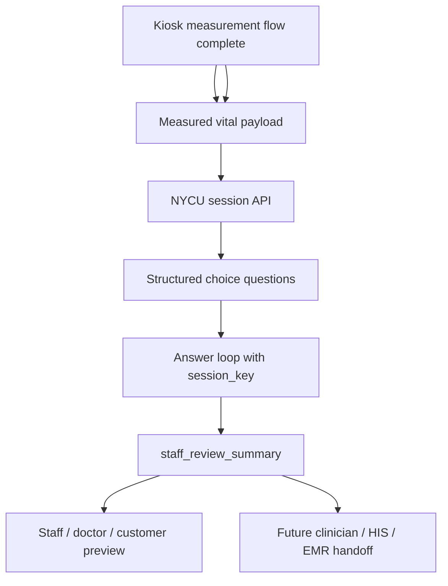

# Project Brief

## One-Line Goal

Create an English AI triage market demo that fits 慧誠智醫's existing kiosk /
web service story before the June US customer visit.

## Current Priority

The current priority is not UI polish, prompt tuning, or model expansion.

The current priority is the post-`2026-05-21` engineering integration path:

```text
iMVS vital-sign measurement complete
-> measured vital payload starts NYCU session
-> structured question loop
-> staff_review_summary
-> staff / clinician / demo-customer preview
```

Detailed architecture note:

```text
docs/architecture-insertion-and-clinical-grounding.md
docs/2026-05-12-imvs-hardware-and-vital-units-baseline.md
source/2026-05-21-imedtac-engineering-sync/meeting-record.md
source/2026-05-21-duobao-post-imedtac-internal-sync/meeting-record.md
source/2026-05-21-wu-line-ai-triage-patent-protection/thinking-and-schedule.md
source/2026-05-21-wu-ai-triage-ip-and-career-call/meeting-record.md
handoff/2026-05-21-imedtac-engineering-sync-closeout.md
```

After the `2026-05-21` imedtac engineering sync, the June default is
`post_measurement_only`. The earlier two-phase during-measurement question flow
remains a future optimized path after the first customer-demo loop is stable.

The next engineering gate is:

```text
company-provided iMVS V1.4 field/unit baseline
-> current imedtac field-dictionary delta confirmation
-> post-sync API v0.2 update
-> generic iMVS question-template confirmation
-> safe question / summary wording
-> first case-lane decision
-> actual iMVS machine review with 多寶 / 許醫師
-> remote API plus local scripted fallback rehearsal
```

The short-term demo should be framed as an English vital-aware intake support
demo on the target device. It shows a staff-review workflow, not autonomous
clinical triage.

Parallel protection gate: Prof. Wu's `2026-05-21 11:53` LINE instruction means
the AI-Triage patent disclosure is now a cooperation-protection task. Share the
API contract needed for the June demo, but keep reusable invention logic,
routing/scoring details, source-governance method, and patent claim structure
inside the Prof. Wu / Tomi review path until cleared.

The `2026-05-21 12:05` phone call adds the operational rule: lab API mode can
serve the demo while preserving know-how, and meeting records should attribute
which ideas came from Jason / 多寶 / NYCU versus imedtac.

Supporting context:

```text
docs/source-index.md
docs/wu-instruction-register.md
workstreams/
docs/2026-05-12-imedtac-materials-analysis.md
```

## What Exists

慧誠智醫 appears to have:

- medical measurement devices for blood pressure, SpO2, temperature, height, and
  weight;
- company-provided `2026-05-12` hardware and unit baseline for iMVS:
  `NBP` in `mmHg`, `SPO2` in `%`, `HR` in `bpm`, `Temp` in `deg C` / `C`,
  `Glucose` in `mg/dL`, `Weight` in `kg`, and `Height` in `cm`;
- a Windows-based fanless all-in-one kiosk with no onboard GPU;
- a web service UI for measurement flow and summary report;
- middleware / gateway integration;
- RESTful API, FHIR, HIS, and EMR integration context.
- a product workflow of identity/login, measurement selection, guided
  measurement, normal/abnormal reference display, re-measure / next actions,
  final report, QR-code style output, and exit reminder;
- an API definition for optional patient authentication and post-measurement
  vital-sign upload.

## What They Want

Short term:

- English triage-facing demo;
- visible integration with kiosk / web service flow;
- symptom collection, structured summary, workflow acceleration, and
  vital-sign-aware story;
- customer-facing capability proof before a June US customer visit.

Long term:

- English voice input;
- broad / all-specialty symptom triage;
- vital signs integrated into triage logic;
- a triage AI database / system that can improve across US, Middle East,
  Singapore, Thailand, Malaysia, and other markets.

## Demo Architecture Hypothesis



## Required Decisions Before Implementation

- Does the current imedtac demo machine / GitHub format still match the
  `2026-05-12` iMVS API `V1.4` baseline, and what field-name or optionality
  deltas should NYCU adapt to?
- Where exactly is the post-measurement AI question loop inserted in iMVS?
- Can iMVS render reusable typed question templates from NYCU JSON, or does
  each question screen need to be hand-coded?
- Which local fallback mode can imedtac host or launch during the customer demo?
- Which first case lane is more useful for the customer: respiratory synthetic,
  tachycardia live-performance, or healthy/unhealthy contrast?
- What option count and label length fit the imedtac question UI without
  dragging or scrolling?
- What is the nearest comparable product, competitor, or FDA `510(k)` reference
  for product-scope comparison?
- What minimum symptom flow should be shown?
- ASR is out for June; what future checkpoint should reopen voice?
- Which vital signs affect question routing, and how is each effect justified?
- What clinical source supports each question and escalation path?
- What exact staff-review wording is safe for the output?
- Which architecture diagram is safe to share externally?
- Which target device / OS represents the June demo, given the current
  Windows-vs-Android ambiguity in meeting notes and product spec?

## Boundary

This repo can prepare a demo, architecture notes, and implementation scaffold.
It must not turn into clinical product claims before clinical criteria,
validation, privacy, cybersecurity, and company approvals exist.

## Immediate Post-Sync Artifact

By Friday `2026-05-22`, keep the main artifact focused on the 5/21 sync
closeout:

- post-measurement API v0.2 update;
- imedtac current field-dictionary delta request against the 5/12 V1.4
  field/unit baseline;
- generic question-template request for `single_choice`, `multi_choice`,
  numeric / scale, variable option counts, and no-scroll display limits;
- `idempotency_key` / retry explanation;
- Remote REST API Mode and Local Scripted Demo Mode runbook;
- first case-lane choice and safe staff-summary wording;
- demo scope and no-diagnosis boundary.
- patent-protection brief for Prof. Wu / Tomi: invention center, what imedtac
  already knows, what can be shared now, and what should remain protected.
- idea-attribution pass for high-value meeting notes before the next deep
  imedtac handoff.
