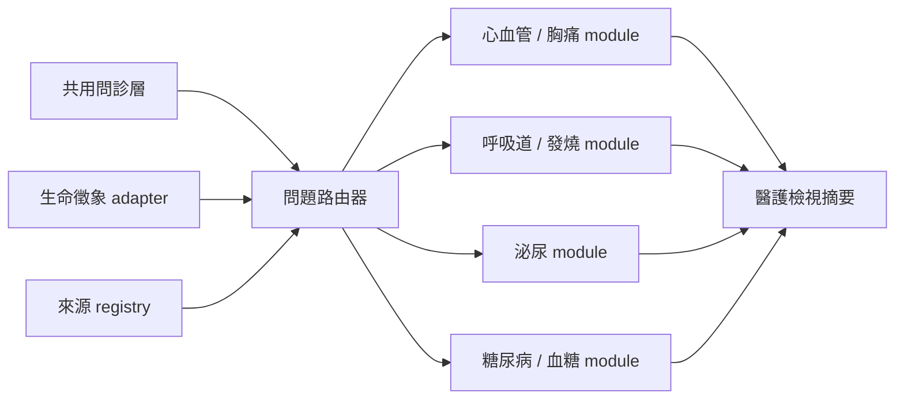

# 2026-05-15 慧誠 AI Triage 可行性討論完整會議資料包（台灣繁中版）

日期：`2026-05-15`
時間：`13:00-14:00`（台灣時間）
會議名稱：`AI triage 可行性討論`
Google Meet：`https://meet.google.com/cjk-iwzq-cmz`
適用對象：Jason / 吳老師 / 慧誠智醫 / 多寶醫師 / 內部協作者
文件定位：會議使用資料包；不是臨床指引、不是正式產品規格、不是法規送審文件

## 0. 這場會議要拿到的決定

這場會議最重要的是回答一個問題：

```text
我們是不是要在六月做一個 demo，展示 iMVS 量測到的生命徵象可以用來
驅動更安全、可追溯來源的英文症狀問診，並產出給醫護人員檢視的摘要？
```

如果答案是「要」，會後下一個工作包至少要確認：

1. 六月要交付的是會議 memo、可點擊 demo，還是接近 kiosk 的 demo；
2. 目標 iMVS 設備、型號、作業系統；
3. 一定會有的生命徵象欄位；
4. 第一版是否可以使用 iMVS API 形狀的合成資料；
5. 第一個臨床切入框架是 `家醫科 / 一般內科`、急診 / urgent-care-style
   triage support，還是其他更小的範圍；
6. 誰負責確認臨床來源、threshold、紅旗症狀 wording、輸出標籤。

## 1. First-Principles 會議框架

週五最稀缺的資源不是更多功能細節，而是可信度：

- 我們能不能正面回答慧誠提出的產品 / 商務問題？
- 我們能不能說清楚生命徵象如何讓 kiosk 比一般 symptom chatbot 更有價值？
- 我們能不能避免過度宣稱診斷、自動分流、FDA clearance、或已完成全科別臨床覆蓋？

會議順序應該是：

```text
慧誠明確需求
-> 全科別模組化架構
-> 生命徵象如何影響問診與摘要
-> source governance / FDA 邊界
-> 多寶醫師臨床可行性校準
-> 六月 demo 決策
```

資料使用順序應該是：

```text
慧誠需求
-> iMVS 產品與 API 事實
-> 多寶醫師臨床校準
-> 吳老師 GPT 家醫科 / 一般內科假設
-> 510(k) 產品範圍與宣稱邊界
```

不要反過來先講 `510(k)` 或 GPT threshold，再試圖把慧誠需求塞進去。

## 2. 會議角色分工

| 對象 | 在這場會議中的角色 | 要避免 |
| --- | --- | --- |
| Jason | 說明 bounded architecture、生命徵象如何影響問題順序、source strategy、六月 demo 選項。 | 不承諾當天開始產品 sprint，也不宣稱已完成全科別臨床系統。 |
| 慧誠 / Johnny Fang | 確認產品需求、目標設備、可用欄位、整合方式、六月需要的 artifact。 | 不讓討論停在抽象概念，最後要有下一步 artifact 與 owner。 |
| 吳老師 | 協助對齊產品方向，判斷是否採用 GPT 文件中的 `家醫科 / 一般內科` 切入。 | 不把 GPT 輸出當成臨床證據。 |
| 多寶醫師 | 說明全科別臨床可行性，判斷 `家醫科 / 一般內科` 是否最適合作為第一版 demo frame。 | 不把這次發言視為 threshold 或輸出 wording 的正式臨床 sign-off。 |

## 3. 多寶醫師的會議段落

Jason 目前的會前假設：

> `家醫科 / 一般內科` 可能比直接承諾全科別更可行，因為它比較符合 kiosk
> 量測到的一般生命徵象，也能讓六月 demo 對慧誠有足夠商業展示價值，同時
> 保持臨床與來源治理邊界。

請直接問多寶醫師：

```text
從醫師 workflow 的角度，第一版六月 demo 應該先用家醫科 / 一般內科
門診前分流，還是急診 / urgent-care-style triage support？全科別應該
怎麼講成 modular roadmap，而不是已完成的 clinical claim？
```

希望多寶醫師協助回答：

1. 全科別模組化 triage 作為架構 roadmap 是否合理？
2. `家醫科 / 一般內科` 是否是第一版產品展示最可行的 frame？
3. 第一版是否應該改成 urgent-care / emergency-triage support？
4. 會後哪些臨床問題必須明確標示為尚未解決？
   - threshold validation；
   - red-flag wording；
   - output label；
   - specialty-module roadmap；
   - clinician / company sign-off owner。

## 4. 60-90 秒開場稿

開場可直接照這段說：

```text
我今天把初步研究收斂在慧誠提出的三個問題：第一，全科別 AI triage
要怎麼模組化；第二，生理量測資料要怎麼影響問診和分析；第三，哪些
FDA 或醫學會資料可以支持這些 vital sign 對分析的影響。

我的短答案是：不要做一個大型 generic chatbot，而是保留一個 shared
intake / vital adapter / question router / source registry core，然後用
specialty modules 擴充。生命徵象應該改變下一題優先順序、紅旗問題
提示，以及 clinician-review summary 的重點；但 v0 不應該做診斷、
治療建議、final ESI level 或 autonomous triage decision。

對六月 demo，我目前建議先做 demo-only 的英文 vital-aware intake
workflow：使用 synthetic 或 API-shaped iMVS vital payload，加上 source-
governed question routing，最後產出 staff / clinician review summary。
今天最需要決定的是：第一個臨床 frame 要走家醫科 / 一般內科、urgent
care / emergency-style support，還是只先講 modular roadmap。
```

## 5. 20 分鐘核心議程

如果時間很緊，用這個版本。

| 時間 | 段落 | 目標 |
| --- | --- | --- |
| 0-2 分 | 確認慧誠問題 | 確認今天回答的是模組化、生命徵象整合、來源例子。 |
| 2-6 分 | 架構位置 | AI 層放在 iMVS 量測完成後，吃 API-shaped vital payload。 |
| 6-10 分 | 全科別方法 | shared core + specialty modules；全科別是 roadmap，不是已完成 claim。 |
| 10-13 分 | 多寶醫師可行性校準 | 判斷第一個 frame：`家醫科 / 一般內科` vs urgent-care / emergency-style support。 |
| 13-17 分 | 生命徵象影響 + 來源邊界 | 生命徵象改變問題優先順序與摘要；FDA 是邊界，臨床來源決定問題邏輯。 |
| 17-20 分 | 最小決策 | 目標設備、必要欄位、合成資料、輸出 wording owner、下一個 artifact。 |

## 6. 60 分鐘完整議程

| 時間 | 段落 | 目標 |
| --- | --- | --- |
| 0-5 分 | 重述需求與六月商務目標 | 確認這是 market / product capability demo，不是正式臨床分流產品。 |
| 5-12 分 | iMVS 插入點 | AI 從量測完成後開始；v0 不做 HIS / EMR writeback。 |
| 12-22 分 | 全科別模組化架構 | shared core + specialty modules。 |
| 22-32 分 | 多寶醫師臨床可行性校準 | 判斷家醫科 / 一般內科是否是第一個可信 demo frame。 |
| 32-42 分 | 生命徵象到問題的矩陣 | BP、SpO2、Temp、HR、呼吸、BMI、選配 glucose 各自有 demo-safe 角色。 |
| 42-50 分 | 來源策略 | FDA 邊界 vs ESI / AHA / CDC / ADA / AUA / local protocol 問題邏輯。 |
| 50-57 分 | 六月 demo 選項 | memo、clickable mock、kiosk-adjacent demo。 |
| 57-60 分 | 收斂 | 確認下一個 artifact、owner、open gates。 |

## 7. 五頁簡報 talking track

### Slide 1 - 週五問題與短答案

```text
用一個 shared triage core 加上 specialty modules。iMVS 量測完成後，
把生命徵象放進問題排序與摘要邏輯。臨床問題與 review signals 要有
可追溯來源。v0 是 triage support，不是 diagnosis。
```

重點：

- 慧誠已經有 measurement workflow。
- AI 應該接在量測後，不取代 kiosk workflow。
- 全科別應該靠模組化擴充，不是一個巨大 prompt。
- 生命徵象應該改變問題優先順序與 review summary 重點。
- 需要請多寶醫師校準 `家醫科 / 一般內科` 是否是第一個最合適 frame。

### Slide 2 - 全科別模組化方法



安全說法：

```text
這是 all-specialty-capable architecture，不是已完成的 all-specialty
clinical coverage。
```

### Slide 3 - 生命徵象如何改變分析

| 生命徵象 | v0 作用 | 安全例子 |
| --- | --- | --- |
| 血壓 BP | 優先問心血管 / 神經紅旗問題。 | 高血壓加胸痛、喘、無力、麻、視力或說話改變。 |
| 血氧 SpO2 | 優先問呼吸 / 心肺問題。 | 低 SpO2 加喘、胸痛、咳嗽或呼吸窘迫。 |
| 體溫 Temp | 導向發燒、感染、脫水、呼吸或泌尿追問。 | 發燒加意識混亂、虛弱、咳嗽、泌尿症狀、尿量減少。 |
| 心跳 / 呼吸 | 與症狀和其他 vital signs 合併看 physiological instability。 | 心跳快加發燒、胸痛、喘、低血壓或低 SpO2。 |
| BMI / 身高 / 體重 | 放在慢病 / 代謝 context；不單獨當急迫 trigger。 | 除非已有審核過的 specialty logic，否則只放 summary context。 |
| 血糖 Glucose | 若設備有此欄位，可做 optional metabolic branch。 | 意識混亂、虛弱、冒汗、嘔吐、喘、用藥 / 進食時間。 |

邊界：

```text
生命徵象改變問題優先順序、review signals、summary structure。
它們不產生 autonomous diagnosis、treatment advice、final ESI level，
也不產生 automatic emergency order。
```

### Slide 4 - 來源策略

| 需求 | 來源類型 | 用途 |
| --- | --- | --- |
| 軟體 / intended-use 邊界 | FDA CDS / Digital Health Policy Navigator / 510(k) summaries | 控制宣稱，確保輸出可由人員檢視。 |
| 急診分流框架 | ESI / emergency medicine | 說明為什麼 vital signs 會影響 review concern。 |
| 血壓 / 心血管警訊 | AHA | 紅旗症狀家族例子。 |
| 發燒 / 呼吸警訊 | CDC / public-health / ID sources | warning signs 家族例子。 |
| 血糖症狀 | ADA | optional diabetes / metabolic branch。 |
| 泌尿症狀 | AUA / local protocol | 只作為 urinary branch，不作為廣泛 ED triage。 |
| 最終 wording | 醫院 / 公司 / 臨床 protocol | 產品化或客戶展示前必須確認。 |

### Slide 5 - 需要慧誠決定的最小項目

1. 六月需要的是 memo、clickable demo，還是 kiosk-adjacent demo？
2. 目標 iMVS 設備 / SKU / OS 是哪一個？
3. 哪些生命徵象欄位一定會有？
4. v0 是否可以使用 synthetic iMVS-shaped values？
5. 可以接受的輸出標籤是什麼？
   - `triage-support summary`
   - `staff-review suggestion`
   - `clinician-review summary`
   - 其他公司核可 wording
6. 誰負責 sign off source family、threshold、red-flag wording？
7. 慧誠是否有美國 partner product、競品、或 `510(k)` reference 可供比較？

## 8. 要問慧誠的問題

產品 / 整合：

1. 六月 demo 代表哪一個 iMVS SKU？
2. runtime 是 Windows、Android、browser-only、embedded webview，還是外部連結？
3. AI 要放在量測後但上傳前、上傳後，還是只放在 demo report screen？
4. 是否可以先使用 synthetic iMVS-shaped payload？
5. 哪些欄位一定會有：`NBP`、`SPO2`、`HR`、`Temp`、`Glucose`、
   `Height`、`Weight`、`BMI`？

臨床 / 來源：

6. 第一個臨床 frame 應該是 `家醫科 / 一般內科`、urgent-care /
   emergency-style triage support，還是其他 bounded scope？
7. 誰負責確認 threshold 和 red-flag wording？
8. source logic 應該依 ESI、醫學會、public-health guidance、醫院 /
   customer protocol，還是 clinician-authored content？
9. 有哪些來源不適合放在 customer-facing material？

商務 / 六月 demo：

10. 六月的需求是 internal alignment、美國客戶展示，還是 integration planning？
11. demo 必須跑在 kiosk device 上，還是 web / clickable mock 即可？
12. 在六月客戶節點前，對慧誠最有幫助的最小輸出是什麼？

法規 / comparator：

13. 是否有指定的美國 partner product、競品、或 `510(k)` number？
14. CareRoute 只作為 UX / commercial reference，還是有其他臨床 triage
    product 要掃描？

## 9. 安全用語

建議使用：

- `vital-aware intake workflow`
- `triage-support summary`
- `staff / clinician review`
- `source-governed question routing`
- `demo-only synthetic vital payload`
- `market / product capability demo`
- `requires clinical sign-off before production`

避免使用：

- `diagnosis`
- `AI decides emergency level`
- `FDA-approved`
- `FDA-cleared`
- `510(k)-cleared demo`
- `predicate-equivalent`
- `clinical-grade triage`
- `automatic ED referral`
- `production HIS / EMR writeback`
- `complete all-specialty clinical coverage`

## 10. 目前的 hallucination / evidence 邊界

目前可以安全說：

- repo 目前沒有宣稱 FDA clearance、clinical validation、production readiness、
  diagnosis 或 autonomous triage。
- 吳老師的 GPT DOCX 可作為 design hypothesis，尤其是 `家醫科 / 一般內科`
  方向，但不能當作臨床證據。
- 多寶醫師的意見是 clinical calibration，不是正式 sign-off。
- `510(k)` scan 方法已經準備好，但還需要實際 comparator product 或 number，
  才能做任何 predicate-style 討論。
- vital-sign thresholds 和 red-flag wording 都仍是 `clinician-signoff-needed`。

目前不能說：

- 「我們已經有全科別 clinical triage。」
- 「kiosk 可以計算 ESI。」
- 「GPT thresholds 可以直接放進 rule engine。」
- 「這個 demo 已經足夠接近 FDA-cleared product。」
- 「AI 可以告訴病人要不要去急診。」

## 11. 建議週五立場

如果會議需要一個清楚建議，可這樣說：

```text
我建議六月先做 controlled capability demo：英文症狀問診、synthetic 或
API-shaped iMVS vital data、source-governed question routing，以及
clinician-review summary。第一個臨床 frame 可能以家醫科 / 一般內科或
urgent-care-style internal medicine 最合適，但要請多寶醫師校準。
全科別應該先講成 modular roadmap，而不是已完成的 clinical coverage。
```

## 12. 會後紀錄模板

會議結束後立即填這份。

```markdown
# 2026-05-15 慧誠 AI Triage Meeting Notes

## 出席者
-

## 決策
- 六月 artifact：
- 第一個臨床 frame：
- 目標設備 / OS：
- 必要生命徵象欄位：
- 是否可用 synthetic payload：
- 輸出 wording：
- 臨床 / source owner：
- comparator / 510(k) reference：

## 多寶醫師臨床校準
- 全科別可行性：
- 家醫科 / 一般內科適合度：
- urgent-care / emergency-style alternative：
- 必要臨床 gates：

## 慧誠釐清事項
- 產品 / 整合：
- 臨床 / 來源：
- 商務 / 六月 demo：
- 法規 / comparator：

## 下一個工作包
- Owner：
- Due：
- Artifact：
- Boundary：

## 目前不能做的 claims
-
```

## 13. 附錄索引

需要細節時再開附錄。

| 需求 | 檔案 |
| --- | --- |
| 主 talking track | `handoff/2026-05-15-friday-discussion-brief.md` |
| need-fit 與會議流程 | `handoff/2026-05-15-imedtac-need-fit-meeting-execution-plan.md` |
| vital-to-question 與 source governance | `handoff/2026-05-15-vital-aware-triage-feasibility-source-governance.md` |
| source registry 與 example flows | `handoff/2026-05-15-source-registry-and-example-flows.md` |
| hallucination / source-grounding audit | `handoff/2026-05-15-hallucination-and-source-grounding-audit.md` |
| first-principles gap audit | `handoff/2026-05-15-first-principles-gap-audit-and-action-plan.md` |
| 慧誠預期 Q&A | `handoff/2026-05-15-imedtac-anticipated-q-and-a-zh-TW.md` |
| 慧誠資料分析 | `docs/2026-05-12-imedtac-materials-analysis.md` |
| source index | `docs/source-index.md` |
| 吳老師 instruction register | `docs/wu-instruction-register.md` |
