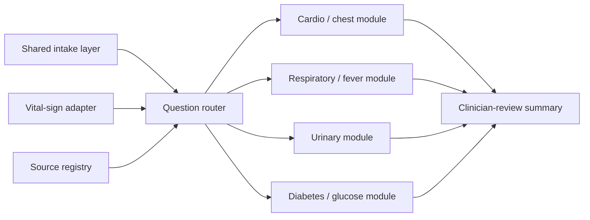

# 2026-05-15 慧誠 AI Triage 可行性討論完整會議資料包

Date: `2026-05-15`
Meeting time: `13:00-14:00 Asia/Taipei`
Meeting title: `AI triage 可行性討論`
Google Meet: `https://meet.google.com/cjk-iwzq-cmz`
Prepared for: Jason / Prof. Wu / 慧誠智醫 / 多寶醫師 / internal collaborators
Status: meeting-use packet; not clinical protocol, not production design, not
regulatory submission

## 0. Meeting Outcome To Get

The meeting should leave with one concrete decision:

```text
Are we building a June demo that shows iMVS vital signs can drive safer,
source-governed English symptom intake and clinician-review summaries?
```

If yes, the next work package should identify:

1. demo target: memo, clickable demo, or kiosk-adjacent demo;
2. target iMVS device / SKU / OS;
3. guaranteed vital fields;
4. whether synthetic iMVS-shaped values are acceptable;
5. first clinical frame: `家醫科 / 一般內科`, urgent-care / emergency-style
   triage support, or another bounded first scope;
6. clinical/product owner for source family, thresholds, red-flag wording, and
   output label.

## 1. First-Principles Frame

The scarce resource on Friday is not more feature detail. It is credibility:

- Can we answer 慧誠's explicit business/product question?
- Can we show that vital signs make their kiosk more valuable than a generic
  symptom chatbot?
- Can we avoid overclaiming diagnosis, autonomous triage, FDA clearance, or
  complete all-specialty clinical coverage?

Meeting order:

```text
慧誠 explicit needs
-> all-specialty modular architecture
-> vital-sign impact on questions and summary
-> source-governance / FDA boundary
-> 多寶醫師 clinical feasibility calibration
-> June demo decision
```

Supporting material order:

```text
慧誠 need
-> iMVS product/API facts
-> 多寶 clinical calibration
-> Prof. Wu GPT family-medicine hypothesis
-> 510(k) product-scope discipline
```

Do not invert the order by leading with `510(k)` or GPT thresholds.

## 2. Who Says What

| Person / group | Role in this meeting | What to avoid |
| --- | --- | --- |
| Jason | Present the bounded architecture, vital-to-question logic, source strategy, and June decision options. | Do not promise a same-day product sprint or completed all-specialty clinical system. |
| 慧誠 / Johnny Fang | Confirm product need, target device, available fields, integration mode, and June artifact. | Do not let discussion stay abstract without naming next artifact and owner. |
| Prof. Wu | Align the product direction and decide whether the demo should follow the family-medicine / general-internal-medicine hypothesis. | Do not treat GPT output as clinical evidence. |
| 多寶醫師 | Explain all-specialty clinical feasibility and judge whether `家醫科 / 一般內科` is the most feasible first demo frame. | Do not treat this as formal clinical sign-off for thresholds or output wording. |

## 3. 多寶醫師的會議段落

Jason's current hypothesis:

> `家醫科 / 一般內科` is likely more feasible than a direct all-specialty promise
> because it matches the kiosk's general vital-sign measurements and keeps the
> June demo broad enough for 慧誠 but bounded enough for source governance.

Ask 多寶醫師 directly:

```text
從醫師 workflow 的角度，第一版 June demo 應該先用家醫科 / 一般內科
門診前分流，還是急診 / urgent-care-style triage support？全科別應該
怎麼講成 modular roadmap，而不是已完成的 clinical claim？
```

Specific points for 多寶醫師:

1. Is all-specialty modular triage plausible as an architecture roadmap?
2. Is `家醫科 / 一般內科` the most feasible first product frame?
3. Should the first demo instead be urgent-care / emergency-triage support?
4. Which clinical gaps must remain explicitly unresolved after Friday?
   - threshold validation;
   - red-flag wording;
   - output label;
   - specialty-module roadmap;
   - clinician / company sign-off owner.

## 4. 60-90 Second Opening Script

Use this at the start:

```text
我今天把初步研究收斂在慧誠提出的三個問題：第一，全科別 AI triage
要怎麼模組化；第二，生理量測資料要怎麼影響問診和分析；第三，哪些
FDA 或醫學會資料可以支持這些 vital sign 對分析的影響。

我的短答案是：不要做一個大型 generic chatbot，而是保留一個 shared
intake / vital adapter / question router / source registry core，然後用
specialty modules 擴充。vital signs 應該改變下一題優先順序、red-flag
prompt、以及 clinician-review summary 的重點，但 v0 不應該做診斷、
治療建議、final ESI level 或 autonomous triage decision。

對六月 demo，我目前建議先做 demo-only 的 English vital-aware intake
workflow：用 synthetic 或 API-shaped iMVS vital payload，加上 source-
governed question routing，最後產出 staff / clinician review summary。
今天最需要決定的是：第一個臨床 frame 要走家醫科 / 一般內科、urgent
care / emergency-style support，還是只先講 modular roadmap。
```

## 5. 20-Minute Core Agenda

Use this if time is tight.

| Time | Segment | Output |
| --- | --- | --- |
| 0-2 min | Confirm 慧誠's ask | We are answering modular method, vital integration, and source examples. |
| 2-6 min | Architecture | AI starts after iMVS measurement with an API-shaped vital payload. |
| 6-10 min | All-specialty method | Shared core plus specialty modules; all-specialty is roadmap, not completed claim. |
| 10-13 min | 多寶醫師 feasibility check | Choose likely first frame: `家醫科 / 一般內科` vs urgent-care / emergency-style support. |
| 13-17 min | Vital impact + source boundary | Vitals change question priority and summary; FDA is boundary, clinical sources govern question logic. |
| 17-20 min | Minimum decisions | Target device, guaranteed fields, synthetic payload, output wording owner, next artifact. |

## 6. 60-Minute Full Agenda

| Time | Segment | Output |
| --- | --- | --- |
| 0-5 min | Restate need and June business goal | Agree this is market / product capability demo, not production clinical triage. |
| 5-12 min | iMVS insertion point | AI starts after measurement; no v0 HIS / EMR writeback. |
| 12-22 min | Modular all-specialty architecture | Shared core plus specialty modules. |
| 22-32 min | 多寶醫師 clinical feasibility check | Decide whether family medicine / general internal medicine is the first credible demo frame. |
| 32-42 min | Vital-to-question matrix | BP, SpO2, Temp, HR, respiration, BMI, optional glucose each get a demo-safe role. |
| 42-50 min | Source strategy | FDA boundary vs ESI / AHA / CDC / ADA / AUA / local protocol question logic. |
| 50-57 min | June demo options | Memo, clickable mock, or kiosk-adjacent demo. |
| 57-60 min | Close | Confirm next artifact, owner, and open gates. |

## 7. Five-Slide Talking Track

### Slide 1 - Friday Questions And Short Answer

```text
Use one shared triage core plus specialty modules. Add measured vital signs
after iMVS measurement. Use authoritative sources for question families and
review signals. Keep v0 as triage support, not diagnosis.
```

Key bullets:

- 慧誠 already has a measurement workflow.
- AI should start after measurement, not replace the kiosk workflow.
- Full all-specialty coverage should be modular.
- Vitals should change question priority and review-summary emphasis.
- 多寶醫師 should calibrate whether `家醫科 / 一般內科` is the best first frame.

### Slide 2 - Modular All-Specialty Method



Safe claim:

```text
All-specialty-capable architecture, not complete all-specialty clinical
coverage.
```

### Slide 3 - How Vital Signs Change Analysis

| Vital data | v0 effect | Safe example |
| --- | --- | --- |
| BP | Prioritize cardiovascular / neurologic red-flag questions. | High BP plus chest pain, dyspnea, weakness, numbness, vision/speech change. |
| SpO2 | Prioritize respiratory / cardiopulmonary questions. | Low SpO2 plus dyspnea, chest pain, cough, or distress. |
| Temp | Route toward fever, infection, dehydration, respiratory, or urinary follow-up. | Fever plus confusion, weakness, cough, urinary symptoms, reduced urination. |
| HR / respiration | Add physiologic-instability context with symptoms and other vitals. | Fast HR plus fever, chest pain, dyspnea, low BP, or low SpO2. |
| BMI / height / weight | Add chronic/metabolic context; not urgent trigger alone. | Summary context only unless reviewed specialty logic exists. |
| Glucose | Optional metabolic branch if available. | Confusion, weakness, sweating, vomiting, dyspnea, medication/meal timing. |

Boundary:

```text
Vitals modify question priority, review signals, and summary structure.
They do not create autonomous diagnosis, treatment advice, final ESI level, or
automatic emergency order.
```

### Slide 4 - Source Strategy

| Need | Source family | Use |
| --- | --- | --- |
| Software / intended-use boundary | FDA CDS / Digital Health Policy Navigator / 510(k) summaries | Keep claims reviewable and non-autonomous. |
| Emergency triage framing | ESI / emergency medicine | Explain why vitals can change review concern. |
| BP / cardiovascular warnings | AHA | Example red-flag families. |
| Fever / respiratory warnings | CDC / public-health / ID sources | Example warning-sign families. |
| Glucose symptoms | ADA | Optional diabetes / metabolic branch. |
| Urinary symptoms | AUA / local protocol | Urinary branch only; not broad ED triage. |
| Final wording | Hospital / company / clinician protocol | Required before production or customer-facing claims. |

### Slide 5 - Minimum Decisions From 慧誠

1. Which June artifact is needed: memo, clickable demo, or kiosk-adjacent demo?
2. Which iMVS device / SKU / OS is the target?
3. Which vital fields are guaranteed?
4. Can v0 use synthetic iMVS-shaped values?
5. What output label is acceptable?
   - `triage-support summary`
   - `staff-review suggestion`
   - `clinician-review summary`
   - other company-approved wording
6. Who signs off on source family, thresholds, and red-flag wording?
7. Does 慧誠 have a US partner product, competitor, or `510(k)` reference for
   comparator scanning?

## 8. Company Questions To Ask

Product / integration:

1. Which iMVS SKU should represent June?
2. Is the runtime Windows, Android, browser-only, embedded webview, or linked
   external page?
3. Should AI run after measurement but before upload, after upload, or only on
   a demo report screen?
4. Can we use synthetic iMVS-shaped payloads?
5. Which fields are guaranteed: `NBP`, `SPO2`, `HR`, `Temp`, `Glucose`,
   `Height`, `Weight`, `BMI`?

Clinical / source:

6. Should the first clinical frame be `家醫科 / 一般內科`, urgent-care /
   emergency-style triage support, or another bounded scope?
7. Who approves threshold and red-flag wording?
8. Should source logic follow ESI, medical societies, public-health guidance,
   hospital/customer protocol, or clinician-authored content?
9. Are there source families that 慧誠 cannot use in customer-facing material?

Business / June demo:

10. Is the June need internal alignment, US customer demo, or integration
    planning?
11. Does the demo need to run on the kiosk device, or is a web/clickable mock
    enough?
12. What is the smallest output that helps 慧誠 before the June customer moment?

Regulatory / comparator:

13. Is there a named US partner product, competitor, or `510(k)` number?
14. Should we compare against CareRoute only as UX/commercial reference, or is
    there another clinical triage product to scan?

## 9. Safe Language

Use:

- `vital-aware intake workflow`
- `triage-support summary`
- `staff / clinician review`
- `source-governed question routing`
- `demo-only synthetic vital payload`
- `market / product capability demo`
- `requires clinical sign-off before production`

Avoid:

- `diagnosis`
- `AI decides emergency level`
- `FDA-approved`
- `FDA-cleared`
- `510(k)-cleared demo`
- `predicate-equivalent`
- `clinical-grade triage`
- `automatic ED referral`
- `production HIS / EMR writeback`
- `complete all-specialty clinical coverage`

## 10. Current Hallucination / Evidence Boundary

Safe current statements:

- Current repo materials do not claim FDA clearance, clinical validation,
  production readiness, diagnosis, or autonomous triage.
- Prof. Wu's GPT DOCX is useful as a design hypothesis, especially the
  `家醫科 / 一般內科` framing, but not as clinical authority.
- 多寶's input is clinical calibration, not formal sign-off.
- The `510(k)` scan method is ready, but a real comparator product or number is
  still needed before any predicate-style discussion.
- Vital-sign thresholds and red-flag wording remain `clinician-signoff-needed`.

Unsafe statements:

- "We already have all-specialty clinical triage."
- "The kiosk can calculate ESI."
- "The GPT thresholds can go directly into the rule engine."
- "The demo is similar enough to an FDA-cleared product."
- "The AI can tell the patient whether to go to the ER."

## 11. Recommended Friday Position

Say this if the meeting needs a clean recommendation:

```text
For June, I recommend a controlled capability demo: English symptom intake,
synthetic or API-shaped iMVS vital data, source-governed question routing, and
a clinician-review summary. The first clinical frame should probably be 家醫科 /
一般內科 or urgent-care-style internal medicine, pending 多寶醫師's correction.
All-specialty should be presented as a modular roadmap, not as finished
clinical coverage.
```

## 12. After-Meeting Output Template

Fill this immediately after the meeting.

```markdown
# 2026-05-15 慧誠 AI Triage Meeting Notes

## Attendees
-

## Decisions
- June artifact:
- First clinical frame:
- Target device / OS:
- Guaranteed vital fields:
- Synthetic payload allowed:
- Output wording:
- Clinical/source owner:
- Comparator / 510(k) reference:

## 多寶醫師 Clinical Calibration
- All-specialty feasibility:
- 家醫科 / 一般內科 suitability:
- Urgent-care / emergency-style alternative:
- Required clinical gates:

## 慧誠 Clarifications
- Product / integration:
- Clinical / source:
- Business / June demo:
- Regulatory / comparator:

## Next Work Package
- Owner:
- Due:
- Artifact:
- Boundary:

## Claims We Must Not Make Yet
-
```

## 13. Appendix Map

Use the appendix files only when needed:

| Need | File |
| --- | --- |
| Main talking track | `handoff/2026-05-15-friday-discussion-brief.md` |
| Need-fit and meeting flow | `handoff/2026-05-15-imedtac-need-fit-meeting-execution-plan.md` |
| Vital-to-question and source governance | `handoff/2026-05-15-vital-aware-triage-feasibility-source-governance.md` |
| Source registry and example flows | `handoff/2026-05-15-source-registry-and-example-flows.md` |
| Hallucination/source-grounding audit | `handoff/2026-05-15-hallucination-and-source-grounding-audit.md` |
| First-principles gap audit | `handoff/2026-05-15-first-principles-gap-audit-and-action-plan.md` |
| Company material analysis | `docs/2026-05-12-imedtac-materials-analysis.md` |
| Source index | `docs/source-index.md` |
| Prof. Wu instruction register | `docs/wu-instruction-register.md` |
