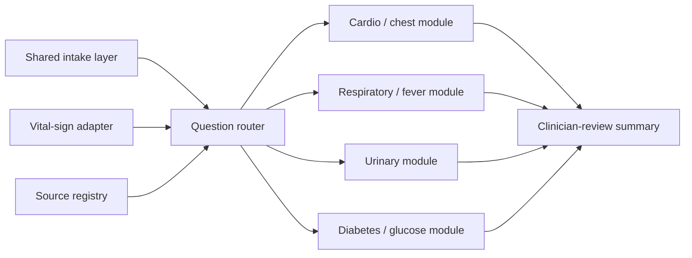

# Friday Discussion Brief - Company Questions Only

Date: 2026-05-15 discussion draft
Primary use: answer 慧誠's Friday action-item questions without opening extra
scope.
Status: main meeting talking track; supplemental notes are used only if asked.

Related supplemental artifacts:

- `handoff/2026-05-15-imedtac-need-fit-meeting-execution-plan.md`
- `handoff/2026-05-15-vital-aware-triage-feasibility-source-governance.md`
- `handoff/2026-05-15-source-registry-and-example-flows.md`
- `handoff/2026-05-15-first-principles-gap-audit-and-action-plan.md`
- `handoff/reviewer-packet/`

## Pre-Meeting Completion Checklist

Before Friday `2026-05-15 13:00`, finish only the material needed to answer
慧誠's explicit meeting ask:

- a `60-90` second opening answer;
- this five-section / five-slide talking track;
- the vital-sign-to-question priority matrix;
- 多寶's physician calibration: emergency / internal-medicine-style triage is
  the strongest vital-sign story; urology is a structured-intake reference with
  more limited vital-sign impact;
- 多寶醫師's meeting role: explain all-specialty clinical feasibility and
  evaluate whether Prof. Wu's `家醫科 / 一般內科` proposal is the most feasible
  first demo frame;
- six clarifying questions for 慧誠;
- 多寶 invite/logistics.
- the need-fit execution plan that keeps `510(k)` and Prof. Wu's GPT DOCX
  subordinate to 慧誠's Friday ask.

Do not prepare a full prototype, broad `510(k)` package, invented clinical
thresholds, production clinical rules, or complete all-specialty coverage claim
before the meeting.

## Meeting Rule

Friday should answer the questions 慧誠 explicitly asked in Johnny Fang's
`2026-05-12 15:10` follow-up email. Do not lead with prototype status,
`510(k)` predicate discussion, go/no-go governance, data lifecycle, or broad
regulatory framing unless they ask.

Need-fit check after adding Prof. Wu's `2026-05-14` GPT product-design DOCX:

- The main Friday deliverable must still be 慧誠-facing: all-specialty modular
  method, physiological-data integration, AI model/workflow integration, and
  FDA / medical-society examples for how vital data affects analysis.
- The `510(k)` scan is useful as product-scope discipline and intended-use
  boundary, but it should stay supplemental unless 慧誠 asks about comparator
  products, US customer positioning, or FDA pathway.
- Prof. Wu's GPT DOCX is useful as a design hypothesis: family medicine /
  general internal medicine, 10-question intake, LLM plus rule-engine split,
  four-level routing, and draft adult threshold candidates. It should not be
  presented as clinical authority.
- The combined use is: `510(k)` constrains what the demo may claim; the GPT
  DOCX suggests what the demo could look like; 慧誠's meeting ask determines
  what we actually present on Friday.

Meeting logistics update from Johnny Fang's `2026-05-13` LINE:

- Discussion window: Friday `2026-05-15 13:00-14:00` Asia/Taipei.
- Meeting title: `AI triage 可行性討論`.
- Google Meet: `https://meet.google.com/cjk-iwzq-cmz`.
- Dial-in: `(US) +1 443-399-3920`, PIN `662 881 369#`.
- Topic wording from LINE: technical evaluation for adding physiological data
  and covering all specialties based on the current development baseline.
- 多寶 should be invited because he is a physician and is interested in the
  project. Send him the Meet link through a confirmed route, or ask Johnny to
  include 多寶 if official attendee control matters.
- Updated Jason request on `2026-05-14`: 多寶醫師 should be invited to the
  Friday afternoon meeting and should be asked to cover two points: whether the
  all-specialty direction is clinically feasible, and whether the `家醫科 /
  一般內科` proposal from Prof. Wu's GPT DOCX is the better first scope.
  Jason's pre-meeting view is that `家醫科 / 一般內科` is likely more feasible
  than a direct all-specialty promise; treat this as a hypothesis for 多寶醫師
  to validate, revise, or reject.

Clinical calibration from 多寶's `2026-05-13` LINE:

- Vital signs make emergency triage the strongest first use case.
- Triage uses both history taking and vital signs; unstable vital signs can
  directly raise urgency and may matter more than the questionnaire.
- Urology is a useful structured-intake reference, but many urology diseases
  have limited vital-sign impact.
- Core vital signs to keep explicit: heart rate, respiration, blood pressure,
  and temperature.
- Friday should avoid one-size-fits-all specialty claims and should narrow one
  emergency / internal-medicine-style flow before all-specialty expansion.

The main answer should stay on three questions:

1. How should an all-specialty AI triage system be modularized?
2. How can physiological data be integrated into triage analysis?
3. What FDA or medical-society examples show how specific vital data affects
   analysis?

Add one clinical-calibration question for 多寶醫師 before closing:

```text
From a physician workflow perspective, should the first June demo be framed as
family medicine / general internal medicine triage support, urgent-care /
emergency-triage support, or a broader all-specialty modular roadmap?
```

## Opening Answer

Use this as the first 60-90 seconds:

> I focused the initial research on your Friday questions: all-specialty modular
> triage architecture, how vital-sign data changes analysis, and which FDA or
> medical-society source families can support the logic. My short answer is:
> keep one shared intake and routing core, add specialty modules as source-
> governed question sets, and let measured vitals change question priority and
> clinician-review summary wording. The v0 should remain triage support, not
> diagnosis or autonomous acuity decision.

Then move directly into the three answers below.

## 20-Minute Meeting Structure

| Time | Topic | Desired outcome |
| --- | --- | --- |
| 0-2 min | Restate their Friday questions | Confirm we are answering the requested action item. |
| 2-7 min | Q1: modular all-specialty method | Align on shared core plus specialty modules. |
| 7-11 min | 多寶 clinical feasibility check | Ask whether `家醫科 / 一般內科` is the more feasible first frame and how to explain all-specialty as a roadmap. |
| 11-15 min | Q2: physiological-data impact | Show how BP, SpO2, Temp, HR, BMI, and Glucose affect question priority and review summary. |
| 15-18 min | Q3: source examples | Separate FDA boundary sources from medical-society / emergency-medicine question sources. |
| 18-20 min | Clarifications needed | Ask only the minimum questions needed to continue: target device, guaranteed fields, source owner, output wording. |

If time is only 10 minutes: answer Q1, ask 多寶醫師 for the first-scope
clinical calibration, then compress Q2/Q3 into one vital-impact/source-boundary
answer and skip all supplemental notes.

## Slide Outline

### Slide 1 - Friday Questions And Short Answer

Title:

```text
AI Triage With Vital Signs: Friday Initial Research Answer
```

Main message:

```text
Use a shared triage core plus specialty modules. Add measured vital signs after
iMVS measurement. Use authoritative sources for question families and review
signals. Keep v0 as triage support, not diagnosis.
```

Bullets:

- 慧誠 already has measurement workflow and vital-sign payloads.
- The AI layer should start after measurement, not replace the kiosk workflow.
- Full all-specialty coverage should be modular, not one huge prompt/database.
- Vitals should change question priority and staff/clinician review summaries.
- The strongest first vital-sign story is emergency / internal-medicine-style
  triage support; urology is less vital-sign-driven and should be framed as a
  structured-intake reference.
- FDA helps define software/intended-use boundaries; clinical question logic
  needs emergency medicine, medical society, public-health, or local protocol
  sources.

### Slide 2 - Q1: Modular All-Specialty Method

Answer:

```text
Build one shared core, then attach specialty/symptom modules.
```

Architecture:



Key points:

- Shared core: identity/demo session, chief complaint, answer state, vital
  adapter, question router, source registry, summary format.
- Specialty modules: cardiovascular, respiratory/fever, urinary, diabetes /
  glucose, and future modules.
- Each module owns question rows, source IDs, vital triggers, clinical purpose,
  evidence status, and review owner.
- This is all-specialty-capable architecture, not a claim of complete
  all-specialty clinical coverage.

### Slide 3 - Q2: How Physiological Data Changes Analysis

Answer:

```text
Vital signs should change what the system asks next and what the reviewer sees.
They should not independently diagnose or decide final triage level in v0.
```

| Vital data | v0 analysis effect | Safe Friday example |
| --- | --- | --- |
| BP | Prioritize cardiovascular / neurologic red-flag questions and review wording. | Very high BP plus chest pain, dyspnea, weakness, numbness, vision/speech change. |
| SpO2 | Prioritize respiratory / cardiopulmonary questions and clinician-review flag. | Low oxygenation plus dyspnea, chest pain, cough, or distress. |
| Temperature | Route toward fever, infection, systemic-risk, dehydration, respiratory, or urinary follow-up. | Fever plus urinary symptoms, cough, confusion, weakness, or reduced urination. |
| HR | Add physiologic-instability context when combined with symptoms and other vitals. | HR plus fever, chest pain, dyspnea, low BP, or low SpO2. |
| Respiration | Treat respiratory status as a core clinical signal if measured or observed; connect to dyspnea/distress review. | Respiratory distress plus low SpO2, fever, chest pain, or abnormal HR/BP. |
| BMI / height / weight | Add context in clinician summary; not an urgent trigger by itself. | Chronic/metabolic context or specialty-module context. |
| Glucose | Optional metabolic branch if available. | Confusion, weakness, sweating, nausea/vomiting, dyspnea, medication/meal timing. |

Boundary:

```text
Vitals modify question priority, review signals, and summary structure.
They do not create autonomous diagnosis, treatment advice, final ESI level, or
automatic emergency order.
```

### Slide 4 - Q3: FDA / Medical-Society Source Strategy

Answer:

```text
Use FDA for software boundary and intended-use discipline. Use medical society,
emergency medicine, public-health, or local clinical sources for symptom and
vital-question logic.
```

| Need | Source family | Friday use |
| --- | --- | --- |
| Software / intended-use boundary | FDA CDS guidance, FDA Digital Health Policy Navigator | Explain why output should be reviewable support, not opaque autonomous triage. |
| All-specialty / emergency triage framing | ESI / emergency medicine framework | Support the idea that vital signs can affect acuity or review concern. |
| High BP + warning symptoms | AHA high-blood-pressure emergency guidance | Example for BP plus chest pain, dyspnea, neuro/vision/speech symptoms. |
| Chest-pain warning signs | AHA heart attack / ACS warning-sign family | Example for radiation, shortness of breath, sweating, nausea, lightheadedness. |
| Fever / respiratory warning signs | CDC / public-health or ID sources | Example for difficulty breathing, chest pain, confusion, dehydration, worsening symptoms. |
| Glucose symptoms | ADA hypo/hyperglycemia guidance | Example for confusion, weakness, sweating, nausea/vomiting, dyspnea. |
| Local threshold and wording | Hospital / company protocol, clinician sign-off | Final authority for exact wording, threshold, and workflow behavior. |

### Slide 5 - Minimum Questions To Ask 慧誠

Ask only what is needed to continue the requested research path:

1. Which iMVS device / SKU is the first target?
2. Which measured fields are guaranteed: BP, SpO2, HR, Temp, Height, Weight,
   BMI, Glucose?
3. Can v0 use synthetic iMVS-shaped values for examples and demo planning?
4. Which source family should control all-specialty urgent-care wording: ESI,
   medical societies, customer protocol, or clinician-authored content?
5. Who signs off on vital thresholds and red-flag wording?
6. For June, do they need a memo/slide answer only, or a small clickable demo
   after this research direction is accepted?

Do not ask about `510(k)` comparator, data lifecycle, go/no-go packet, or
prototype implementation unless they raise those topics.

## Supplemental Notes - Use Only If Asked

### If They Ask About FDA / 510(k)

Say:

> FDA is useful for intended-use, CDS boundary, transparency, and comparable
> product-scope discipline. FDA is not the main source for symptom-question
> wording. If you have a US partner product, competitor, or `510(k)` reference,
> we can extract its indications, functions, limitations, and safe wording as a
> supplement.

Do not lead with this unless they ask about FDA product scope.

### If They Ask For A Prototype Immediately

Say:

> A small demo is possible after we agree on the source-governed flow. For v0 I
> would keep it synthetic-payload only, deterministic, two flows only, and
> clinician-review summary only.

Do not make prototype status the main Friday topic.

### If They Ask About Safety / Governance

Say:

> The safe boundary is triage support: no diagnosis, no treatment advice, no
> final ESI level, no autonomous emergency order, no real patient data, and no
> production HIS/EMR writeback.

Use the reviewer packet only if the discussion moves toward customer-facing demo
approval.

### If They Ask About Basic Hardware / Cloud Cost

Say:

> The architecture can be low-cost because the first v0 does not require a large
> generative model to decide clinical routing. The core can be deterministic:
> vital adapter, symptom state, source-governed question router, and summary
> template. ASR can remain optional or staged.

## Follow-Up Email Draft

Subject:

```text
Friday follow-up: modular AI triage and vital-sign integration
```

Body:

```text
Hi all,

For Friday, I focused the initial research on the questions raised in the
follow-up note:

1. How to structure an all-specialty AI triage system as modular components.
2. How physiological data can be integrated into the analysis.
3. Which FDA or medical-society source families can support the effect of
   specific vital data.

My current recommendation is:

- Use one shared intake / routing core, then attach specialty modules.
- Insert the AI layer after iMVS measurement completes.
- Let vitals affect question priority, review signals, and clinician-summary
  wording.
- Keep v0 as triage support, not diagnosis, treatment advice, or final triage
  level.
- Use FDA for software / intended-use boundary, and use emergency medicine,
  medical society, public-health, or local clinical protocols for question
  logic.

The minimum decisions needed from 慧誠 are target device, guaranteed vital
fields, whether synthetic iMVS-shaped values are acceptable for v0, which source
family should control urgent-care wording, and who signs off on thresholds /
red-flag wording.

Best,
Jason
```
