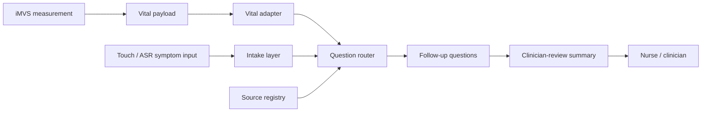

# Friday Discussion Brief - Vital-Aware AI Triage

Date: 2026-05-15 discussion draft  
Related artifacts:

- `handoff/2026-05-15-vital-aware-triage-feasibility-source-governance.md`
- `handoff/2026-05-15-source-registry-and-example-flows.md`

Status: meeting brief and talking track; safe for internal alignment before any
external/customer-facing version.

## One-Sentence Position

慧誠智醫's iMVS kiosk can become more than a generic symptom checker if measured
vital signs are used to prioritize follow-up questions and produce a
clinician-review summary, but the first rigorous step is source governance and
workflow feasibility, not a prototype, not autonomous triage, and not an FDA
clearance memo.

## Opening Answer

For Friday, I would open with this:

> We should not start by claiming that AI can decide triage level. The feasible
> and defensible first step is a vital-aware triage-support workflow. iMVS
> already measures BP, SpO2, HR, temperature, height/weight/BMI, and optionally
> glucose. Those measurements can change question priority and review wording.
> FDA helps define the CDS / intended-use / transparency boundary, while the
> clinical question logic should be governed by ESI, AHA/ACC, CDC, ADA, AUA or
> other specialty sources, plus local clinician/company sign-off.

Then show the architecture and the source-governance matrix.

## Recommended Meeting Goal

Do not try to decide the whole product in this meeting.

The goal should be to get agreement on five decisions:

1. v0 is triage support, not diagnosis.
2. v0 inserts after iMVS measurement completes.
3. v0 can use synthetic iMVS-shaped payloads for June demo planning.
4. v0 question logic must use source registry rows and clinical sign-off.
5. v0 output is a clinician-review summary, not an ESI score or final acuity
   decision.

## 20-Minute Meeting Structure

| Time | Topic | Desired outcome |
| --- | --- | --- |
| 0-3 min | Executive framing | Align that this is feasibility/source governance, not prototype/FDA memo. |
| 3-6 min | Architecture insertion point | Confirm after-measurement workflow and synthetic payload boundary. |
| 6-11 min | Vital-to-question matrix | Confirm which measured fields matter for v0. |
| 11-15 min | Source governance | Confirm FDA vs clinical-source division. |
| 15-18 min | Example flows | Walk through chest pain/high BP/SpO2 and fever/urinary examples. |
| 18-20 min | Decisions needed | Confirm target SKU, guaranteed fields, wording, reviewer, and next artifact. |

If time is only 10 minutes, skip the source registry details and show only the
architecture, vital matrix, and decision requests.

## Slide Outline

### Slide 1 - Core Answer

Title:

```text
Vital-Aware AI Triage: Feasibility And Source Governance
```

Main message:

```text
Measured vitals can change AI follow-up questions and review summaries.
They should not create autonomous diagnosis or final triage decisions in v0.
```

Bullets:

- iMVS already has a measurement-centered workflow.
- AI should enter after measurement.
- Output should support nurse/clinician review.
- Clinical logic requires source provenance and sign-off.

Speaker note:

> The value is not "chatbot in a kiosk." The value is a vital-aware intake and
> review workflow that uses 慧誠's existing hardware advantage.

### Slide 2 - Architecture Insertion Point

Diagram:



Bullets:

- Start after measurement completes.
- Use synthetic iMVS-shaped payload for v0.
- Keep output read-only/report-only for first demo.
- No HIS/EMR writeback claim in v0.

Speaker note:

> The safest insertion point is after vital measurement, before any permanent
> clinical record writeback or treatment instruction.

### Slide 3 - What Vitals Change

Table:

| Vital | v0 effect | Boundary |
| --- | --- | --- |
| BP | prioritize cardiovascular/neurologic red flags | threshold needs sign-off |
| SpO2 | prioritize respiratory/cardiopulmonary review | exact rule needs sign-off |
| Temp | route fever/infection/systemic questions | source mapping needed |
| HR | instability context with symptoms/other vitals | not standalone rule |
| BMI/weight | context in summary | not urgent trigger in v0 |
| Glucose | optional metabolic branch | only if field available |

Speaker note:

> The claim is not that each vital independently decides triage. The claim is
> that vitals change what the system asks next and what the clinician sees.

### Slide 4 - Source Governance

Table:

| Question | Right source |
| --- | --- |
| Is this CDS / software risk / intended use? | FDA |
| Should vitals affect ED review priority? | ESI / emergency triage framework |
| Which cardiovascular red flags matter? | AHA / ACC / emergency medicine |
| Which fever/respiratory warning signs matter? | CDC / ID / local protocol |
| Which glucose symptoms matter? | ADA / emergency protocol |
| What exact wording and threshold is allowed? | clinician/company sign-off |

Speaker note:

> FDA is essential for the software boundary, but FDA is not the source of the
> symptom questionnaire. This separation is the core governance answer.

### Slide 5 - Example Flow: Chest Pain + High BP / Low SpO2

Input:

```text
BP 188/122, SpO2 91%, HR 112
Chief concern: chest pressure
```

Questions prioritized:

- active chest pressure;
- radiation to arm/shoulder/back/neck/jaw/stomach;
- shortness of breath;
- weakness/numbness/vision/speech/lightheadedness;
- sudden onset, worsening, or at rest.

Output:

```text
Staff review suggested based on measured vitals plus reported symptoms.
Not diagnosis. Not treatment. Not final ESI level.
```

Speaker note:

> This demonstrates the product differentiator: measured vitals shape the
> questioning path and the review summary.

### Slide 6 - Example Flow: Fever + Urinary Or Respiratory Symptoms

Input:

```text
Temp 38.7 C, HR 108
Chief concern: fever and painful urination
```

Questions prioritized:

- fever/chills duration;
- dysuria/frequency/urgency;
- flank/back pain;
- vomiting, severe weakness, dizziness, confusion;
- shortness of breath, cough, chest pain;
- reduced urination or inability to keep fluids down.

Output:

```text
Review wording pending clinician/company sign-off.
Not diagnosis of UTI, pyelonephritis, sepsis, flu, or pneumonia.
```

Speaker note:

> Temperature does not diagnose infection. It chooses a safer branch of
> follow-up questions and flags what staff should review.

### Slide 7 - Decisions Needed From 慧誠

Questions:

1. Which iMVS SKU is the June demo target?
2. Which fields are guaranteed: BP, SpO2, HR, Temp, Height, Weight, BMI,
   Glucose?
3. Is synthetic payload acceptable for v0?
4. Should AI appear as same app, embedded page, link-out, or standalone demo?
5. What exact output wording is safe: "staff review suggested" or softer
   wording?
6. Who signs off on vital thresholds and question logic?
7. Does June need clickable mock, architecture memo, slides, or all three?

Speaker note:

> These are the questions that convert research into an implementation plan.

## Talking Points By Audience

### For Prof. Wu

Emphasize:

- clinical workflow first;
- source traceability;
- triage support, not diagnosis;
- clinician review;
- no overclaiming before data/sign-off.

Suggested wording:

> This keeps the work aligned with a clinical deployment mindset. We are not
> inventing triage rules. We are building the governance structure that lets
> company/device data, source-backed questions, and clinician review fit
> together.

### For 慧誠 Product / Business Side

Emphasize:

- differentiator versus generic symptom checker;
- measured vital signs as product advantage;
- June demo can be capability proof;
- synthetic payload avoids integration delay;
- output can be market-safe if wording stays bounded.

Suggested wording:

> The demo story is that 慧誠's kiosk already captures signals that ordinary
> symptom checkers do not. The AI layer uses those measured signals to ask
> better follow-up questions and produce a clearer staff-review summary.

### For Clinician Reviewer

Emphasize:

- every question has provenance;
- exact thresholds are not final;
- the system shows basis for review;
- local protocol can override source-family defaults.

Suggested wording:

> We are asking you to review whether these source families and question
> purposes are appropriate. We are not asking the system to independently make a
> clinical decision.

### For Engineering / Demo Builder

Emphasize:

- use synthetic payload;
- parse vitals cleanly;
- keep question router deterministic for first demo;
- show source IDs in clinician/debug view;
- no real patient data or live HIS/EMR writeback.

Suggested wording:

> The first implementation should be a deterministic source-governed workflow,
> not an open-ended medical chatbot.

## Decision Table For Friday

| Decision | Preferred answer | Why it matters | Owner |
| --- | --- | --- | --- |
| v0 intended use | Triage-support summary for clinician/staff review. | Avoid diagnosis/autonomous triage claim. | Prof. Wu / company. |
| insertion point | After iMVS measurement completes. | Uses measured vitals and avoids disrupting login/measurement. | Company product/engineering. |
| data mode | Synthetic iMVS-shaped payload for first demo. | Avoids real patient data and integration delay. | Company engineering. |
| output wording | "Staff review suggested" or softer approved wording. | Controls safety and regulatory boundary. | Clinician/company. |
| source method | FDA for software boundary; ESI/AHA/CDC/ADA/AUA/local protocol for clinical question families. | Prevents treating FDA as symptom-question source. | Clinical/research lead. |
| first flows | Chest pain/vital red flags and fever/urinary or respiratory symptoms. | Enough to demonstrate vital-aware value without broad all-specialty overclaim. | Project team. |
| June artifact | Clickable mock only if requested; otherwise memo + architecture + source matrix. | Keeps work bounded before sign-off. | Company/business. |

## Recommended Next Work After Friday

If Friday confirms the source-governance direction:

1. Build a small `source_registry.csv` or JSON file with source IDs, source
   names, URLs, dates, and allowed-use notes.
2. Build `question_registry.csv` with `question_id`, `patient_text`,
   `trigger_vital`, `trigger_symptom`, `source_id`, `status`, and
   `review_owner`.
3. Implement only two deterministic demo flows:
   - chest pain + BP/SpO2/HR;
   - fever + urinary/respiratory symptoms.
4. Generate a static clinician-review summary from synthetic payloads.
5. Keep ASR optional; touch input is enough for the first governed demo.

If Friday asks for a clickable June demo:

1. Make it a browser-only prototype.
2. Use no real patient data.
3. Keep payloads under `demo/fixtures/`.
4. Add visible "demo only; not diagnosis" boundary in clinician output.
5. Put source IDs in a reviewer/debug panel.

If Friday asks for more clinical rigor before demo:

1. Stop prototype work.
2. Expand the source registry.
3. Ask for named clinician reviewer.
4. Convert each branch into question-provenance rows.
5. Do not invent thresholds.

## Follow-Up Email Draft

Subject:

```text
Follow-up: vital-aware AI triage feasibility and source-governance direction
```

Body:

```text
Hi all,

For Friday's discussion, my current recommendation is to frame the first
deliverable as a vital-aware AI triage feasibility and source-governance
artifact, not as a prototype or full FDA memo.

The proposed v0 direction is:

1. Use iMVS measurement completion as the AI insertion point.
2. Consume an iMVS-shaped vital payload, initially synthetic for demo safety.
3. Use measured vitals to prioritize follow-up questions and produce a
   clinician-review summary.
4. Keep the output as triage support, not diagnosis, treatment advice, or final
   triage level.
5. Use FDA for CDS / intended-use / software-risk / transparency boundaries.
6. Use ESI, AHA/ACC, CDC, ADA, AUA or other specialty / hospital protocol
   sources for question families and vital-trigger interpretation.
7. Require clinician/company sign-off for exact thresholds and output wording.

The two suggested example flows for review are:

- chest pain with high BP / low SpO2 context;
- fever with urinary or respiratory symptoms.

The key decisions needed from 慧誠 are target SKU, guaranteed measured fields,
demo integration mode, acceptable output wording, and the clinical reviewer /
sign-off owner.

Best,
Jason
```

## What To Say If They Ask About FDA

Short answer:

> FDA is important, but not as the source of the symptom questionnaire. FDA is
> where we check intended use, CDS boundary, whether the clinician can
> independently review the basis, whether the software is directive or
> time-critical, and whether claims create device-risk concerns.

Longer answer:

> For the clinical content, FDA helps us avoid overclaiming, but the actual
> question logic should come from clinical and professional sources. For example,
> ESI supports the general role of vital signs in triage acuity review; AHA
> supports cardiovascular and high-BP warning-sign families; CDC supports
> fever/respiratory emergency warning-sign families; ADA supports glucose symptom
> families; and local protocol/clinician review decides exact wording and
> thresholds.

## What To Say If They Ask For A Prototype Immediately

Recommended answer:

> A small prototype is possible, but it should be a synthetic-payload,
> deterministic demo after the source-governance rows are agreed. If we build
> before agreeing on source status and output wording, the prototype may
> accidentally imply clinical claims that we do not want to make.

Acceptable prototype scope:

- browser-only;
- synthetic iMVS payload;
- two flows only;
- no diagnosis;
- no final acuity score;
- no real patient data;
- clinician-review summary only;
- source IDs visible.

## What To Say If They Want All-Specialty Coverage

Recommended answer:

> All-specialty coverage should be a modular architecture goal, not a Friday
> claim. The shared infrastructure can be all-specialty: vital adapter, intake
> layer, question router, source registry, and summary format. Each specialty
> module then needs its own source rows and review owner.

Good near-term phrasing:

```text
The v0 system is all-specialty-capable in architecture, but only selected
symptom/vital flows are source-mapped for the first demo.
```

Avoid:

```text
The system already performs all-specialty clinical triage.
```

## Final Meeting Close

Close with:

> If we agree on this source-governed direction, the next concrete deliverable
> is either a slide/memo package for the June customer conversation or a small
> synthetic-payload browser demo with two governed flows. I would not recommend
> expanding to a general chatbot until the source registry and reviewer owner
> are in place.

