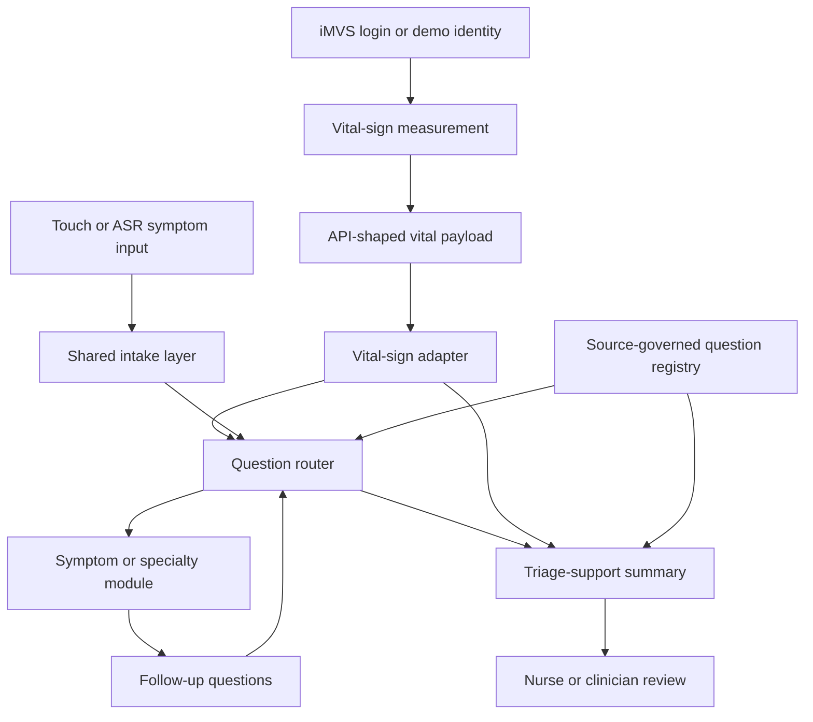

# Vital-Aware AI Triage Feasibility And Source Governance

Date: 2026-05-15 discussion package draft  
Prepared for: internal discussion with Prof. Wu / 慧誠智醫 / collaborators  
Status: feasibility and source-governance artifact, not prototype, not FDA memo

## Executive Answer

The strongest Friday answer is:

> 慧誠智醫's iMVS workflow can plausibly support a vital-aware AI triage-support
> layer, because measured vital signs can change question priority, red-flag
> routing, and clinician-review summaries. The first rigorous deliverable should
> be a source-governed workflow and vital-impact matrix, not autonomous diagnosis,
> not treatment advice, and not production triage.

The short-term artifact should prove four things:

1. The AI insertion point is after iMVS measurement completes.
2. Physiological data should influence follow-up questioning and summary
   framing.
3. FDA should be used for CDS / intended-use / software-risk / transparency
   boundaries, not as the primary source for patient symptom questions.
4. Question logic and vital-trigger interpretation need ESI, emergency medicine,
   specialty society guidance, public-health guidance, hospital protocol, or
   clinician/company sign-off.

## Scope Boundary

This artifact supports Friday discussion only.

It is not:

- a clinical guideline;
- a validated triage algorithm;
- a regulatory submission;
- an FDA clearance analysis;
- a production intended-use statement;
- an autonomous emergency referral system;
- a claim that LLM output can replace nurse or physician judgment.

Safe wording:

- "triage-support summary"
- "vital-sign-aware follow-up questions"
- "source-governed question routing"
- "clinician-review summary"
- "demo-only workflow feasibility"
- "requires clinical validation and sign-off before production use"

Avoid wording:

- "diagnosis"
- "AI decides acuity"
- "FDA-approved"
- "clinical-grade triage"
- "automatic emergency order"
- "production HIS / EMR writeback"
- "validated all-specialty triage model"

## Proposed Architecture

The preferred v0 insertion point is after measurement and before any clinical
claim or permanent medical-record writeback.



V0 should consume a synthetic payload shaped like the iMVS API document rather
than real hospital data. It should not write back to HIS / EMR in the first
demo.

## Modular Method Map

The all-specialty path should be modular at the governance layer, not only at
the software layer.

| Module | Responsibility | Friday claim | Production gate |
| --- | --- | --- | --- |
| Vital-sign adapter | Parse iMVS-style fields such as `NBP`, `SPO2`, `HR`, `Temp`, `Glucose`, `Height`, `Weight`; normalize units and missing values. | Feasible with synthetic payload. | Confirm target SKU, field availability, device units, parsing rules, abnormal-value handling. |
| Shared intake layer | Capture chief complaint, duration, severity, demographic context, and patient answer format by touch or ASR. | Feasible as workflow design. | Confirm language, ASR privacy, fallback UI, accessibility, and accepted patient-facing wording. |
| Question router | Decide which follow-up question is next based on symptom context plus vital context. | Feasible as source-governed routing. | Each branch needs source mapping and clinician review. |
| Source registry | Store source family, exact support text, version/date, question purpose, and review owner. | Required for rigor. | Must be maintained before customer-facing clinical claims. |
| Symptom/specialty modules | Add bounded question sets for chest pain, respiratory symptoms, fever/infection, urinary symptoms, diabetes/glucose, etc. | Start with a few examples, not full all-specialty coverage. | Specialty owner and clinical validation needed. |
| Summary generator | Produce clinician-readable triage-support summary with vitals, answers, source-backed red flags, and review-needed wording. | Feasible for demo. | Output wording, liability boundary, and human-review workflow need sign-off. |

## Vital-To-Question Impact Matrix

This matrix is the core Friday deliverable. It is a research planning artifact,
not production triage logic.

| Vital data | What it can change in v0 | Example question-routing impact | Example source family | Current evidence status | Sign-off needed |
| --- | --- | --- | --- | --- | --- |
| Blood pressure | Red-flag question priority, clinician-review wording, repeat-measure prompt, and summary emphasis. | Very high BP plus chest pain, dyspnea, weakness, numbness, vision change, or difficulty speaking should prioritize emergency red-flag questions instead of a long generic intake. | AHA high-blood-pressure emergency guidance; ESI high-risk framing; local ED protocol. | Source-backed for BP plus emergency symptoms; exact product thresholds and wording need review. | Clinician/company threshold owner; target-market emergency wording. |
| SpO2 | Respiratory/cardiopulmonary routing, shortened low-risk branch, clinician-review flag when concerning. | Low oxygenation plus dyspnea/chest pain/cough should prioritize respiratory distress, cyanosis, chest pain, duration, and immediate staff-review prompts. | ESI high-risk vital signs; emergency medicine protocol; respiratory specialty guidance. | Source-backed at ESI family level for SpO2 as high-risk vital sign; exact demo rule needs sign-off. | Whether to use ESI adult SpO2 threshold directly in demo wording; target patient population. |
| Temperature | Infection/systemic-risk routing, fever duration, exposure/source symptoms, dehydration, respiratory/urinary follow-up. | Fever plus cough/dyspnea/chest pain/confusion/dehydration/urinary symptoms should move toward infection or systemic-risk follow-up instead of routine symptom capture. | CDC emergency warning signs; IDSA or hospital infection protocol; AUA/urology source for urinary symptom context. | Source-family supported; individual branches still need exact source mapping. | Specialty owner for fever thresholds and urinary/respiratory branches. |
| Heart rate | Physiologic instability context when combined with symptoms and other vitals; summary emphasis. | Abnormal HR plus dizziness, chest pain, dyspnea, hypotension, fever, or low SpO2 should increase review priority and ask instability/red-flag questions. | ESI high-risk vital signs; emergency medicine protocol. | Source-backed at ESI family level; do not use HR alone as a standalone decision rule. | Clinician interpretation of age bands, device source, and repeat measurement. |
| BMI / height / weight | Context and risk summary; module selection for chronic/metabolic risk; not urgent routing by itself in v0. | Include BMI/weight in summary and risk context; avoid claiming urgent triage action unless tied to a specialty pathway and reviewed source. | Specialty guidance or local protocol. | Demo-context only. | Decide whether BMI appears in patient-facing text or clinician-only summary. |
| Glucose | Optional diabetes/metabolic branch; altered mental status, weakness, medication/meal timing, and emergency review prompts. | If glucose is available and abnormal or patient reports diabetes symptoms, ask about confusion, weakness, medication, meal timing, vomiting, dyspnea, and whether the patient can self-treat. | ADA hypoglycemia/hyperglycemia guidance; ESI immediate-intervention examples; local urgent-care protocol. | Source-backed for symptom families; optional iMVS field, so do not assume availability. | Confirm glucose device availability and whether point-of-care glucose can drive any routing in this demo. |

## FDA Boundary Table

FDA should be used to define the boundary of the software function and the
reviewability of recommendations. FDA should not be used as the main source for
which symptom question to ask.

| Governance question | FDA relevance | Friday interpretation |
| --- | --- | --- |
| What is the intended use? | FDA digital-health policy starts by identifying the intended use of each software function. | Keep intended use as demo triage support and clinician summary, not diagnosis or treatment direction. |
| Is it clinical decision support? | FDA Step 6 asks whether the function provides CDS. | Treat the AI layer as potentially CDS-like if it analyzes patient symptoms/vitals and offers review-relevant recommendations. |
| Is the output for clinicians or patients? | FDA's non-device CDS framing is narrower when recommendations are to health care professionals; patient/caregiver-facing functions are different. | Keep actionable interpretation in clinician-review output. Patient-facing text should be questions and neutral safety language. |
| Does the clinician see the basis? | FDA CDS FAQ and guidance emphasize that the HCP should not rely primarily on an opaque recommendation. | Summary should show vitals, patient answers, source family, and why review is suggested. |
| Is it time-critical or directive? | FDA Step 6 distinguishes recommendations/options from specific outputs or directives for diagnosis/treatment, especially time-critical use. | Avoid "AI says emergency"; use "staff review suggested based on measured vitals plus reported symptoms." |
| Does the product have multiple functions? | FDA recognizes multi-function products where some functions may be device functions and others may not be the focus. | Separate kiosk measurement, display/upload, AI question routing, and summary generation as distinct functions for analysis. |

## Source-Governance Table

| Source family | Use in this artifact | What it can support | What it cannot support yet |
| --- | --- | --- | --- |
| FDA CDS / Digital Health Policy Navigator | Intended-use, CDS, software-risk, transparency, independent-review boundary. | Product boundary and claim discipline. | Exact symptom-question content or vital thresholds for triage. |
| ENA Emergency Severity Index 5th edition | ED triage logic family, high-risk situation framing, vital-sign reassessment, HR/RR/SpO2 relevance. | Why vitals can change acuity/review priority in emergency triage. | Direct product rules without clinician/company approval and jurisdiction fit. |
| AHA / ACC / cardiovascular society guidance | BP and cardiovascular red-flag symptom family. | Why very high BP plus chest pain, dyspnea, neurologic/vision/speech symptoms should trigger urgent review questions. | All chest-pain triage logic; EKG interpretation; treatment recommendation. |
| CDC public-health guidance | Fever/infection warning signs and public-health symptom families. | Emergency warning signs such as breathing difficulty, chest/abdominal pain, confusion, dehydration/not urinating, worsening symptoms. | Full ED triage; specialty diagnosis; local thresholds. |
| ADA diabetes guidance | Glucose-related symptoms and self-care/emergency distinction. | Why glucose branch should ask about confusion, weakness, fast heartbeat, nausea, vomiting, dyspnea, medication/meal context. | Device-specific glucose routing without target SKU and clinician sign-off. |
| AUA / urology guidance | Urinary symptom branch and fever/flank-pain risk context. | Why fever/flank pain changes urinary-symptom review priority. | Broad all-specialty triage without exact guideline extraction. |
| Hospital / company protocol | Local workflow, threshold selection, output wording, escalation behavior. | Final demo wording and sign-off. | Cannot replace official-source mapping unless explicitly accepted as the controlling local protocol. |

## Example Provenance Rows

These examples show the table shape. They should not be treated as approved
clinical rules.

| Question or prompt | Trigger | Source family | Clinical purpose | Evidence status | Review owner |
| --- | --- | --- | --- | --- | --- |
| "Are you having chest pain, shortness of breath, weakness, numbness, vision changes, or difficulty speaking?" | Very high BP or cardiovascular complaint. | AHA high-BP emergency guidance; ESI high-risk framing. | Screen for symptoms that make BP context more urgent. | Source-backed family; exact wording needs review. | Clinician/company. |
| "Are you short of breath, having chest pain, or feeling unusually weak or confused?" | Low SpO2, respiratory complaint, fever, or chest complaint. | ESI SpO2/high-risk vital signs; CDC warning signs; respiratory guidance to verify. | Identify cardiopulmonary or systemic red flags. | Source-family plus ESI support; wording needs review. | Clinician/company. |
| "Do you have fever with urinary symptoms, back/flank pain, vomiting, weakness, or confusion?" | Fever plus urinary complaint or abnormal temperature. | AUA/urology, CDC/ID guidance, local protocol. | Distinguish routine urinary complaint from possible systemic/upper-tract concern needing review. | Source-family hypothesis. | Urology/emergency clinician. |
| "Do you have shakiness, sweating, confusion, fast heartbeat, dizziness, weakness, nausea, or vomiting?" | Glucose available and abnormal, diabetes history, or glucose-related complaint. | ADA hypoglycemia/hyperglycemia guidance; ESI severe hypoglycemia as emergency presentation. | Support metabolic branch and clinician summary. | Source-backed family; threshold needs review. | Clinician/company. |
| "Should staff review this patient before the patient leaves the kiosk area?" | Any red-flag answer or vital-context concern. | ESI clinician-review framing; local workflow. | Convert AI output into human-review workflow rather than autonomous action. | Governance-backed; workflow sign-off needed. | Company clinical/product owner. |

## Output Format Recommendation

For the June demo, the output should be a structured summary, not a final triage
level.

Recommended summary sections:

```text
Measured context
- BP: ...
- SpO2: ...
- HR: ...
- Temperature: ...
- Glucose: unavailable / ...

Patient-reported concern
- Chief concern: ...
- Duration: ...
- Key positive answers: ...
- Key negative answers: ...

Review signals
- Vital-sign context: ...
- Symptom/vital combinations requiring review: ...
- Source family used for question routing: ...

Suggested workflow
- Staff review suggested / routine review / insufficient information.
- Demo only; not diagnosis or treatment advice.
```

Avoid:

```text
Diagnosis: ...
Treatment: ...
ESI level: ...
Emergency order: ...
Patient should go to ED because AI says so.
```

## Friday Discussion Questions For 慧誠

Product and integration:

1. Which iMVS SKU is the June demo target: AIO, DKP, MOB, or another device?
2. Is the runtime target Windows, Android, browser-only, embedded webview, or a
   linked external page?
3. Should AI run after measurement but before hospital upload, after upload, or
   only as a demo report screen?
4. Can Friday and June use synthetic iMVS-shaped payloads?
5. Which fields are guaranteed: `NBP`, `SPO2`, `HR`, `Temp`, `Glucose`,
   `Height`, `Weight`, `BMI`?

Clinical governance:

6. Who is the review owner for threshold interpretation?
7. Which market's emergency wording should be used for the first English demo:
   US, Taiwan English, Singapore, Middle East, or generic non-jurisdictional?
8. Can we use ESI as the emergency-triage framework family, or should a hospital
   local protocol control the demo language?
9. Are we allowed to show source-family names in the clinician-facing summary?
10. Is the demo allowed to say "staff review suggested," or should it only say
    "review signal present"?

Business/demo:

11. Does Friday require a memo, slides, architecture diagram, clickable mock, or
    all of the above?
12. Is the June customer expected to inspect clinical logic, integration
    feasibility, or market positioning?
13. Should ASR be shown, hidden, or described as future capability only?

## Immediate Workplan

Before Friday discussion:

1. Freeze this artifact as the source-governance baseline.
2. Build one small source registry table for BP, SpO2, temperature, HR, BMI, and
   glucose.
3. Choose two example flows only:
   - chest pain / high BP / low SpO2;
   - fever / urinary or respiratory symptoms.
4. Prepare one architecture diagram and one output-summary example.
5. Keep every clinical branch labeled as `source-backed`,
   `source-family hypothesis`, or `requires clinician sign-off`.

After Friday discussion:

1. Replace source-family hypotheses with exact source rows where approved.
2. Confirm target SKU and guaranteed vital fields.
3. Decide whether a clickable demo is needed for the June customer visit.
4. If a demo is needed, implement synthetic-payload-only workflow first.
5. Do not add real hospital data, credentials, or HIS/EMR writeback without a
   separate integration decision.

## Current Source Pointers

Official sources checked for this draft:

- FDA, Clinical Decision Support Software FAQ:
  https://www.fda.gov/medical-devices/software-medical-device-samd/clinical-decision-support-software-frequently-asked-questions-faqs
- FDA, Digital Health Policy Navigator Step 6:
  https://www.fda.gov/medical-devices/digital-health-center-excellence/step-6-software-function-intended-provide-clinical-decision-support
- ENA, Emergency Severity Index Handbook, 5th Edition:
  https://d1w2w5dpazlk1u.cloudfront.net/ENA/pdf/729e51c2-2e61-4a39-ba83-441d729c71d1.pdf
- American Heart Association, When To Call 911 About High Blood Pressure:
  https://www.heart.org/en/health-topics/high-blood-pressure/understanding-blood-pressure-readings/when-to-call-911-for-high-blood-pressure
- CDC, Signs and Symptoms of Flu:
  https://www.cdc.gov/flu/signs-symptoms/
- American Diabetes Association, Hypoglycemia symptoms and treatment:
  https://diabetes.org/living-with-diabetes/hypoglycemia-low-blood-glucose/symptoms-treatment
- American Diabetes Association, Hyperglycemia:
  https://diabetes.org/living-with-diabetes/treatment-care/hyperglycemia
- AUA, Recurrent Uncomplicated Urinary Tract Infections in Women guideline PDF:
  https://www.auanet.org/documents/Guidelines/PDF/rUTI-guideline.pdf

## Bottom Line

The discussion should not be framed as "we found FDA rules for the
questionnaire." The stronger and safer framing is:

> We can use FDA to discipline the software boundary, use ESI and medical
> society/public-health sources to govern the clinical question families, and
> use 慧誠 / clinician sign-off to decide the exact demo wording and threshold
> behavior.

