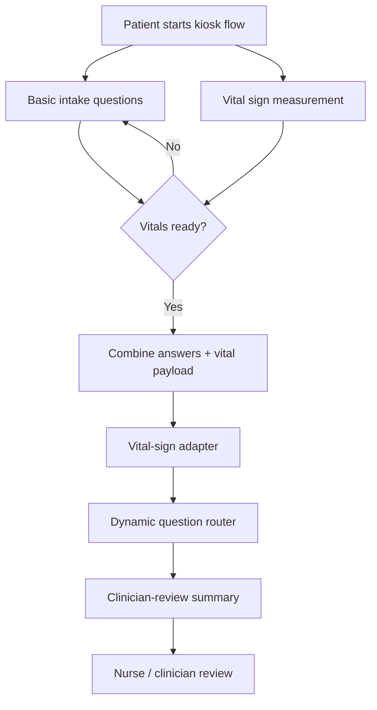
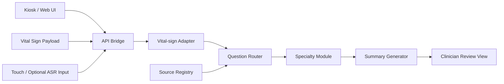
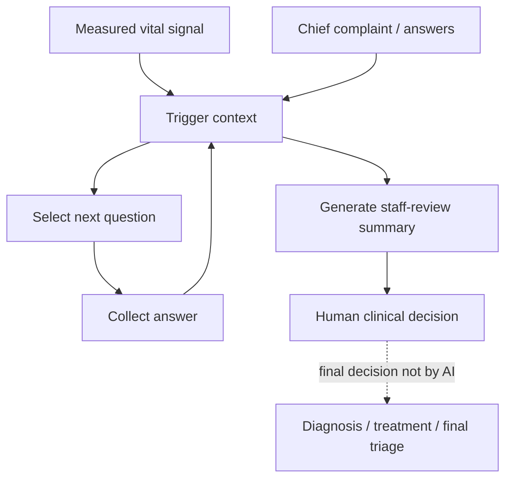

# 專利提案揭露書草稿 - AI Triage

Status: `draft-ready for Tomi review; must be transferred into Tomi / 德米專用範本 docx before formal submission`

Template basis:
`/home/jnln3799/record_jn/record_audio_ubuntu/260309_0904_lab_sync_(patent_Tomi)/260310_專利撰寫/專利提案揭露書-德米專用範本.docx`

Draft date: `2026-05-18`

Source basis:

- `source/2026-05-13-duobao-line-imedtac-vital-sign-triage/source.md`
- `source/2026-05-15-imedtac-second-sync-and-duobao-followup/meeting-record.md`
- `docs/architecture-insertion-and-clinical-grounding.md`
- `handoff/2026-05-15-june-demo-case-pack-v0.md`
- `handoff/reviewer-packet/claim-language-control.md`

Disclosure boundary:

- This is a patent-disclosure drafting packet, not a legal filing.
- This is not a clinical protocol, regulatory submission, FDA/TFDA claim, or production clinical-triage claim.
- Hidden implementation details such as exact scoring formulas, model weights, prompt chains, embedding configuration, threshold constants, source-ranking weights, and data curation logic should remain trade secret unless Tomi / counsel asks for controlled disclosure.

## 專利提案名稱

基於量測生理訊號之動態問診與臨床審閱摘要產生系統及方法

Alternative English working title:

System and Method for Vital-Sign-Aware Dynamic Intake Questioning and Clinician-Review Summary Generation

## 一、是否需進行專利檢索或專利探勘?

1. □需進行專利檢索  ■需進行專利探勘  □無須進行，直接申請
2. □公司內部自行處理  ■委外處理
3. □已進行專利檢索  □已進行專利探勘  ■尚未完成正式前案檢索

### 目前已知參考 / 待探勘方向

| 相關專利前案 / 文獻國別 | 申請案號或期刊資訊 | 備註 |
| --- | --- | --- |
| US / FDA public material | 510(k) comparable-product summaries to be identified | 用於界定 intended use、software risk、clinical decision support 邊界；不作為症狀問診規則來源。 |
| Emergency medicine / triage literature | ESI / emergency triage source family to verify | 用於理解 urgent-care / emergency-style triage support 的工作流與 clinician-review 邊界。 |
| Clinical guideline families | AHA / ACC, CDC, ADA, AUA / EAU, local hospital protocol to verify | 用於後續 question provenance；本揭露書不直接主張已完成臨床驗證。 |
| Existing symptom-checker / triage systems | To be searched by Tomi / patent office | 需探勘是否已有 symptom checker, vital sign triage, kiosk intake, clinician summary, dynamic questionnaire patents. |
| Company kiosk / iMVS material | 慧誠智醫 product / API materials | 本提案插入於量測後 workflow；公司既有硬體 / gateway / API 屬合作背景，不直接主張為本發明核心。 |

## 二、請描述與本提案相關之習知作法(傳統作法 / 傳統技術)?

### 1. 一般症狀問診系統多以文字或固定題目為主

傳統 symptom checker 或線上問診工具，多以患者主訴、文字輸入、固定選項或單一路徑決策樹來收集資料。此類系統常先問「哪裡不舒服」、「症狀多久」、「是否疼痛」等固定問題，再輸出建議或摘要。

此類作法的問題是，問診流程通常未能即時利用 kiosk 或醫療量測設備取得的血壓、血氧、體溫、心率、身高、體重等客觀量測資料。即使患者的生理訊號已經被量測，傳統問診流程仍可能依照固定順序詢問，而不是依生理訊號改變下一題優先順序或摘要重點。

### 2. 醫療量測 kiosk 多以量測與報告為核心

既有 vital-sign kiosk 或自助量測設備，常見流程為：

```text
患者登入 / 識別
-> 量測血壓、血氧、體溫、身高、體重等
-> 顯示量測結果或產生報告
-> 可能透過 API / gateway / FHIR / HIS / EMR 路徑傳送資料
```

這類設備的強項是硬體整合、量測流程、gateway / middleware、醫院系統串接與報告輸出。然而，量測結果通常只是被展示或傳送，未必進一步驅動問診流程，也未必形成可被 nurse / clinician 快速審閱的動態摘要。

### 3. AI chatbot 類醫療問答容易形成黑箱與過度主張

部分 AI 問診或 chatbot 系統強調自然語言對話，但若缺乏可追溯的臨床來源、問題來源、觸發條件與人工審閱邊界，容易形成黑箱式醫療判斷。此類系統若直接輸出診斷、治療建議、final triage level 或 emergency referral，會產生臨床安全、法規、責任歸屬與使用者誤信風險。

### 4. 線性問卷難以處理生理訊號與症狀的組合情境

傳統固定問卷常假設所有患者都走相似題目順序。然而，多寶醫師的臨床討論指出，vital signs 對 urgent-care / emergency-style intake 最有價值，因為生理不穩定與患者主訴的組合會影響醫護人員需要先知道什麼。

例如：

- 發燒加血氧偏低時，呼吸症狀與胸痛相關問題應更優先；
- 胸悶加心率很快時，應更快形成 staff-review 摘要，而不是繼續完整低風險問卷；
- 泌尿症狀加發燒或 flank pain 時，可能需要從單純症狀收集轉向 clinician review context。

傳統固定題目較難把這種「生理訊號 + 主訴 + 回答狀態」的組合轉成動態問診流程。

## 三、請描述習知作法的缺點或問題(亦即本提案所欲解決問題)?

### 1. 生理訊號未能成為問診流程的即時觸發條件

現有 kiosk 能量測生命徵象，但多數流程只是顯示或保存結果。量測結果未必用於即時決定下一題、優先詢問的症狀、是否應縮短問診、或摘要中應突出哪些 review signals。

### 2. 固定問卷與通用 chatbot 缺乏可審計的臨床工作流

固定問卷缺乏彈性；通用 chatbot 又可能缺乏可審計性。本提案要解決的是如何在兩者之間建立一個 source-governed、rule/router-first、clinician-review 的工作流，使系統能動態提問但仍可解釋、可控、可審閱。

### 3. 全科別 AI triage 容易過度擴張

公司需求曾提到 all-specialty AI triage，但多寶與既有討論顯示，vital signs 對不同科別的意義不同。若直接主張全科別完成，會導致臨床規則、資料來源、驗證與責任邊界全面失控。

因此，本提案要解決的是：如何用共用 intake / vital adapter / question router / source registry core 建立可擴充架構，而不是一次主張已完成全科別臨床決策。

### 4. 直接輸出診斷或最終分級會造成安全與法規風險

若 AI 系統直接給出診斷、治療、final triage level、急診轉送或用藥建議，會超出目前 demo 與臨床驗證範圍。本提案需要把 output 限制在 clinician-review summary / staff-review summary，讓最終決策保留給人類醫護。

## 四、針對習知作法之缺點或問題，本提案做了哪些改善或改變?

本提案提出一種「基於量測生理訊號之動態問診與臨床審閱摘要產生系統及方法」。其核心不是讓 AI 直接診斷，而是將 kiosk 量測資料轉成可觸發、可追溯、可審閱的問診與摘要工作流。

### 1. 量測後插入 AI-assisted intake workflow

系統插入點設定在 vital-sign measurement 完成後：

```text
患者登入 / 啟動 kiosk
-> 固定基本問題可先開始
-> 量測血壓、血氧、體溫、身高、體重、心率等
-> 將量測資料與患者主訴 / 回答合併
-> 啟動動態問診路由
-> 產生 clinician-review summary
```

此設計保留 kiosk 原本量測與 API / gateway 價值，同時讓生理訊號不只是報告欄位，而是可影響後續問診流程的 workflow signal。

### 2. Vital-sign adapter 將生理訊號轉為問診觸發上下文

系統包含一個 vital-sign adapter。該 adapter 不直接輸出診斷，而是把量測值轉為下列上下文：

- 哪些問題應優先；
- 哪些 red-flag family 應被提示給 staff review；
- 是否應縮短低風險問卷；
- 摘要中哪些客觀量測與主觀症狀應被並列呈現；
- 哪些問題需要臨床來源或醫師確認後才能啟用。

### 3. Question router 選擇下一題，而不是黑箱生成決策

系統包含 question router / dynamic questioning module。其功能是依照：

- 患者主訴；
- 量測生理訊號；
- 已回答題目；
- 缺失資訊；
- clinical source registry 狀態；
- demo-only safety boundary；

選擇下一個或下一組應詢問的問題。此處可用規則、決策樹、question bank ranking、retrieval、或其他可審計方法實作，但專利揭露不綁定特定模型或權重。

### 4. Source registry 與 question provenance 控制題目來源

每個 production-facing 問題未來應對應：

- question ID；
- symptom context；
- vital trigger；
- source family / source name；
- source version；
- clinical purpose；
- escalation effect；
- reviewer owner；
- status。

此設計讓系統的問診問題不是通用 chatbot 自由發揮，而是逐步建立可追溯的醫療工作流。

### 5. Clinician-review summary 取代 autonomous triage decision

系統輸出不是診斷或最終分級，而是給 nurse / clinician / staff review 的摘要，例如：

- 患者主訴；
- 量測到的生命徵象；
- 關鍵陽性 / 陰性回答；
- 是否存在需要 staff review 的訊號；
- 本系統未做診斷、治療、用藥、檢查或 final triage level。

### 6. 模組化科別擴充

系統可由 shared intake core 擴充到不同 specialty modules：

- respiratory / fever module；
- chest discomfort / cardiovascular concern module；
- abdominal pain / fever module；
- urinary symptom module；
- chronic disease / metabolic context module；
- allergy / mild trauma module。

每個 module 都需來源治理與 clinician review，不主張一次完成全科別臨床驗證。

## 五、請描述藉由本提案之技術思維，可以達到何種目的或功效?

### 1. 讓 kiosk 量測資料成為 AI-assisted workflow 的驅動訊號

本提案使血壓、血氧、體溫、心率、身高、體重等量測資料，不只是靜態報告，而能進一步影響問診題目、摘要重點與 staff-review signal，提升 kiosk 由「量測設備」延伸為「AI-assisted intake workflow」的產品價值。

### 2. 降低問診冗餘並提高臨床摘要可讀性

系統可依據已知主訴與量測訊號選擇較有價值的下一題，避免所有患者都走完整固定問卷。最後產生的摘要能協助醫護快速看到：

- 為何患者來；
- 客觀量測是什麼；
- 重要症狀回答是什麼；
- 哪些資訊仍需人工確認。

### 3. 保持安全與責任邊界

本提案將輸出限制在 clinician-review / staff-review summary，而非 autonomous diagnosis 或 final triage level，降低使用者誤信、過度醫療主張與法規風險。

### 4. 提供可擴充的 all-specialty-capable architecture

本提案不是一次完成所有科別規則，而是提供 shared intake core、vital adapter、question router、source registry、summary generator 的可擴充架構。未來可依照臨床來源與 reviewer owner 增加 specialty modules。

### 5. 形成可專利化的 workflow / interaction innovation

本提案的可 claim 重點不是 LLM、ASR、embedding 或特定模型本身，而是：

```text
量測生理訊號
-> 轉換為問診觸發上下文
-> 動態選擇下一題
-> 產生臨床審閱摘要
-> 保留人類醫護最終決策
```

此 workflow 具有 UI / interaction / service orchestration 層面的可觀察性，較適合作為專利揭露主軸。

## 六、請具體說明本提案之實施範例並配合圖示說明(附件)!

### 實施例 1：發燒 + 咳嗽 / 呼吸不適

輸入：

- 主訴：發燒與咳嗽；
- 生理訊號：體溫偏高、SpO2 較低、心率偏快；
- 互動方式：touch choice + optional short voice supplement。

系統流程：

1. 患者完成 kiosk 基本啟動與量測。
2. 系統接收 vital payload。
3. 系統依主訴與 vital context 優先詢問呼吸、胸痛、慢性病、過敏等短問題。
4. 系統停止在 clinician-review summary，不輸出肺炎、COVID、流感等診斷。

輸出摘要示意：

```text
Synthetic demo case.
Patient reports fever and cough.
Measured vitals include elevated temperature and lower SpO2 than expected.
Patient reports / denies shortness of breath and chest pain according to answers.
Staff should review the respiratory complaint and measured vitals.
This demo does not diagnose, recommend treatment, or assign final triage level.
```

### 實施例 2：胸悶 / 心悸 + 心率很快

輸入：

- 主訴：胸悶或心悸；
- 生理訊號：心率很快，可能搭配血壓或 SpO2 context；
- 互動方式：choice-based red-flag questions。

系統流程：

1. 系統識別胸部不適與心率訊號同時存在。
2. 系統優先詢問呼吸困難、頭暈 / 昏厥、起始時間、用藥與慢性病。
3. 若回答與 vital context 顯示需要 review，系統縮短問卷並產生 staff-review summary。
4. 系統不診斷 arrhythmia，不自動指派急診分級。

### 實施例 3：腹痛 + 發燒

輸入：

- 主訴：腹痛；
- 生理訊號：體溫偏高、心率 context；
- 回答：疼痛位置、疼痛程度、嘔吐、慢性病、過敏。

系統流程：

1. 系統依疼痛位置與發燒 context 選擇 location / severity / vomiting / duration 等題目。
2. 系統產生 abdominal pain + fever clinician-review summary。
3. 系統不診斷 appendicitis、cholecystitis 或其他疾病。

### 圖 1：系統插入點



### 圖 2：模組架構



### 圖 3：Claim-oriented workflow



## 七、建議本提案必要之申請國家

□台灣、□大陸、■美國、□歐洲、□日本、□其他

Recommendation:

- Primary: US, because 慧誠's June demo and business story mention US urgent-care / Texas deployment context.
- Secondary: Taiwan, if the team wants local ownership and a defensive filing before broader collaboration.
- Defer Europe / Japan until commercial path and prior-art search become clearer.

## 八、請相關人員確認並簽名(請按提案貢獻度順序)

| 發明人姓名 | 角色 / 貢獻 | 簽名 | 日期 |
| --- | --- | --- | --- |
| Jason Lin | workflow framing, source-governed question routing, disclosure drafting |  |  |
| 許桓瑜（多寶 / 許醫師） | clinical calibration, urgent-care / emergency-style vital-sign workflow insight, demo case direction |  |  |
| 吳育德老師 | project direction, stakeholder routing, product / regulatory framing |  |  |
| 慧誠智醫相關人員 | kiosk workflow, device/API context, integration constraints, if confirmed as inventor / assignee contributor |  |  |

Note:

- Inventorship and ownership must be reviewed by Tomi / counsel.
- Company-side contribution, contract rights, university rights, and collaboration documents must be checked before filing.

## 附件：待 Tomi / 專利事務所確認事項

1. 是否以一篇主案處理，或拆成：
   - vital-sign-triggered dynamic questioning;
   - clinician-review summary generation;
   - source-governed question provenance / safety boundary。
2. 是否應避免 `triage` 字眼，改用 `intake support` / `clinical review support` 以降低醫療主張風險。
3. 哪些內容應列為 trade secret：
   - exact question-ranking weights;
   - prompt / LLM chain;
   - embedding model choice;
   - source registry scoring;
   - proprietary clinical case curation;
   - company API / integration details。
4. 是否需要先做 patent search / patent mining before filing。
5. 是否需在 formal disclosure 裡加入更多 UI screenshots / flowcharts from the demo。
