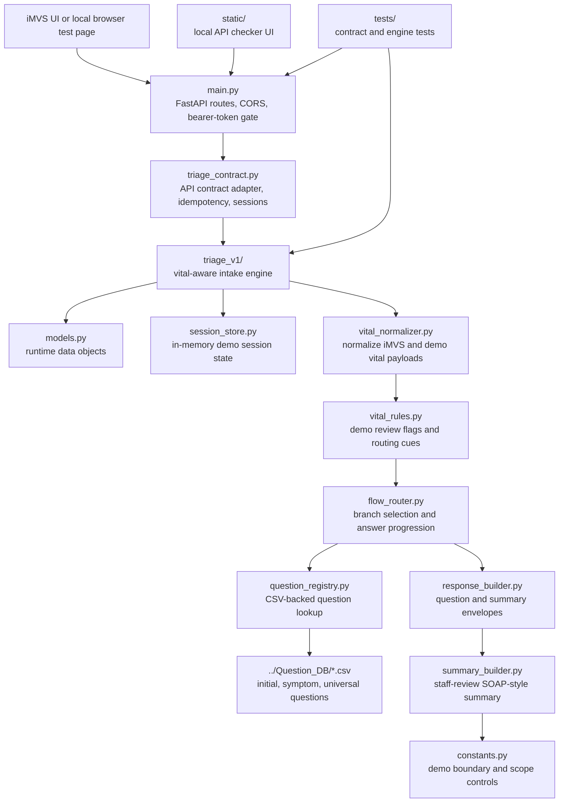
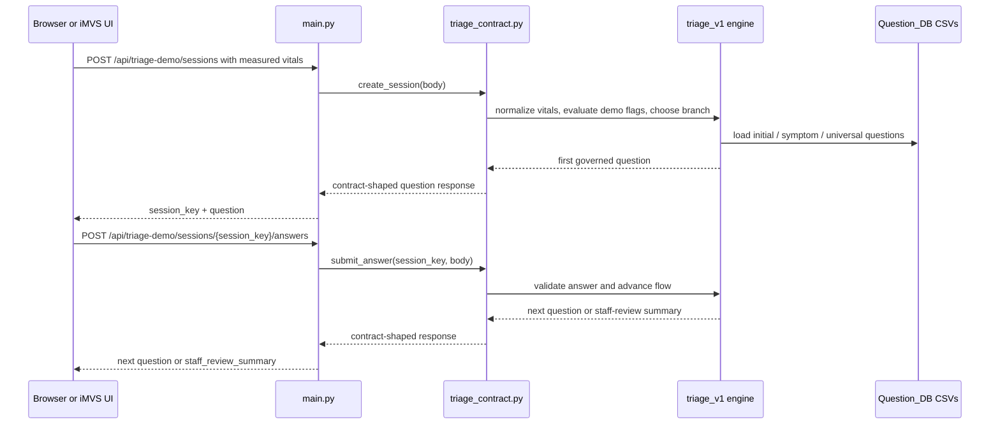

# FastAPI AI Triage Demo API

This directory contains the Python FastAPI runtime for the AI triage kiosk demo.
It implements the two-endpoint synthetic-data demo contract described in
`../API.md` and serves a simple browser page for local API testing.

The runtime is staff-review intake support for a demo workflow. It does not
provide diagnosis, treatment advice, final triage level assignment, production
clinical decision support, or HIS / EMR / FHIR writeback.

## Run Locally

Create a virtual environment and install dependencies with `uv`:

```bash
uv venv .venv
. .venv/bin/activate
uv pip install -r python_api/requirements.txt
```

Start the FastAPI server:

```bash
uv run python -m uvicorn main:app --host 127.0.0.1 --port 8000 --reload
```

Open the API test page:

```text
http://127.0.0.1:8000/
```

Health check:

```text
http://127.0.0.1:8000/healthz
```

The API test page builds requests from the origin plus the canonical endpoint
path. If a browser field, tunnel path, or proxy path accidentally adds a prefix
such as `/doebow`, the request should still target `/api/triage-demo/sessions`
on the FastAPI app. A server log entry for
`POST /doebow/api/triage-demo/sessions` means the caller or proxy is
forwarding the prefix instead of using the canonical API path.

## API Endpoints

```text
POST /api/triage-demo/sessions
POST /api/triage-demo/sessions/{session_key}/answers
OPTIONS /api/triage-demo/sessions
OPTIONS /api/triage-demo/sessions/{session_key}/answers
GET /healthz
GET /demo-ui/summary-review/
GET /
```

The workflow is:

```text
iMVS vital-sign measurement complete
-> POST /api/triage-demo/sessions
-> receive session_key + first question
-> submit selected option ids
-> POST /api/triage-demo/sessions/{session_key}/answers
-> receive next question or staff_review_summary
```

## Directory Organization

`python_api/` is organized around a small FastAPI adapter, a demo-contract
compatibility layer, and a versioned triage engine. The runtime keeps the
external API contract stable while the `triage_v1/` package owns vital-aware
question routing and staff-review summary generation.



The request path for the demo runtime is:



The main files are:

```text
python_api/
|-- main.py                     FastAPI app, HTTP routes, static page serving,
|                               CORS, JSON parsing, and bearer-token checks.
|-- triage_contract.py          Stable demo API contract, idempotency handling,
|                               response ids, session lifecycle, and bridge into
|                               the v1 triage engine.
|-- triage_v1/
|   |-- constants.py            Demo boundary text, scope controls, branch map,
|   |                           and session TTL.
|   |-- models.py               FlowState, Patient, Question, normalized vitals,
|   |                           answers, and review flags.
|   |-- vital_normalizer.py     Converts iMVS-style and normalized payloads into
|   |                           runtime vital fields.
|   |-- vital_rules.py          Demo review cues from measured vitals; these are
|   |                           validation gates, not production clinical rules.
|   |-- flow_router.py          Initial branch selection, answer validation,
|   |                           question progression, and dynamic module expansion.
|   |-- question_registry.py    Loads CSV question banks and converts questions
|   |                           into API response shape.
|   |-- response_builder.py     Builds question and summary response envelopes.
|   |-- summary_builder.py      Builds staff-only SOAP-style review summaries.
|   `-- session_store.py        In-memory demo session storage.
|-- static/                     Browser API checker used for local demo testing.
|-- tests/                      FastAPI contract tests and v1 engine tests.
|-- requirements.txt            Runtime and test dependency list for uv pip.
|-- pyproject.toml              Python project metadata.
|-- uv.lock                     Locked Python dependency resolution.
`-- PlanMD/                     Internal implementation planning notes.
```

## Demo Bearer Token

By default, local bearer-token checking is disabled.

To require a demo bearer token:

```bash
export DEMO_BEARER_TOKEN="replace-with-local-demo-token"
uv run python -m uvicorn python_api.main:app --host 127.0.0.1 --port 8000 --reload
```

Requests must then include:

```text
Authorization: Bearer <demo token>
```

Do not store real tokens, credentials, patient identifiers, private API keys, or
live hospital integration details in tracked files.

## Test

Run the Python contract tests:

```bash
uv run python -m pytest python_api/tests
```

The tests cover:

- bearer-token disabled and enabled behavior,
- start-session first question response,
- answer idempotency retry,
- idempotency conflict,
- final staff-review summary,
- invalid session error response,
- CORS preflight behavior.

## Implementation Notes

- `main.py` defines the FastAPI app and HTTP routes.
- `triage_contract.py` ports the current JavaScript demo contract behavior into
  Python.
- `static/` contains the browser test page served by FastAPI.
- `tests/` contains HTTP-level contract tests using FastAPI `TestClient`.

The Python runtime reads the same demo fixture and handoff response examples
used by the current repository materials, preserving the API/schema/flow version
fields and the tachycardia demo question sequence.

