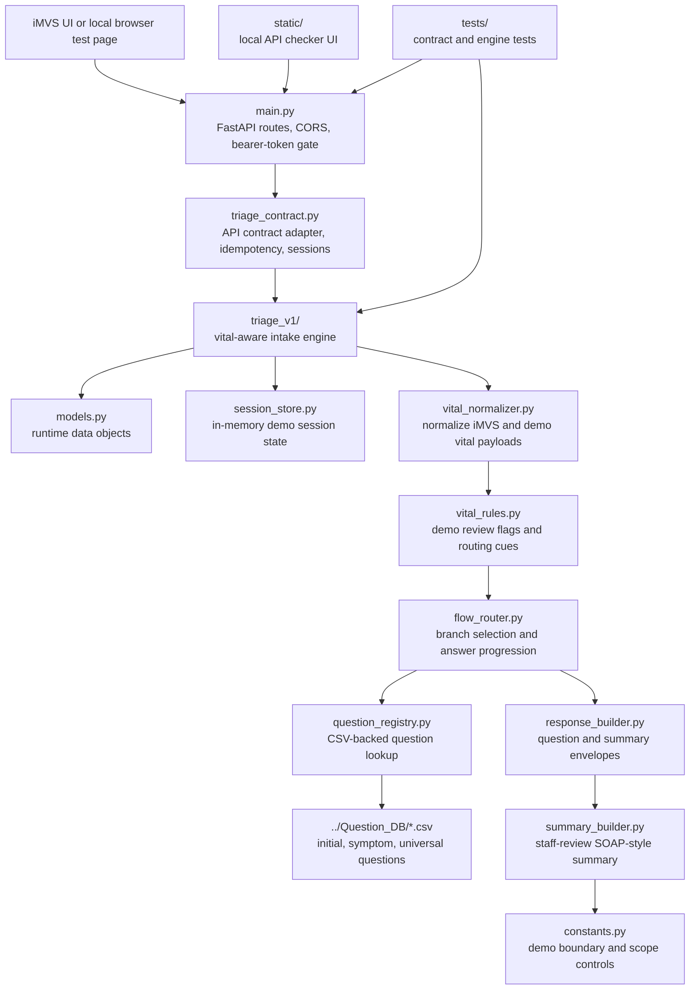
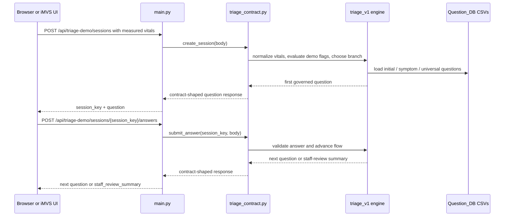

# FastAPI AI Triage Demo API

This directory contains the Python FastAPI runtime for the AI triage kiosk demo.
It implements the two-endpoint synthetic-data demo contract described in
`../API.md` and serves a simple browser page for local API testing.

The runtime is staff-review intake support for a demo workflow. It does not
provide diagnosis, treatment advice, final triage level assignment, production
clinical decision support, or HIS / EMR / FHIR writeback.

## Run Locally

From the repo root, create the project environment and install dependencies
with `uv`:

```bash
uv sync --project python_api
```

Start the canonical FastAPI server from the repo root:

```bash
uv run --project python_api python -m uvicorn python_api.main:app --host 127.0.0.1 --port 8000 --reload
```

Open the API test page:

```text
http://127.0.0.1:8000/
```

Health check:

```text
http://127.0.0.1:8000/healthz
```

The API test page builds requests from the origin plus the canonical endpoint
path. If a browser field, tunnel path, or proxy path accidentally adds a prefix
such as `/doebow`, the request should still target `/api/triage-demo/sessions`
on the FastAPI app. A server log entry for
`POST /doebow/api/triage-demo/sessions` means the caller or proxy is
forwarding the prefix instead of using the canonical API path.

## API Endpoints

```text
POST /api/triage-demo/sessions
POST /api/triage-demo/sessions/{session_key}/answers
OPTIONS /api/triage-demo/sessions
OPTIONS /api/triage-demo/sessions/{session_key}/answers
GET /healthz
GET /demo-ui/summary-review/
GET /
```

`GET /demo-ui/summary-review/` is a demo review surface for a completed
`staff_review_summary` payload. It is not a replacement for the two POST
endpoints and does not add a required `report_url` or QR-code API contract.

The workflow is:

```text
iMVS vital-sign measurement complete
-> POST /api/triage-demo/sessions
-> receive session_key + first question
-> submit selected option ids
-> POST /api/triage-demo/sessions/{session_key}/answers
-> receive next question or staff_review_summary
```

## Directory Organization

`python_api/` is organized around a small FastAPI adapter, a demo-contract
compatibility layer, and a versioned triage engine. The runtime keeps the
external API contract stable while the `triage_v1/` package owns vital-aware
question routing and staff-review summary generation.



The request path for the demo runtime is:



## Optional LLM Summary

The default staff-review summary is deterministic and does not require an LLM
service. `LLM_SUMMARY_URL` is empty by default. Set it only for a controlled
demo run that intentionally enables `../LLM_api/`:

```text
LLM_SUMMARY_URL=http://127.0.0.1:8091/api/llm-summary/subjective
```

When the URL is missing, unreachable, or returns an invalid payload, the runtime
falls back to the deterministic subjective summary and still returns the same
`staff_review_summary` envelope.

The main files are:

```text
python_api/
|-- main.py                     FastAPI app, HTTP routes, static page serving,
|                               CORS, JSON parsing, and bearer-token checks.
|-- triage_contract.py          Stable demo API contract, idempotency handling,
|                               response ids, session lifecycle, and bridge into
|                               the v1 triage engine.
|-- triage_v1/
|   |-- constants.py            Demo boundary text, scope controls, branch map,
|   |                           and session TTL.
|   |-- models.py               FlowState, Patient, Question, normalized vitals,
|   |                           answers, and review flags.
|   |-- vital_normalizer.py     Converts iMVS-style and normalized payloads into
|   |                           runtime vital fields.
|   |-- vital_rules.py          Demo review cues from measured vitals; these are
|   |                           validation gates, not production clinical rules.
|   |-- flow_router.py          Initial branch selection, answer validation,
|   |                           question progression, and dynamic module expansion.
|   |-- question_registry.py    Loads CSV question banks and converts questions
|   |                           into API response shape.
|   |-- response_builder.py     Builds question and summary response envelopes.
|   |-- summary_builder.py      Builds staff-only SOAP-style review summaries.
|   `-- session_store.py        In-memory demo session storage.
|-- static/                     Browser API checker used for local demo testing.
|-- tests/                      FastAPI contract tests and v1 engine tests.
|-- requirements.txt            Runtime and test dependency list for uv pip.
|-- pyproject.toml              Python project metadata.
|-- uv.lock                     Locked Python dependency resolution.
`-- PlanMD/                     Internal implementation planning notes.
```

## Demo Bearer Token

By default, local bearer-token checking is disabled.

To require a demo bearer token:

```bash
export DEMO_BEARER_TOKEN="replace-with-local-demo-token"
uv run --project python_api python -m uvicorn python_api.main:app --host 127.0.0.1 --port 8000 --reload
```

Requests must then include:

```text
Authorization: Bearer <demo token>
```

Do not store real tokens, credentials, patient identifiers, private API keys, or
live hospital integration details in tracked files.

## Test

Run the Python contract tests:

```bash
uv run --project python_api python -m pytest python_api/tests
```

The tests cover:

- bearer-token disabled and enabled behavior,
- start-session first question response,
- answer idempotency retry,
- idempotency conflict,
- final staff-review summary,
- invalid session error response,
- CORS preflight behavior.

## Docker And Render Deployment

The repository includes a Dockerfile for the canonical Python/FastAPI backend.
Render should use this repo as a Docker Web Service rather than treating the
service as a Node runtime.

Local Docker build:

```bash
docker build -t imedtac-ai-triage-kiosk-v0-render-check .
```

Local container run:

```bash
docker run --rm -p 18080:8000 imedtac-ai-triage-kiosk-v0-render-check
```

Health check:

```bash
curl -sS http://127.0.0.1:18080/healthz
```

CORS preflight check:

```bash
curl -sS -X OPTIONS http://127.0.0.1:18080/api/triage-demo/sessions \
  -H 'Origin: http://localhost:5174' -i

curl -sS -X OPTIONS http://127.0.0.1:18080/api/triage-demo/sessions \
  -H 'Origin: http://127.0.0.1:5174' \
  -H 'Access-Control-Request-Method: POST' \
  -H 'Access-Control-Request-Headers: content-type,authorization' -i

curl -sS -X OPTIONS http://127.0.0.1:18080/api/triage-demo/sessions/test-session/answers \
  -H 'Origin: http://127.0.0.1:5174' \
  -H 'Access-Control-Request-Method: POST' \
  -H 'Access-Control-Request-Headers: content-type,authorization' -i
```

Recommended Render settings:

```text
Service type: Web Service
Runtime: Docker
Branch: main
Health check path: /healthz
Environment: DEMO_BEARER_TOKEN=<private token, only if bearer gate is enabled>
Environment: DEMO_ALLOWED_ORIGINS=http://127.0.0.1:5174,https://<imedtac-frontend-origin>
```

The Docker image copies `python_api/`, `Question_DB/`, and
`handoff/api-examples/` because `triage_contract.py` uses the sent API examples
to preserve external contract fields. Real bearer tokens and private tunnel
credentials must stay in Render environment variables, not in Git.

CORS origin matching is exact by scheme, host, and port. The default allowlist
already supports local `localhost` and `127.0.0.1` testing; add imedtac's
browser, WebView, HTTPS, or local-network origin through `DEMO_ALLOWED_ORIGINS`
after confirming the actual `Origin` header. The runtime ignores `*` wildcard
configuration so the bearer-token protected demo API keeps a bounded browser
surface.

## Online Smoke Verification

Live public checks for the Render rehearsal API are available from the repo
root:

```bash
npm run smoke:online
```

The command targets
`https://nycu-imedtac-triage-demo-api.onrender.com` by default and verifies
`/healthz`, CORS preflight for `http://localhost:5174`, unknown-origin
non-echo behavior, and bearer-gate posture without storing any token.

When the private demo token is available through the agreed private channel,
run the authenticated full answer loop with a shell-only environment variable:

```bash
DEMO_BEARER_TOKEN='<private token from agreed channel>' npm run smoke:online
```

Do not store bearer tokens in Git, Markdown, screenshots, logs, or shell
history captures. The `2026-06-17` deployment and smoke-test record is preserved
in `handoff/2026-06-17-render-deploy-and-smoke-test-record.md`.

## Implementation Notes

- `main.py` defines the FastAPI app and HTTP routes.
- `triage_contract.py` preserves the externally discussed imedtac two-endpoint
  contract while routing requests into Python.
- `static/` contains the browser test page served by FastAPI.
- `tests/` contains HTTP-level contract tests using FastAPI `TestClient`.

The Python runtime reads the same demo fixture and handoff response examples
used by the current repository materials, preserving the API/schema/flow version
fields and the tachycardia demo question sequence.
