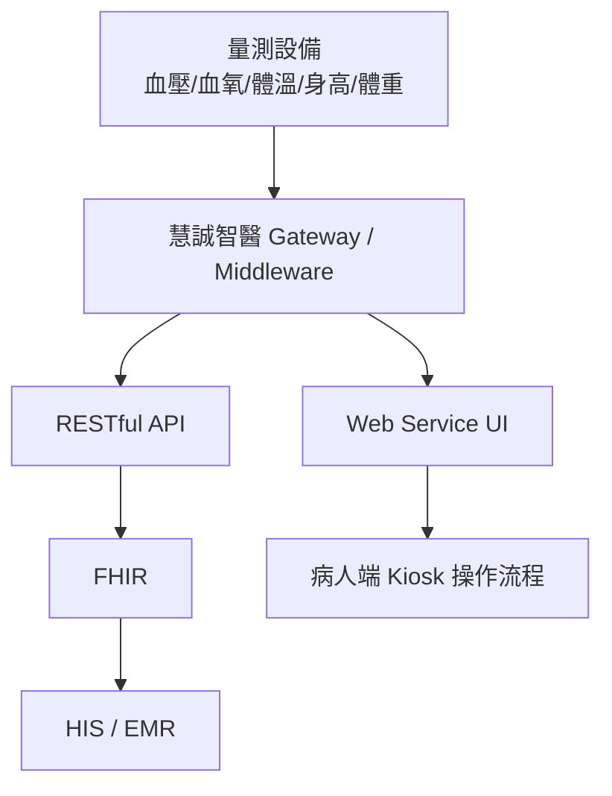
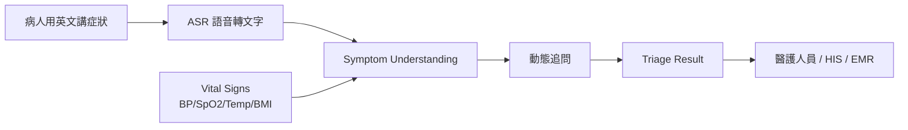
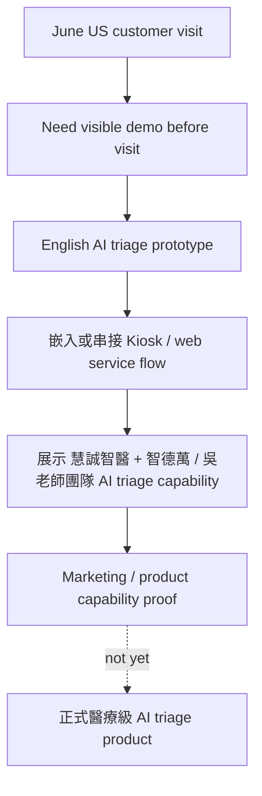

# 慧誠智醫 AI Triage Demo Brief

## Core Read

目前判讀基本正確：慧誠智醫最急迫的需求，是在六月前先做出一個能放進既有 Kiosk / web service 流程裡的 AI triage demo，用來展示給美國客戶看。

這不是正式產品上線，也還不是完整醫療級 AI triage 系統。它比較像第一版 market demo / product capability demo。

精準版本：

> 慧誠智醫短期希望在六月前，基於我們現有的 triage prototype，快速做出英文版 demo，能被放進他們既有 Kiosk / web service 產品流程中，展示「慧誠智醫 + 智德萬 / 吳老師團隊已具備 AI triage capability」。這個 demo 主要用途是 go-to-market 與美國客戶展示，還不是正式醫療決策產品。

## 1. 他們目前的技術架構

慧誠智醫現在的核心架構是三層：

**底層：醫療量測設備**

包含血壓、血氧、體溫、身高、體重等符合醫規的裝置。

**中層：middleware / gateway**

他們的核心能力是把不同量測設備串接起來，整合成 turnkey solution，再透過 middleware 處理資料。

**上層：HIS / EMR / FHIR 串接**

資料會透過 FHIR standard 串到醫院 HIS 或 EMR。

## 2. 他們現有硬體

他們的 Kiosk 是 **Windows-based all-in-one 電腦**，多半是 fanless，所以 CPU 不會太強。設備本身**沒有 GPU**。

現有 SKU 大概分兩種：

| 類型 | 可量測項目 |
| --- | --- |
| All-in-one / AIO | 血壓、血氧、體溫、體重、身高 |
| Desktop / DKP | 血壓、血氧、額溫 |

他們也提到技術上可加 ECG、ultrasound，但目前不算 default triage 範圍。

## 3. 他們現有軟體

他們現在有一套 **web service UI**，跑在 Kiosk 上。流程包含：

登入 / 身分識別 -> 選擇量測項目 -> 逐步引導量測 -> 顯示正常值或異常提示 -> next / measure again -> 最後產出 summary report。

後端有他們自己的 code / gateway 讀取醫療儀器，也有 RESTful API，可以支援 EMR、HIS、FHIR 等資料庫串接。

## 4. 他們真正想做什麼

他們長期想做的是：

**英文語音輸入 + 全科別 symptom triage + vital signs 整合 + 產出 triage result。**

業務有明確收斂 scope：英語系、語音輸入、全科別 symptom triage、參考生理資訊，形成 triage result。

更白話講，他們不只是想要 chatbot。他們想要的是：

他們看到國外很多 triage 系統幾乎只靠口述症狀，沒有 vital signs；慧誠智醫覺得如果不整合 vital signs，就跟他們的設備沒有關係。

## 5. 他們對你們的要求

目前對你們的要求可以分成短期與長期。

**短期要求：**

把現有的 triage demo 英文化，想辦法嵌入或串接到他們的 Kiosk web service 流程，做出可展示情境。

**長期要求：**

協助他們發展一套自己可掌握的 triage AI database / system，未來可依照美國、中東、新加坡、泰國、馬來西亞等案子慢慢累積與優化。

他們關心的問題包括：

- 泌尿科 demo 能不能擴展到全科？
- symptom database 要怎麼長出來？
- 英文、跨國、跨語言怎麼處理？
- ASR 能不能接進來？
- vital signs 進來後，AI triage 流程怎麼變？
- 地端版、雲端版、產品化資源需求是什麼？

## 6. 六月前的急迫需求

六月前比較急的是：

**六月美國客戶來台灣前，能不能讓客戶在他們預計部署到德州的設備上，看到初步 AI triage 合作 demo。**

原話重點是：六月美國客戶會來台灣；如果能在預計要去德州 deploy 的設備上看到初步合作，對第一步 marketing 有幫助。

因此這次 demo 的定位要保持清楚：

- 用途：go-to-market / customer-facing capability demo。
- 對象：六月前可能來台灣的美國客戶。
- 場景：放進既有 Kiosk / web service flow，最好能對應預計部署到德州的設備故事。
- 邊界：非正式醫療決策產品，非 autonomous diagnosis，非 production clinical triage。
- 允許：英文 symptom intake、vital-sign-aware workflow、structured summary、demo-level kiosk integration。
- 不允許：未驗證臨床 threshold、真實病人資料、HIS/EMR 寫入、正式分流醫囑或診斷宣稱。

## Reusable Writing Format

後續要寫給吳老師、慧誠或內部協作文件時，沿用這種格式：

1. 先判斷需求是否正確：用一句話說「目前判讀基本正確 / 需要修正」。
2. 區分短期 demo 與長期產品：避免把 market demo 寫成正式醫療產品。
3. 先畫現有系統架構：device -> gateway / middleware -> web service / API -> FHIR -> HIS / EMR。
4. 再畫目標 AI workflow：English speech -> ASR -> symptom understanding + vital signs -> dynamic follow-up -> triage result -> clinician / HIS / EMR。
5. 用表格寫硬體 / SKU / 可量測項目。
6. 用 bullets 寫短期要求、長期要求、開放問題。
7. 結尾一定寫 safety / regulatory boundary，特別是「triage support, not diagnosis」。

## One-Paragraph Briefing Version

慧誠智醫短期想在六月美國客戶來台灣前，基於現有 triage prototype 做出一個英文 AI triage market demo，能嵌入或串接到他們既有的 Windows-based Kiosk / web service 流程，展示 symptom intake、vital-sign-aware workflow、structured summary 與 kiosk integration capability。這個 demo 的價值不是正式醫療決策，而是證明慧誠的 vital-sign kiosk 可以從「量測設備」延伸成「AI-assisted triage workflow」。正式產品化仍需要 clinical criteria、vital-sign threshold validation、ASR noise testing、API / FHIR / HIS / EMR integration design、privacy / cybersecurity / regulatory review，以及醫師或公司端 sign-off。
