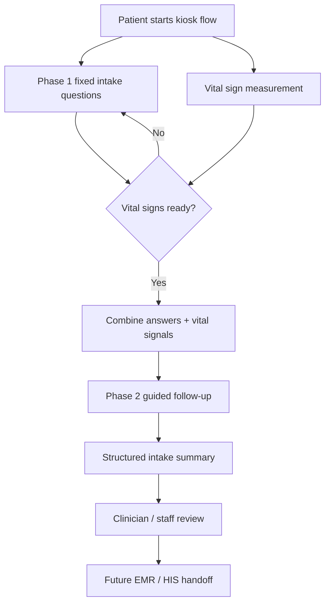
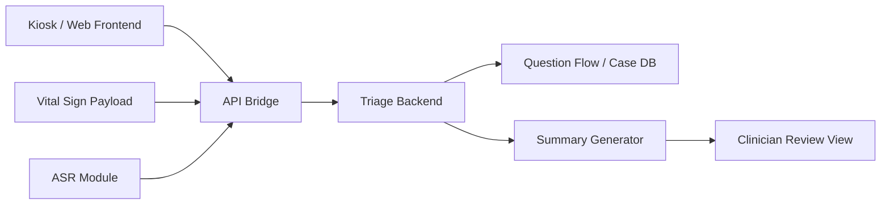

# 2026-05-15 慧誠智醫第二場 AI-Triage 會議與多寶會後討論

**紀錄性質：** 結構化整理版。完整原始材料保留在同一資料夾：

- User-provided structured note: `user-provided-meeting-record.md`
- 慧誠會議逐字稿: `transcript-imedtac-meeting-1259.txt`
- 多寶會後討論逐字稿: `transcript-duobao-followup-1358.txt`
- LINE context: `line-thread-2026-05-15.md`
- 慧誠 company-side minutes: `company-provided-meeting-minutes.md`
- 多寶 demo-case draft: `duobao-demo-case-draft.md`

This record is for local execution planning. It is not a clinical validation
document, regulatory submission, or customer-facing claim.

## Participants

- 慧誠智醫 / iMedtac
  - Jason Miao
  - Johnny Fang
- NYCU / 吳老師團隊
  - Jason Lin
  - 許桓瑜（多寶 / 許醫師）

## Main Shift From The Previous Meeting

The previous meeting asked whether `AI + vital signs + kiosk` could become an
AI-Triage product direction.

This second meeting made the immediate problem much sharper:

> Build a credible June demo that shows 慧誠's kiosk / vital-sign workflow can
> connect with a Taiwan-team AI-assisted intake capability.

This is not yet a complete FDA-grade, all-specialty clinical triage product.
The immediate deliverable is a controlled demo that helps a US partner imagine
the future workflow.

## Product Frame Settled In The Meeting

The first useful market frame is **US-style urgent care**, not Taiwan emergency
room replacement.

Working interpretation:

```text
Urgent care = between outpatient clinic and emergency department
             + walk-in intake
             + not immediately life-threatening
             + still needs fast sorting and structured information
```

This matters because kiosk usage is more plausible in urgent care than in the
most acute emergency-room cases. It also supports a safer product definition:

```text
AI-assisted intake + triage support
```

The system should help collect and structure information. It should not diagnose,
prescribe, order tests, replace clinician judgment, or autonomously assign a
final triage level.

## Company-Side Reality

慧誠's near-term business pressure is real:

- A US partner is expected to visit Taiwan in June.
- If the demo and business path move well, 慧誠 hopes to send two devices to the
  US and explore Q3 deployment around a Texas urgent-care setting.
- 慧誠 is already discussing HIS / EMR integration with the partner-side IT
  group, but the AI-Triage demo does not need to solve full EMR integration now.
- For June, the goal is to show that the Taiwan team has the hardware, software,
  medical-workflow, and AI-assisted intake capability.

The company also clarified that the current kiosk hardware is a standard,
low-cost industrial / tablet PC type. Lower hardware cost is preferred for total
cost and commercial fit, but the demo is allowed to use networked / external
compute in 慧誠's demo room if needed.

## Clinical Position From 多寶

多寶's core clinical contribution:

- Vital signs are most meaningful when they affect triage / intake workflow.
- Emergency / urgent-care style intake is the strongest vital-sign-driven story.
- Many specialty clinics do not need vital signs as strongly as urgent care does.
- Triage should ask enough to tell clinicians why the patient came, what the
  major warning signals are, and whether staff review is needed.
- A demo can start from diagnosis-shaped cases, but the product output must not
  present a diagnosis as the system's decision.

Practical clinical boundary:

```text
Use diagnosis-shaped thinking to design cases.
Output chief complaint, key positives/negatives, vitals, and review signal.
Leave diagnosis, orders, treatment, and final triage decision to clinicians.
```

## Workflow Decision

The likely demo workflow is:



Important detail:

- Some fixed questions can be asked while vital signs are being measured.
- After vital signs are available, the system can choose short follow-up
  questions based on the combination of complaint and vital signal.
- The demo should likely stay around `6-10` questions because 慧誠's baseline
  vital-sign measurement flow aims for roughly `1.5-3` minutes.

## Interaction Design Direction

The meeting rejected a fully open-ended chatbot as the first demo shape.

Better v0 pattern:

| Input style | Use |
| --- | --- |
| Touch / button choices | Fast routing, pain score, symptom category, chronic disease, allergy, basic yes/no questions. |
| ASR / voice input | Short free-text supplement when typing on kiosk is impractical. |
| Rule-guided question flow | Auditable clinical process and demo stability. |
| LLM-style layer | Optional phrasing / summary / conversational polish, not final medical decision logic. |

This keeps the demo believable, bounded, and less dependent on heavy real-time
local inference.

## Engineering Direction

The system can be split into three main modules:



The important engineering decisions after the meeting:

- Do not assume fully local CPU-only LLM / ASR is safe or smooth.
- For June demo, external compute / API-backed inference is acceptable if it is
  operationally hidden enough for the customer demo.
- A rules-first / question-router-first design is safer than a black-box
  end-to-end LLM.
- Jason needs the API shape for vital variables and the UI integration point.
- 慧誠 needs to involve UI and technical staff so the demo can fit the kiosk
  flow instead of becoming a disconnected webpage.

## Demo Case Strategy

The agreed v0 strategy is to prepare `3-5` demo cases and optimize them for
clarity.

Candidate cases from the meeting and follow-up discussion:

| Case | Why useful | Demo-safe output boundary |
| --- | --- | --- |
| Fever + cough / dyspnea | Easy urgent-care story; temperature and SpO2 matter. | Fever/respiratory complaint summary and staff-review signal if concerning; no pneumonia diagnosis. |
| Abdominal pain + fever, such as right-upper abdominal pain | Shows location + fever + pain score and clinician-facing summary. | Abdominal pain summary and clinician review; no cholecystitis diagnosis claim. |
| Chest tightness / palpitations + very fast HR | Shows vital-sign-driven urgency. | Flag as needs prompt staff review / may be inappropriate for kiosk-only flow; no arrhythmia diagnosis. |
| Low SpO2 + shortness of breath | Strong vital-sign differentiator. | Staff-review / escalation wording only after clinical sign-off; no autonomous emergency order. |
| High BP / high BMI / chronic disease context | Matches a realistic demo actor and 慧誠's self-measurement story. | Structured chronic-risk context; no treatment recommendation. |

The first two cases are probably enough to start implementation. The third case
is useful to show vital-sign-driven urgency but should use conservative
clinician-review wording.

## Immediate Action Items

### Jason Lin

- Build the local source bundle and planning mirror.
- Draft the June demo case pack with `3-5` synthetic cases.
- Define a minimal JSON-shaped vital payload:
  - `age`
  - `sex`
  - `chief_complaint`
  - `BP`
  - `HR`
  - `SpO2`
  - `Temp`
  - `Height`
  - `Weight`
  - optional `free_text`
- Draft the short kiosk question flow:
  - fixed questions during measurement;
  - dynamic questions after vitals;
  - clinician-facing summary.
- Draft an API / module diagram for 慧誠's technical team.
- Keep the demo boundary conservative: clinician-review summary only.

### 多寶 / 許醫師

- Write simple case drafts, starting with `2-3` cases before expanding to `3-5`.
- For each case, provide:
  - age / sex;
  - chief complaint;
  - synthetic vital signs;
  - `5-8` questions worth asking;
  - what should be shown to staff;
  - what the system must not say.
- Help decide where the question flow should stop and hand off to clinicians.
- Review whether red-flag wording is clinically reasonable.
- If possible, join a future device / kiosk walkthrough to see the physical
  interaction constraints.

### 慧誠智醫

- Provide the target kiosk flow and UI integration point.
- Confirm whether the demo will be same-app, iframe/link, API handoff, or a
  separate hidden backend.
- Confirm available vital fields and payload names.
- Involve the software / UI team and identify the technical contact.
- Confirm the demo room network and acceptable external-compute path.
- Clarify final output expectation:
  - display-only summary;
  - EMR/HIS-ready text field;
  - FHIR-like payload;
  - or another internal format.

## What Jason And 多寶 Can Complete First

Do these before touching broad all-specialty logic:

1. **Case Pack v0**
   - Start with fever/respiratory, abdominal pain + fever, and tachycardia/chest
     tightness.
   - Keep all cases synthetic and demo-only.

2. **Question Stop Rule**
   - Decide which questions are kiosk-level intake questions and which must be
     left for the clinician.
   - This is more valuable than adding more AI.

3. **Summary Template**
   - Create one clinician-facing output template:
     `chief complaint + vitals + key answers + review signal + source boundary`.

4. **Integration Sketch**
   - Draw the shortest working demo path:
     `kiosk vital payload -> AI triage API -> next question -> summary`.

5. **Literature Matrix**
   - Use `docs/literature-matrix-workflow.md` for the next paper / guideline
     sprint.
   - Do not summarize papers one by one; make each paper answer the same core
     questions about clinician workload, ASR fit, vital-sign routing,
     hallucination/source control, human review, evidence level, and intended
     use.

6. **Prof. Wu / Company Update**
   - Report the narrowed plan: June demo, urgent-care intake, synthetic cases,
     external compute allowed for demo, no diagnosis / no autonomous triage.

## Open Risks

- **Scope creep:** all-specialty AI triage is too broad for June.
- **Clinical-source risk:** the team must not invent thresholds or official
  triage claims.
- **Regulatory wording risk:** avoid diagnosis, treatment, orders, or final
  acuity assignment.
- **Compute risk:** fully local CPU-only ASR / LLM may overheat or feel slow.
- **Integration risk:** API bridge and UI insertion point are not yet confirmed
  with 慧誠's technical team.
- **Ownership / resource risk:** this is now product work, not only a research
  brainstorm; scope and staffing should be kept explicit.
- **Literature-synthesis risk:** paper reading can become isolated summaries.
  Use a question-first matrix so literature work updates source governance,
  case-pack choices, reviewer concerns, or product-boundary gaps.

## Next Decision

The next decision is not "which model should we use?"

The next decision is:

> Which `2-3` demo cases can Jason and 多寶 make clinically plausible enough
> that 慧誠's UI / engineering team can wire them into a June kiosk story?

Once that is settled, implementation can stay narrow and credible.

## Company-Provided Minutes Cross-Check

Johnny Fang's same-day email minutes arrived at `2026-05-15 15:25` and are
preserved in `company-provided-meeting-minutes.md`.

The company version aligns with this internal record on urgent care, June demo,
`3-5` cases, touch / partial-voice interaction, short question count, and a
doctor-facing chief-complaint summary.

The main confirmation items are:

- whether `AI 資料訓練 study` means synthetic demo-data / feasibility study rather
  than real patient-data training;
- whether `比較完整的解讀結果` should be constrained to clinician-review summary
  rather than diagnosis or final triage level;
- whether 慧誠 prefers trauma / chronic disease / allergy cases or the
  vital-sign-forward cases from the internal follow-up;
- whether `8-10` questions is the hard upper bound;
- whether June demo may use external compute / API calls;
- whether 多寶 / 許醫師 should be added to the email loop.

## 多寶 Demo Case Draft

多寶 sent `Demo Case.docx` at `16:42` and described it as a few simple cases
that may be "too medical" but represent the kind of output a doctor can read
quickly. The PDF export and derived note are preserved in:

- `duobao-demo-case-draft.md`
- `assets/2026-05-15-duobao-demo-case-draft.pdf`
- `extracted/2026-05-15-duobao-demo-case-draft.txt`

The first case set is:

- acute cholecystitis-labeled scenario: fever with RUQ abdominal pain, draft
  level `3`;
- AfRVR-labeled scenario: palpitation and chest tightness with HR `150`, draft
  level `2`;
- pneumonia-labeled scenario: dyspnea, fever, SpO2 `92%`, draft level `2`;
- URI-labeled scenario: fever, cough, runny nose, draft level `5`.

Interpretation:

- These are strong design anchors because they give the demo a spread from
  low-acuity URI to higher-review cardiopulmonary cases.
- The diagnosis labels and levels should remain internal clinical design
  references unless a clinician/company-approved output wording decision is
  made.
- The patient-facing flow should ask simple intake questions and produce a
  clinician-review summary, not announce `acute cholecystitis`, `AfRVR`,
  `pneumonia`, `URI`, or final triage level as system conclusions.
