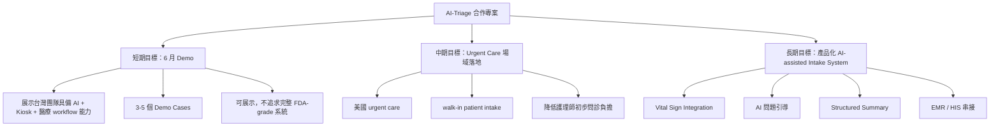
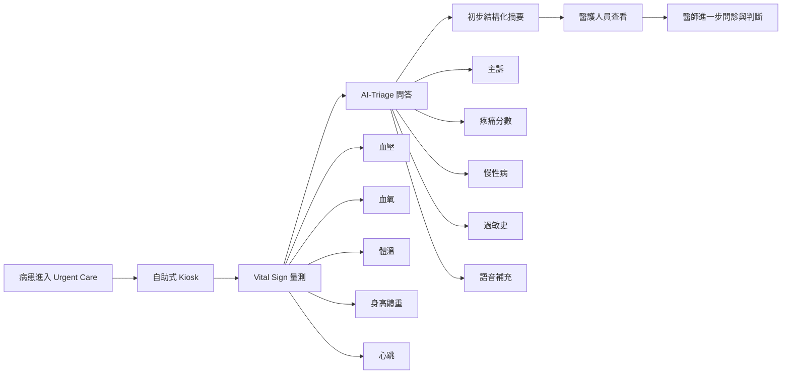
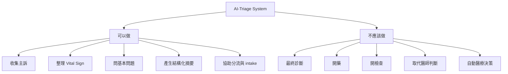
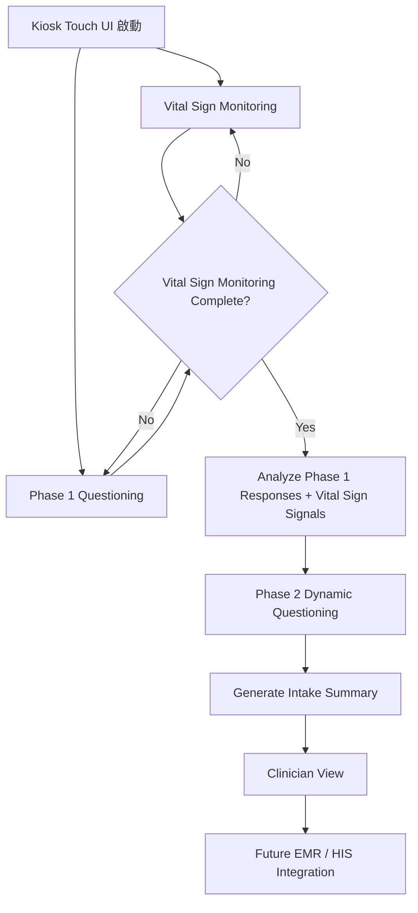
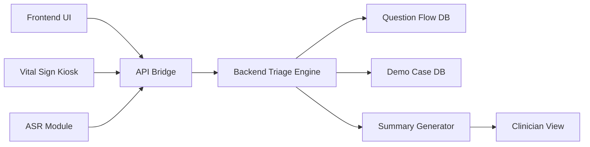
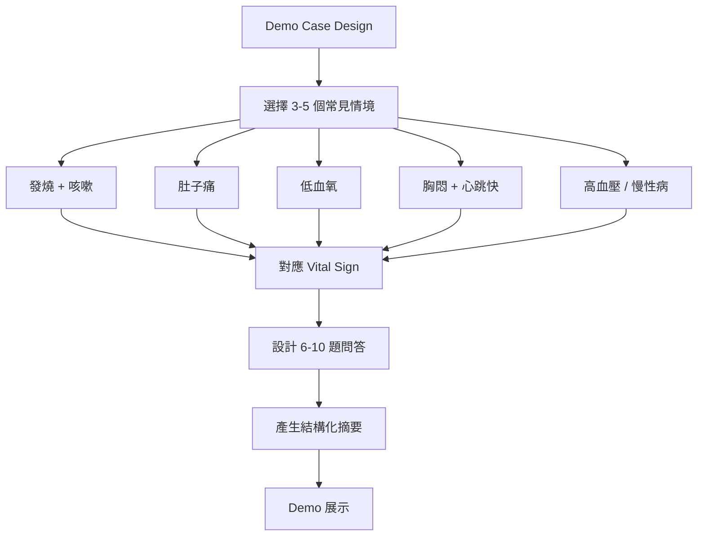
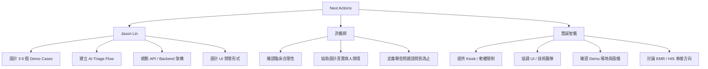

# AI-Triage 合作會議記錄（NYCU 吳老師團隊 × 慧誠智醫）260515

**會議日期：** 2026/05/15 (Friday)

**會議主題：** AI-Triage Demo 規劃、Urgent Care 應用場景、Vital Sign 與 Triage Flow 整合討論

**參與人員：**

### 慧誠智醫（iMedtac）

- Jason Miao（業務）
- Johnny Fang（PM）

### NYCU 團隊

- Jason Lin（阿聖）
- 多寶 - 許醫師（急診／臨床背景）

---

# 一、這次會議與上次最大的差異

上次會議的核心是：

> 「AI 問診 + Vital Sign + Kiosk」能否形成 AI-Triage 的產品方向。
>

這次會議則進一步進入：

- 真正的臨床 workflow
- urgent care 的實際使用情境
- demo 應該怎麼設計
- 問題應該問到什麼程度
- Vital Sign 要如何影響 triage flow
- AI 到底應該做什麼、不該做什麼

而且：

這次加入許醫師後，整場討論開始真正「醫療化」。

也就是：

開始從：

- AI 能做什麼

轉變成：

- 醫療現場真正需要什麼



---

# 二、許醫師提出的重要臨床觀點

許醫師提供了非常關鍵的急診／檢傷流程觀點。

## 1. Vital Sign 本身就已經可以做初步檢傷

許醫師指出：

急診真正的流程其實是：

```
病患進入急診
↓
先量 Vital Sign
↓
初步檢傷分類（Triage）
↓
再由醫師進一步問診
```

也就是：

其實：

- 血壓
- 血氧
- 體溫
- 心跳

本身就已經具有：

「初步判斷病人危急程度」的能力。

例如：

| Vital Sign | 可能代表 |
| --- | --- |
| SpO2 很低 | 呼吸窘迫 |
| HR 很高 | 心律問題／shock |
| 高燒 | 感染 |
| 血壓異常 | cardiovascular risk |

這讓整個 AI-Triage 的定位變得更清楚：

不是「診斷 AI」。

而是：

> 「協助初步分類與整理資訊的 AI。」
>

---

# 三、Urgent Care 的真正定位

這次會議中，慧誠智醫補充了美國 urgent care 的真實定位。

這點非常重要。

因為：

你原本比較偏向：

- 台灣急診室思維

但這次明確對齊：

## 美國 urgent care 並不是台灣急診

它更像：

```
門診 與 急診 之間
```

的中間地帶。

特徵：

- walk-in
- 不需預約
- 非立即生命危險
- 但又需要快速處理

例如：

- 發燒
- allergy
- 肚子痛
- 呼吸不舒服
- 小外傷
- 感冒惡化

這也代表：

你們現在設計的 AI-Triage：

其實更接近：

```
Urgent Care Intake Assistant
```

而不是：

```
ER Diagnostic AI
```

這是非常大的定位差異。



---

# 四、這次真正對齊的 AI-Triage 定義

這次會議其實已經慢慢把：

「AI-Triage 到底是什麼」

定義清楚了。

## 現在的 AI-Triage 定位

它不是：

- AI 診斷醫師
- AI 開藥
- AI 判斷疾病

而是：

## 「AI-assisted intake + triage support」

也就是：

### AI 做的事情

- 收集主訴
- 問基本問題
- 整理資訊
- 搭配 vital sign
- 初步分類
- 協助醫護 workflow

### AI 不做的事情

- 最終診斷
- 醫療決策
- 開藥
- 開檢查
- 醫療判斷

這個邊界在會議中被講得非常清楚。



---

# 五、這次最重要的策略轉變：先做 Demo，不做完整系統

這是整場會議最重要的共識之一。

## 你們現在不是在做：

```
完整 FDA-grade AI Triage
```

而是在做：

```
可展示的 AI-Triage Demo
```

因此：

會議中開始出現非常重要的工程策略：

---

## Demo 導向策略

### 1. 只做 3～5 個 case

例如：

- 發燒 + 咳嗽
- 肚子痛
- 低血氧
- 胸悶
- 心跳過快

---

### 2. 對 case 做「極端優化」

因為：

demo 的目的是：

```
讓客戶 imagine future
```

而不是：

```
完整泛化能力
```

---

### 3. 問題不要太多

會議中反覆強調：

- 6～10 題左右
- 不要超長
- 不要像完整病史問診

因為：

真正目的只是：

```
快速 triage
```

不是：

```
完整診斷
```

流程圖，如下：



---

# 六、這次開始真正形成的系統架構

這次會議已經慢慢把架構講清楚了。

---

## 整體流程

```
Vital Sign Kiosk
↓
取得 Vital Data
↓
AI Triage Engine
↓
Question Flow
↓
Structured Summary
↓
EMR / HIS
↓
醫師參考
```

---

# 七、這次真正開始清楚的「問題設計哲學」

這次會議裡有一段很重要：

## 「不是所有問題都要 open-ended」

你提出：

- 選擇題
- 限制式互動
- Guided interaction

其實非常合理。

因為：

病患常常：

- 描述太久
- 沒重點
- 不知道怎麼講

而 triage 真正需要的是：

```
快速結構化資訊
```

因此：

現在的方向開始變成：

| 問題類型 | 用途 |
| --- | --- |
| 固定選項 | 快速收斂 |
| 疼痛量表 | structured data |
| 主訴選擇 | routing |
| ASR 補充 | 開放描述 |

這是一個非常合理的 hybrid design。

---

# 八、目前技術架構方向

你這次也開始把系統技術架構講得更具體了。

---

## 三大模組



### 1. Frontend UI

- kiosk touch UI
- button-based
- guided interaction

---

### 2. ASR / Voice Module

- 語音轉文字
- 開放式補充
- Whisper 類型模型

---

### 3. Backend Triage Engine

- 問題 flow
- 資料庫
- triage logic
- case management

---

# 九、重要工程現實：Local LLM 很可能不可行

你這次非常明確提出：

## CPU-only local AI 很容易過熱

尤其：

- ASR
- 即時 LLM
- realtime inference

會非常吃資源。

因此：

目前最實際的方向變成：

## Demo 階段

```
Kiosk
↓
API
↓
外部運算主機
```

而不是：

```
完全 local inference
```

這是很務實的判斷。



---

# 十、這次會議真正隱含的產品哲學

這次其實有一個很重要的隱含訊息：

## 這不是 AI 專案

而是：

```
Medical Workflow Product
```

真正重要的是：

- friction
- workflow
- patient throughput
- nursing load
- clinical usability

而不是：

- LLM 多強
- reasoning 多 fancy
- AI 多聰明

這個方向已經開始非常明顯了。

---

# 十一、目前已形成的短期 Action Items



## Jason Lin（阿聖）

### 1. 設計 Demo Cases

預計：

- 3～5 個 case
- 與 vital sign 結合

例如：

- 發燒＋咳嗽
- 肚子痛
- 低血氧
- 心跳過快

---

### 2. 建立初步 AI-Triage Flow

包括：

- 問題流程
- UI flow
- triage logic
- ASR interaction

---

### 3. 設計 API / Backend 架構

包括：

- frontend
- ASR
- backend
- API 橋接
- Docker / deployment 思考

---

## 多寶 - 許醫師

### 1. 協助醫療情境設計

包括：

- case realism
- triage flow
- clinical questioning
- symptom prioritization

---

## 慧誠智醫

### 1. UI / Kiosk integration

### 2. Frontend 配合

### 3. Demo environment

### 4. API 與軟體整合討論

---

# 十二、這次會議真正的結論

現在這個專案：

已經不再只是：

```
AI 問答系統
```

而是開始變成：

```
Medical Intake Workflow System
```

而且：

這次最大的進步是：

## 你們終於開始把：

- AI
- Vital Sign
- Clinical Workflow
- Urgent Care
- Demo Reality
- Hardware Constraints
- Regulatory Boundaries

放進同一個系統裡思考。

這才是真正的產品化開始。