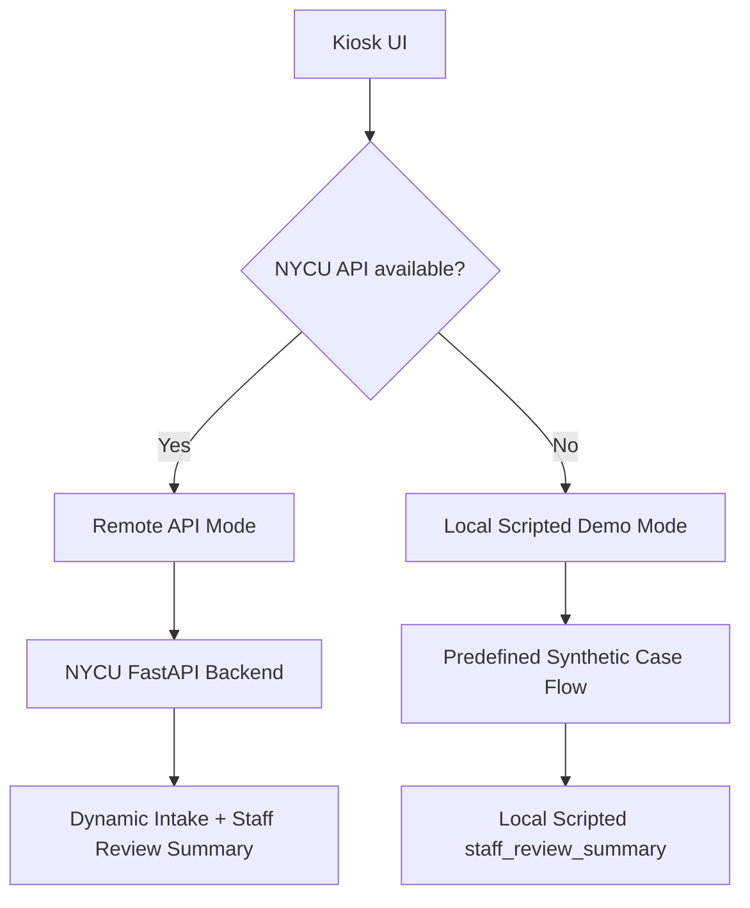

# 慧誠智醫會前提供文件：iMVS / NYCU AI Triage Demo API v0.2 會前閱讀文件

提供對象：慧誠智醫 / Johnny Fang / 工程設計團隊 / 許醫師 / NYCU demo 團隊

會議時間：`2026-05-21 10:00` Asia/Taipei

## 1. 會議目標

NYCU 建議 5/21 sync 直接收斂 iMVS 與 NYCU AI Triage Demo 之間的 API v0.2 工作合約。這份文件提供可討論、可修改、可落地的 pre-read，讓慧誠工程團隊可以在會前先看見 UI 插入點、payload 欄位、`session_key` 行為、問題物件格式、回答回傳流程，以及人員檢閱摘要（`staff_review_summary`）的輸出格式。

本次建議收斂成一個完整、可進行 demo、可測試的合成資料流程：

```text
iMVS 合成生命徵象 payload
-> NYCU 結構化 / 選項式動態問診
-> iMVS 回傳回答 payload 與 session_key
-> NYCU 產生 staff_review_summary
-> 工作人員 / 臨床人員檢閱
```

這個 demo 的產品主張很清楚：iMVS 的量測資料可以成為 NYCU 結構化問診流程的 vital context，最後產生給工作人員 / 臨床人員檢閱的 `staff_review_summary`。六月版本以 synthetic data、staff review、read-only demo flow 作為範圍控制；不輸出診斷、治療建議、最終檢傷或 acuity 分級，也不執行 production HIS / EMR / FHIR writeback。

## 2. 慧誠需求與本次回應

| 慧誠提出的需求 / 規格方向 | 本次 NYCU 回應 |
| --- | --- |
| 六月前要能放進 iMVS kiosk / web service demo 流程。 | 先提供 API v0.2 草稿與 JSON 範例，讓慧誠工程團隊確認 UI 插入點與 payload 形狀。 |
| iMVS 量測到的生命徵象要進入 AI Triage 流程。 | API 請求以合成的 iMVS-shaped vital payload 為核心，欄位包含 `measurement_timestamp`、`device_id`、`value`、`unit`、`measurement_status`、`quality_flag`、`missing_reason`。 |
| 動態 OPQRST-style 問題數需要精簡。 | 依目前 iMVS product spec，可見的病人端問題使用 `<8` 作為上限；API 硬性上限建議設定為 `max_questions=7`。 |
| UI 需要支援單選、多選、量表與進度顯示。 | API 問題物件會明確回傳 `question.type`、`options`、`none_option_id`、`progress.current`、`progress.expected_total`。 |
| iMVS 需要知道回答後下一步怎麼走。 | 使用 `session_key` 維持 session；iMVS 送出回答後，NYCU 回傳下一題或 `staff_review_summary`。 |
| 希望有醫師 / 工作人員可看的 AI 結果頁。 | 六月 demo 建議顯示僅供工作人員檢視的 summary page，欄位使用 `review_basis`、`review_action`、`staff_handoff_note`。 |
| 語音輸入有產品吸引力。 | 語音輸入建議排除在六月關鍵路徑；若列為延伸項目，需逐字稿確認、重試 / 備援機制，並且不保留 raw audio。 |
| HIS / FHIR / EMR return path 是產品方向。 | 六月 demo 建議只做醫師檢視頁或 mock export，不做 production writeback。 |

## 3. 六月 demo 建議範圍

### 納入六月主線

- 完成一個完整的合成呼吸道情境 demo 流程；
- 使用 iMVS-shaped synthetic vital payload；
- 支援結構化問題流程；
- 以 `session_key` 為基礎送出結構化回答；
- 顯示可理解的進度；
- 支援 `single_choice`、`multi_choice`、`scale` 的 question schema；
- 產生提早轉交工作人員檢閱的 handoff summary；
- 定義穩定的錯誤行為與 fallback 文字；
- API 或 measurement quality 失敗時，不產生假的臨床摘要。

### 六月範圍控制

以下控制讓六月 demo 保持可交付、可整合、可由臨床人員檢閱：

- 輸出維持為 `staff_review_summary`，不輸出診斷；
- 保留 staff / clinician review，不輸出最終檢傷或 acuity 分級；
- 只呈現 workflow support，不輸出治療建議或 emergency order；
- 使用合成資料，不使用真實病人識別資料或真實病人資料；
- 語音不進入六月 critical path，因此不收 raw ASR audio；
- HIS / EMR / FHIR 維持 read-only / mock 呈現，不做 production writeback；
- 對外主張維持 demo capability，不使用 FDA / 510(k)-ready claim；
- 六月先完成一個可驗證的 respiratory loop，再擴充到更多案例或更廣科別。

## 4. API v0.2 建議合約

### 端點 1：建立 session

```http
POST /api/triage-demo/sessions
```

主要輸入：

- `api_version`
- `schema_version`
- `flow_version`
- `case_id`
- `request_id`
- `idempotency_key`
- `workflow_mode`
- `measurement_state`
- `vitals_ready`
- `client`
- `patient_context`
- `vitals`
- `capabilities`

主要回應：

- `session_key`
- `session_expires_at`
- `session_state`
- `last_question_id`
- `status: "question"`
- `progress`
- `question`
- `demo_boundary`

### 端點 2：送出回答

```http
POST /api/triage-demo/sessions/{session_key}/answers
```

主要輸入：

- `session_key`
- `question_id`
- `answer.selected_option_ids`
- `answer.scale_value`
- `client_event.input_mode`
- `request_id`
- `idempotency_key`

主要回應：

- 下一個 `question`；或
- `status: "summary"` 與 `staff_review_summary`。

### 端點 3：生命徵象完成後回傳 payload

```http
POST /api/triage-demo/sessions/{session_key}/vitals
```

若慧誠 UI 支援最佳化的 two-phase flow，建議使用此端點：

```text
Phase 1：iMVS 量測中先詢問 pre-vital intake questions
-> vitals-ready payload
-> Phase 2：vital-aware follow-up
-> staff_review_summary
```

若 iMVS UI 不適合在量測中顯示問題，使用保守 fallback：

```text
post-measurement-only flow
-> synthetic vital values 完成後再呼叫 Endpoint 1
```

## 5. 需要慧誠確認的 vital payload 欄位

NYCU 可以先依照以下 shape 製作 API v0.2 草稿。慧誠工程團隊需確認實際欄位名稱、單位、required / optional 狀態，以及 missing / failure 語意。

```json
{
  "vitals": {
    "measurement_timestamp": "2026-05-21T10:00:00+08:00",
    "device_id": "IMVS-DEMO-001",
    "temperature": {
      "value": 38.5,
      "unit": "C",
      "measurement_status": "measured",
      "quality_flag": "needs_review",
      "missing_reason": null
    },
    "spo2": {
      "value": 92,
      "unit": "%",
      "measurement_status": "measured",
      "quality_flag": "needs_review",
      "missing_reason": null
    },
    "heart_rate": {
      "value": 102,
      "unit": "beats/min",
      "measurement_status": "measured",
      "quality_flag": "ok",
      "missing_reason": null
    },
    "respiratory_rate": {
      "value": 23,
      "unit": "breaths/min",
      "measurement_status": "measured",
      "quality_flag": "needs_review",
      "missing_reason": null
    },
    "blood_pressure_systolic": {
      "value": 123,
      "unit": "mmHg",
      "measurement_status": "measured",
      "quality_flag": "ok",
      "missing_reason": null
    },
    "blood_pressure_diastolic": {
      "value": 81,
      "unit": "mmHg",
      "measurement_status": "measured",
      "quality_flag": "ok",
      "missing_reason": null
    }
  }
}
```

會議需要確認：

- 每一個 vital field 是否都能帶自己的 `measurement_status`、`quality_flag`、`missing_reason`？
- 若六月來不及做到 per-vital quality fields，是否先使用 session-level quality fields？

## 6. 第一個 demo 案例

建議第一個案例：

```text
呼吸喘、發燒與較低血氧
```

合成案例設定：

- 年齡：`80`
- 性別：`male`
- 體溫：`38.5 C`
- SpO2：`92%`
- 心率：`102 beats/min`
- 呼吸速率：`23 breaths/min`
- 血壓：`123/81 mmHg`

這個案例適合作為第一個 demo 案例，原因如下：

- 能清楚呈現量測生命徵象為什麼會影響後續問題；
- 支援短流程、可視覺化、結構化問診；
- 可自然收斂到 staff-review handoff，不需要宣稱診斷或最終檢傷分級；
- 可以維持在 `<8` 可見問題要求內。

建議問題流程：

| # | 階段 | 問題目的 | 類型 |
| --- | --- | --- | --- |
| 1 | pre-vital intake | 主訴 | single-choice |
| 2 | pre-vital intake | 呼吸喘持續時間 | single-choice |
| 3 | pre-vital intake | 呼吸不適嚴重程度 | scale 或 single-choice |
| 4 | pre-vital intake | 相關症狀 | multi-choice |
| 5 | post-vital follow-up | 胸痛或胸口壓迫感確認 | single-choice |
| 6 | post-vital follow-up | 慢性肺病、居家氧氣或呼吸用藥脈絡 | multi-choice |
| 7 | post-vital follow-up | 藥物過敏或需 staff 確認的用藥脈絡 | multi-choice |

## 7. `staff_review_summary` 建議格式

建議欄位名稱：

```json
"staff_review_summary"
```

建議結構：

```json
{
  "status": "summary",
  "summary_visibility": "staff_only",
  "handoff_required": true,
  "handoff_reason_codes": [
    "reported_shortness_of_breath",
    "measured_lower_oxygen_saturation_demo",
    "measured_fever_demo"
  ],
  "staff_review_summary": {
    "format": "review_summary_demo",
    "subjective": [
      "合成案例：使用者回報呼吸喘。"
    ],
    "objective": [
      "合成量測生命徵象包含發燒、呼吸速率偏高，以及本 demo 情境中較低的血氧值。"
    ],
    "review_basis": [
      "回報的呼吸症狀與量測血氧線索應由工作人員檢閱。"
    ],
    "review_action": [
      "需要工作人員或臨床人員檢閱。"
    ],
    "staff_handoff_note": "請檢閱量測生命徵象與使用者回報症狀。",
    "not_claimed": [
      "本 demo 不提供診斷。",
      "本 demo 不提供治療建議。",
      "本 demo 不指定最終檢傷分級。",
      "本 demo 不寫入 HIS/EMR/FHIR。"
    ]
  }
}
```

六月 API 合約建議使用 `review_basis` 與 `review_action`。避免使用 `diagnosis`、`assessment_support`、`plan_support`，因為這些字眼容易被理解成診斷、SOAP Assessment 或 SOAP Plan。

## 8. 錯誤與 fallback 規則

如果 API、session 或 measurement quality 失敗，系統不應產生假的臨床摘要。

建議 fallback 文字：

```text
AI Triage Demo service 目前無法使用，或 measurement quality 無法支援本次 demo 摘要。請繼續使用標準工作流程。本次未產生 AI 產生的臨床摘要。
```

必要 error fields：

- `status: "error"`
- `error.code`
- `error.message`
- `http_status`
- `retry_allowed`
- `fallback_to_standard_staff_workflow: true`
- 不包含 `staff_review_summary`

建議 error examples：

- `missing_required_field`
- `unsupported_question_type`
- `invalid_session`
- `session_expired`
- `api_timeout`
- `measurement_quality_unavailable`
- `idempotency_conflict`

## 9. 會前或會中需要慧誠確認的事項

### 產品 / Johnny

- 確認六月中客戶 demo 的確切日期。
- 確認這次 demo 的成功標準是 UI 驗證、API 驗證，或工作流程驗證。
- 確認工程團隊需要 Markdown API 文件、OpenAPI、mock endpoint，或 sequence diagram。
- 確認單一工程窗口與後續溝通管道。

### 工程 / 慧誠

- 確認 iMVS 實際 vital field names 與 units。
- 確認哪些 vital fields 是 guaranteed，哪些是 optional。
- 確認 missing / failed / poor-quality measurement 的表示方式。
- 確認六月目標 iMVS device / product mode。
- 確認 UI insertion point：same app、iframe、external link、backend API、laptop API，或 static mock。
- 確認 Phase 1 questions 是否能在 measurement running 時顯示。
- 確認 iMVS 是否能呼叫 `POST /api/triage-demo/sessions/{session_key}/vitals`。
- 確認是否由 NYCU 產生 `session_key`，iMVS 後續 echo 回來。
- 確認 demo 是否允許 external HTTPS endpoint，或應採 local mock / laptop API。

### 臨床 / 許醫師

- 確認第一個 live demo case 是否採用 respiratory case。
- 確認 `SpO2 92%`、發燒與 respiratory-rate wording 是否應在較少問題後觸發 early handoff。
- 確認安全的 staff-summary wording。
- 確認 customer demo 中不可出現的 forbidden wording。

### 隱私 / 資安

- 確認六月不使用真實姓名、MRN、身分證字號、電話、raw audio，或 live chart data。
- 確認六月不連接 production HIS / EMR / FHIR endpoint。
- 確認 demo log 與 screenshot 的處理規則。

## 10. 建議會議收斂的負責人 / 日期

| 負責人 | 交付項目 | 建議期限 | 驗收方式 |
| --- | --- | --- | --- |
| 慧誠 engineering | Synthetic iMVS vital payload example 與 field dictionary | 2026-05-22 | 欄位名稱、單位、required / optional、missing / failure behavior 明確。 |
| 慧誠 engineering / UI | UI insertion decision | 2026-05-22 | 明確指定 same-app / iframe / external link / backend API / laptop API / static mock。 |
| 慧誠 engineering | Two-phase feasibility decision | 2026-05-22 | 確認 Phase 1 during measurement 與 vitals-ready endpoint 是否可行。 |
| Johnny / product | demo 日期、受眾、成功標準、engineering POC | 2026-05-21 call | 明確指定日期、受眾、預期證明項目與單一 owner。 |
| 許醫師 | Respiratory case stop rule 與 safe summary wording | 2026-05-22 | 核准第一個案例、handoff trigger 與確切 wording boundary。 |
| Jason / NYCU | 欄位確認後的 confirmed API v0.2 | 2026-05-22 | 依確認後的 field dictionary、session ownership 與 error behavior 更新草稿。 |
| Jason / NYCU | One respiratory mock adapter / static rehearsal | 2026-05-25 | 一個合成案例可跑完 request -> answer -> summary examples。 |
| 隱私 / 資安 owner | Demo data 與 endpoint boundary | 2026-05-22 | 確認 synthetic-only data、no raw audio、no production endpoint 與 log policy。 |

## 11. 建議 email 文字

主旨：

```text
AI Triage Demo：iMVS / NYCU API v0.2 5/21 Sync 會前閱讀文件
```

內文：

```text
Johnny 與慧誠 engineering team 您好，

會議前先提供 NYCU 端整理的 API v0.2 會前閱讀文件，供 5/21 sync 直接收斂工程決策。

我們建議六月 demo 先固定成一個 synthetic-data vital-aware intake loop：
iMVS 提供合成生命徵象 payload，NYCU 回傳結構化 question object 與 session_key，iMVS 回傳結構化回答，NYCU 最後回傳 staff_review_summary 給工作人員 / 臨床人員檢閱。

這份文件包含：
1. API / session loop 建議；
2. vital payload 欄位方向；
3. question object 與 answer schema；
4. staff_review_summary 欄位；
5. voice 與 HIS/FHIR writeback 的六月範圍決策；
6. 會議中需要慧誠 / 許醫師 / NYCU 確認的負責人 / 日期。

明天會議希望優先確認：
- iMVS actual field dictionary；
- UI insertion point；
- session_key ownership；
- Phase 1 during measurement 是否可行；
- first respiratory case 與 safe summary wording；
- API v0.2 confirmed version 的交付時間。

Jason 敬上
```

## 12. 建議附檔或分享資料

### A. 對外寄送 / 分享的最低限度

- 本會前閱讀文件；
- `2026-05-21-imvs-nycu-api-design-v0.2-draft.md`；
- `api-examples/` JSON examples；
- `2026-05-21-decision-defaults-and-owner-matrix.md`。

若只寄一份文件，建議先寄本會前閱讀文件，並保留 API examples 供會後補充。

### B. 自己手上開會時必帶的會議資料包

這一組是 Jason / NYCU 團隊自己開會控場用，不是預設要全部寄給 imedtac 的正式附件。它的用途是：對方追問時可以立刻回答、查欄位、收斂 owner / date，並避免會議漂移成 broad brainstorming。

必帶清單：

- `AI-Triage_imedtac_Pre-Meeting_Pre-Read_2026-05-21.md`
  - 用途：自己的完整會前 meeting packet；
  - 重點：scope、API contract、UI integration、clinical boundary、owner / due date、fallback、Q&A 回答口徑。
- `handoff/2026-05-21-imedtac-meeting-q-and-a.md`
  - 用途：分類 Q&A 與 detailed speaking answers；
  - 重點：產品定位、REST API / JSON / FastAPI、`session_key`、vitals missing / quality flag、CORS/auth/logs、local scripted fallback、clinical wording、ASR / HIS deferral、versioning、closeout questions。
- `handoff/2026-05-21-imedtac-engineering-sync-prep.md`
  - 用途：會議流程與議程控場；
  - 重點：meeting frame、roles、agenda、what Jason should prepare、questions for Johnny / engineering / 多寶。
- `handoff/2026-05-21-imvs-nycu-api-design-v0.2-draft.md`
  - 用途：API contract 主文件；
  - 重點：endpoint list、request / response fields、`session_key`、vitals endpoint、summary schema、error behavior。
- `handoff/api-examples/`
  - 用途：工程團隊問「實際 JSON 長怎樣」時直接打開；
  - 重點：start session、submit answer、update vitals、next question、summary、error examples。
- `handoff/2026-05-21-decision-defaults-and-owner-matrix.md`
  - 用途：會議結尾收斂 decision / owner / due date；
  - 重點：field dictionary、UI insertion、two-phase feasibility、session ownership、local fallback、clinical wording、confirmed API v0.2。
- `docs/2026-05-19-two-phase-question-flow-design.md`
  - 用途：解釋為什麼 Phase 1 可在量測中先問 non-vital-dependent questions；
  - 重點：不要浪費量測等待時間，但若影響姿勢 / signal quality 就退回 post-measurement-only flow。
- `docs/2026-05-19-api-session-design-plain-explanation.md`
  - 用途：自己或對方需要白話解釋 API session 時使用；
  - 重點：`session_key` 是 workflow 流水號，不是病人身分資料。
- `handoff/2026-05-20-nycu-response-to-imedtac-ai-triage-demo-api-v02.md`
  - 用途：外部 pre-read / NYCU 回覆的 active copy；
  - 重點：會前正式說法、API v0.2 建議、respiratory case、staff_review_summary、error fallback。

會議中使用順序建議：

```text
1. 先用本 meeting packet 的核心說法開場。
2. 對方問 API -> 開 API v0.2 draft + api-examples。
3. 對方問「如果壞掉怎麼辦」-> 開 Q&A 的 fallback / degraded mode。
4. 對方問 clinical wording -> 開 Q&A 的 clinical boundary / summary wording。
5. 會議快結束 -> 開 decision defaults / owner matrix 收斂 owner、due date、fallback。
```

不要主動外寄的內容：

- personal note 裡的完整個人補充段落；
- classified Q&A 的全部 detailed speaking answers；
- patent-sensitive implementation details；
- backend model / prompt / retrieval / scoring / threshold internals；
- token、private endpoint、Teams access details、raw source screenshots。

## 13. 會中補充確認清單（個人筆記）

這一節不是要全部放進寄給 imedtac 的正式文件，而是明天會議中用來避免漏問的控制清單。正式文件已經涵蓋 API v0.2、vital payload、first respiratory case、`staff_review_summary`、error fallback、voice 與 HIS/FHIR writeback 邊界；以下項目是在會中若對方沒有主動說明，建議補問清楚。

### A. Demo 成功標準

- 明天要驗證的是 clickable UI、API integration、workflow story，還是 customer-facing capability demo？
- 六月 demo 的「完成」定義是什麼？
- 客戶看完 demo 後，imedtac 希望對方記住哪一個產品能力？

### B. 實際 demo 形式

- 六月 demo 要跑在 iMVS 裡面，還是可以使用 iframe / external link / NYCU laptop API / static mock？
- 如果無法放進 iMVS，是否接受 kiosk-adjacent demo？
- 會議後第一個工程 rehearsal 要用哪一種形式驗收？

### C. Engineering POC 與溝通節奏

- imedtac 是否可以指定單一 engineering POC？
- 後續問題要走 email、LINE、Teams，還是 shared document？
- API field dictionary、sample payload、UI insertion decision 由誰彙整？

### D. API 文件格式

- Markdown API document 是否足夠？
- 是否需要 OpenAPI spec、sequence diagram、mock endpoint、Postman collection？
- JSON examples 是否要分成 request / response / error cases？

### E. Session Ownership 與狀態處理

- `session_key` 由 NYCU 團隊產生、iMVS echo 回來是否可接受？
- 如果使用者 back、restart、abandon flow，session 如何處理？
- retry 是否需要 `idempotency_key`？
- answer history 在六月 demo 是否需要保存？保存在哪一端？

### F. Demo Environment

- 六月 demo 是否允許 external HTTPS endpoint？
- 是否有 CORS、VPN、firewall、internet、local network 限制？
- demo 現場是否有穩定網路？
- network failure 時是否接受 local mock fallback？

### G. Summary 顯示位置

- `staff_review_summary` 要顯示在 kiosk、doctor / staff review page、另一個 web page，還是 mock export？
- patient-facing UI 是否會看到 summary？如果會，需要另外寫 patient-safe wording。
- staff / clinician review page 需要中英雙語，還是英文即可？

### H. Case Count 與擴充節奏

- imedtac 是否仍期待 `3-5` cases？
- 若期待多案例，是否接受「一個 respiratory full loop 先完成，再擴充 fixtures」？
- 第二個 case 優先順序是 abdominal pain + fever、tachycardia / chest tightness，還是 URI contrast？

### I. AI Training / Study 說法

- 六月 demo 是否需要被描述為 AI training / study？
- NYCU 團隊建議六月 demo 不使用 real patient data，也不做 model training study。
- 若 imedtac 希望進入 real-data / study，需要另開 governance path：資料來源、同意、IRB / privacy、logging、clinical owner、security owner。

### J. 語言與對外呈現

- customer-facing question wording 是否全英文？
- staff / clinician summary 是否需要中文、英文或雙語？
- 對外名稱是否統一使用 `慧誠智醫（imedtac Co., Ltd.）`，後續英文簡稱 `imedtac`？

### K. 會議結尾必收斂

會議結束前至少確認以下 owner / decision：

| Decision | Owner | Notes |
| --- | --- | --- |
| iMVS actual field dictionary | imedtac | 欄位名稱、單位、required / optional、missing / failure semantics。 |
| UI insertion point | imedtac | same app / iframe / external link / backend API / laptop API / static mock。 |
| Session ownership | imedtac + NYCU 團隊 | `session_key` owner、retry、restart、abandon behavior。 |
| Phase 1 during measurement feasibility | imedtac | 是否會干擾量測姿勢或 signal quality。 |
| First respiratory case wording | 許醫師 / NYCU 團隊 | stop rule、safe summary wording、forbidden wording。 |
| Confirmed API v0.2 next artifact | Jason / NYCU 團隊 | field dictionary 確認後更新。 |
| Demo environment | imedtac | external HTTPS / CORS / firewall / local fallback。 |
| Privacy / security boundary | imedtac + NYCU 團隊 | synthetic-only、no raw audio、no production endpoint、log / screenshot rule。 |

建議會議結尾口頭確認：

```text
今天我們先把六月 demo 收斂成一個 synthetic-data vital-aware intake loop。下一步需要 imedtac 確認 field dictionary、UI insertion point、session ownership、demo environment；NYCU 團隊會依照確認結果更新 confirmed API v0.2；許醫師 / NYCU 團隊會確認第一個 respiratory case 的 stop rule 與 safe summary wording。Voice input 與 HIS/FHIR writeback 不進六月 critical path，除非另開 decision。
```

## 14. 會前資料定位與 API 回答口徑（個人補充）

這份資料本質上是一份 meeting packet。它不是研究論文，也不是單純 API 文件；它的任務是讓 `2026-05-21` 會議直接收斂六月 demo 的 scope、API contract、UI integration、clinical boundary、ownership 與 due date。

NYCU 端這次要交付的核心定位是：

```text
AI triage demo engine
+ intake workflow logic
+ dynamic question loop
```

也就是一個 synthetic-data vital-aware intake support demo，而不是完整醫療系統、HIS 廠商、醫療器材產品或法規送件包。

### A. 這包 meeting packet 的八個部分

1. `00-README.md`
   - 會議的 first principle：六月 demo 的時間、人力與信任都是稀缺資源。
   - 會議主線：`iMVS vital-sign payload -> NYCU dynamic intake questions -> staff_review_summary -> human review`。
   - 邊界：不做 diagnosis、treatment advice、final triage、HIS / EMR writeback、真實病患資料處理。

2. `01-meeting-prep.md`
   - 真正用途是會議腳本。
   - 會議任務不是 brainstorm，而是凍結最小可運作 integration contract。
   - 對方最需要確認：能不能串、API 長怎樣、誰管理 session、two-phase workflow 是否可行、clinical wording 是否安全。

3. `03-decision-owner-matrix.md`
   - 這是會議控制表。
   - 每個重要問題都要收斂成 decision、owner、due date、fallback。
   - 不能停在「我們回去再想想」。

4. API v0.2 Freeze Checklist
   - 工程 freeze gate。
   - 需要確認 iMVS payload dictionary、unit、required / optional、missing semantics、measurement quality 與 idempotency。
   - 沒有這些細節，API 不能視為 frozen。

5. Question Budget
   - 產品限制。
   - 病人可見問題上限維持 `<8`，建議 `5-7` 題。
   - 這是 kiosk workflow，不是長時間門診問卷。

6. API Examples
   - 給工程師 mock API 用的 request / response / error JSON。
   - 會議中若對方問「具體格式」，直接開 examples。

7. Reviewer Packet
   - claim governance。
   - 可以說 staff-review support、workflow support、staff_review_summary。
   - 不說 AI diagnosis、final triage、clinical-grade autonomous decision。

8. My Meeting Notes
   - 自己的戰場筆記。
   - 作用是會中防漏問：API、session、UI、fallback、owner、due date 都要收斂。

### B. API section key 的正確回答

如果對方問 API section key，先把語意釐清成 `session_key`。

`session_key` 不是醫療資料，也不是病人身分資料。它是一次 demo intake workflow 的 session 流水號。建議由 NYCU 產生，因為 dynamic question state、回答歷史、Phase 1 / Phase 2 狀態都在 NYCU demo engine 端。

範例：

```json
{
  "session_key": "nycu-demo-20260521-0001"
}
```

會議回答口徑：

```text
我們建議 session_key 由 NYCU demo API 產生，iMVS 後續每次 answer 或 vitals-ready update 都 echo 同一個 session_key。這樣 question loop 的 state、retry、idempotency 與 summary 產生都能保持一致。
```

### C. API 不是只給 key/value，而是給 contract

要給對方的是 JSON API contract，不只是欄位名稱。最小內容包括：

- 對方要送什麼 request；
- NYCU 會回什麼 response；
- session 如何建立與維持；
- answer 如何讓 question loop 前進；
- vital signs 如何在量測完成後更新；
- summary schema 長什麼樣；
- timeout、invalid session、measurement failure 時怎麼回；
- retry / idempotency 如何避免重送造成流程跳題。

最小 endpoint 清單：

```text
POST /api/triage-demo/sessions
POST /api/triage-demo/sessions/{session_key}/answers
POST /api/triage-demo/sessions/{session_key}/vitals
GET  /api/triage-demo/sessions/{session_key}/summary
```

`GET /summary` 可以是明確查詢端點；若工程團隊希望簡化，也可以讓 answer / vitals endpoint 在 `status="summary"` 時直接回傳 `staff_review_summary`。

### D. 可直接展示的最小 JSON flow

建立 session：

```http
POST /api/triage-demo/sessions
```

```json
{
  "api_version": "0.2",
  "case_id": "respiratory_demo_001",
  "source": "imvs_kiosk",
  "workflow_mode": "parallel_measurement_intake",
  "measurement_state": "in_progress",
  "vitals_ready": false
}
```

回第一題：

```json
{
  "session_key": "nycu-demo-abc123",
  "session_state": "active",
  "status": "question",
  "next_question": {
    "question_id": "q001",
    "question_type": "single_choice",
    "text": "What is your main discomfort right now?",
    "choices": [
      "Fever",
      "Cough",
      "Shortness of breath",
      "Chest discomfort",
      "Other"
    ]
  }
}
```

送回答：

```http
POST /api/triage-demo/sessions/nycu-demo-abc123/answers
```

```json
{
  "session_key": "nycu-demo-abc123",
  "question_id": "q001",
  "answer": {
    "selected_option_ids": ["shortness_of_breath"]
  },
  "idempotency_key": "answer-q001-demo-001"
}
```

送生命徵象：

```http
POST /api/triage-demo/sessions/nycu-demo-abc123/vitals
```

```json
{
  "session_key": "nycu-demo-abc123",
  "vitals_ready": true,
  "vitals": {
    "spo2": {
      "value": 92,
      "unit": "%",
      "measurement_status": "measured",
      "quality_flag": "needs_review"
    },
    "temperature": {
      "value": 38.2,
      "unit": "C",
      "measurement_status": "measured",
      "quality_flag": "needs_review"
    },
    "heart_rate": {
      "value": 110,
      "unit": "beats/min",
      "measurement_status": "measured",
      "quality_flag": "ok"
    },
    "respiratory_rate": {
      "value": 24,
      "unit": "breaths/min",
      "measurement_status": "measured",
      "quality_flag": "needs_review"
    }
  }
}
```

回 post-vital follow-up：

```json
{
  "session_key": "nycu-demo-abc123",
  "status": "question",
  "question_phase": "post_vital_followup",
  "next_question": {
    "question_id": "q005",
    "question_type": "single_choice",
    "text": "Your measured oxygen level is part of this demo review. Are you currently having noticeable chest tightness or difficulty breathing?",
    "choices": [
      "No",
      "Mild",
      "Noticeable",
      "Severe"
    ]
  }
}
```

回 staff review summary：

```json
{
  "session_key": "nycu-demo-abc123",
  "status": "summary",
  "summary_visibility": "staff_only",
  "handoff_required": true,
  "staff_review_summary": {
    "subjective": [
      "Synthetic demo case: user reports shortness of breath and fever."
    ],
    "objective": [
      "Synthetic vitals include SpO2 92%, temperature 38.2 C, heart rate 110 beats/min, and respiratory rate 24 breaths/min."
    ],
    "review_basis": [
      "Reported respiratory symptoms and measured vital context should be reviewed by staff."
    ],
    "review_action": [
      "Staff or clinician review is required for this demo handoff."
    ],
    "staff_handoff_note": "Review measured vitals and reported symptoms.",
    "not_claimed": [
      "No diagnosis is provided.",
      "No treatment advice is provided.",
      "No final triage level is assigned.",
      "No HIS/EMR/FHIR writeback is performed."
    ]
  }
}
```

### E. 技術選擇的回答：REST API + JSON + FastAPI

如果對方問「你們要用什麼 API」，要把 API style、data format、backend framework 分開講。

| 名稱 | 真正意思 | 會議建議 |
| --- | --- | --- |
| REST API | iMVS 與 NYCU 溝通的 API style | 六月 demo 建議使用 |
| JSON | request / response 資料格式 | 六月 demo 建議使用 |
| FastAPI | Python backend framework | NYCU 端最適合快速實作 |
| Flask | Python 輕量 backend framework | 可行，但文件與型別支援較弱 |
| Rust / Axum / Actix | Rust backend framework | 不建議作為六月主線 |
| Node.js / Express | JavaScript backend framework | 可行，但 NYCU AI logic 若在 Python，會增加整合成本 |

會議回答口徑：

```text
NYCU 端建議六月 demo 使用 REST API + JSON contract，後端以 Python FastAPI 實作。FastAPI 可以快速產生 OpenAPI / Swagger 文件，也方便接 NYCU 的 AI intake logic。Rust 很適合正式高效能服務，但六月 demo 的主要風險是 integration clarity、field contract、fallback behavior 與 clinical wording，不是效能。
```

### F. Demo 部署方式：先 tunnel / demo backend，避免對方直連實驗室電腦

建議不要讓 imedtac 直接連實驗室電腦的裸 IP 或內網服務。六月 demo 可採用一個乾淨的 HTTPS demo backend URL，背後再連到 NYCU 的 FastAPI service。

最簡便版本：

```text
iMVS / imedtac demo UI
-> HTTPS public URL
-> Cloudflare Tunnel or ngrok
-> NYCU lab computer FastAPI
-> session store + question logic + staff_review_summary
```

比較正式版本：

```text
iMVS / imedtac demo UI
-> HTTPS cloud demo backend
-> FastAPI in Docker
-> synthetic session store
-> deterministic question engine
```

六月建議：

```text
先用 FastAPI + HTTPS tunnel 或簡單 demo backend 讓工程串接跑起來。
等 API contract、UI insertion point、field dictionary 確認後，再決定是否搬到雲端或院內主機。
```

### G. 需要具體跟對方說的 NYCU 技術提供項目

NYCU 端可以具體提供：

- RESTful JSON API contract；
- FastAPI-based demo backend；
- `session_key` based question loop；
- `POST /sessions`、`POST /answers`、`POST /vitals`、summary retrieval；
- synthetic respiratory demo case；
- question object schema：`single_choice`、`multi_choice`、`scale`；
- staff-only `staff_review_summary` schema；
- timeout / invalid session / measurement quality fallback behavior；
- OpenAPI / Swagger 或 Markdown API 文件；
- HTTPS tunnel / demo backend URL 作為六月串接測試方式；
- local mock fallback，避免現場網路失敗時 demo 直接中斷。

會議回答口徑：

```text
NYCU 端可以提供一組 RESTful JSON API 作為六月 demo integration interface。初版以 Python FastAPI 實作，提供 session start、answer submit、vital update、summary retrieval 四類 endpoint。所有互動以 session_key 綁定，不涉及真實病患資料、不寫入 HIS/EMR、不產生診斷或最終檢傷等級。Demo 階段可先以 HTTPS tunnel 或 demo backend URL 供 iMVS 呼叫；後續若要正式部署，再討論雲端、院內主機、資安控管、log policy 與資料治理。
```

### H. 會中若被問「我們到底要準備什麼」

最短回答：

```text
我們現在要先準備四件事：API endpoint list、JSON request/response examples、session_key 規則、demo deployment method。六月主線是 REST API + JSON + FastAPI + HTTPS tunnel/demo backend。交付的是最小可運作 AI intake loop，不是完整醫療系統。
```

工程版回答：

```text
Input 是 synthetic vitals + structured answers；middle layer 是 dynamic question engine；output 是 staff_review_summary。Question loop 的 state 由 session_key 維持，vitals-ready event 進來後進入 post-vital follow-up。所有 failure case 都 fallback to standard staff workflow，不產生假的臨床摘要。
```

產品版回答：

```text
這個 demo 展示 iMVS vital-sign payload 如何驅動一個短、可控、staff-review 的 intake workflow。它的價值是 workflow support 與 integration readiness，不是 autonomous medical decision。
```

## 15. API Spec 與 Fallback / Degraded Mode（個人補充）

結論：仍然需要產出一份 API spec。

Fallback mode 只是 demo 失敗時的備援路徑；API spec 才是 NYCU 與 imedtac 工程團隊真正整合的主合約。六月 demo 應該同時定義 primary mode 與 fallback mode：

```text
Primary mode: Remote REST API Mode
Fallback mode: Local Scripted Demo Mode
```

### A. Primary mode：API spec 的主體

API spec 要定義的是 remote REST API mode。也就是正常情況下，iMVS 怎麼呼叫 NYCU API，NYCU 怎麼回傳 dynamic questions 與 `staff_review_summary`。

API spec 至少需要回答：

- iMVS 怎麼 call NYCU API；
- NYCU API 要收什麼 JSON；
- NYCU API 回什麼 question / summary；
- `session_key` 怎麼建立、保存、echo、過期；
- answer submit 後 question loop 怎麼前進；
- vitals-ready event 怎麼送；
- error 怎麼回；
- timeout 怎麼處理；
- retry / idempotency 怎麼避免重複前進；
- demo 當天對方實際要連哪一個 URL。

因此，API spec 不是被 fallback mode 取代，而是整合主線的必要文件。

### B. Fallback mode：放進 API spec 的降級章節

Fallback / degraded mode 要補在 API spec 裡面的一節，但它不是 API spec 的替代品。

建議架構：



Local fallback mode 的目的：

- 避免網路斷線時 demo 直接停止；
- 避免 tunnel 掛掉時無法展示；
- 避免 NYCU lab computer / backend 當機時會議無法繼續；
- 讓現場仍可展示 workflow story；
- 清楚標示這是 scripted synthetic flow，不是 live AI API mode。

### C. 建議 API spec 文件結構

```text
1. Demo Scope
2. Integration Modes
   2.1 Primary: Remote REST API Mode
   2.2 Fallback: Local Scripted Demo Mode
3. Endpoint List
4. JSON Request / Response Examples
5. session_key Rules
6. Vitals Payload Dictionary
7. staff_review_summary Schema
8. Error Handling
9. Fallback / Degraded Demo Mode
10. Deployment Method
```

### D. Fallback / Degraded Demo Mode 建議文字

可以加入 API spec 的文字：

```text
If NYCU remote API is unavailable, the kiosk UI may switch to Local Scripted Demo Mode.
Local Scripted Demo Mode uses predefined synthetic cases and predefined question logic.
It does not call the NYCU backend.
It is intended only for demo continuity.
All fallback outputs must be clearly labeled as local scripted demo outputs.
```

中文說法：

```text
若 NYCU remote API 因網路、tunnel、backend 或 timeout 問題暫時不可用，kiosk UI 可切換到 local scripted demo mode。此模式只使用預先定義的 synthetic cases 與固定 question logic，不呼叫 NYCU backend，不代表 live AI API mode，目的僅是確保 demo continuity。
```

### E. 會議中可直接使用的回答

如果對方問「既然有 local demo fallback，還需要 API spec 嗎？」可以回答：

```text
需要。API spec 是六月 demo 的 primary integration contract，讓 imedtac 可以依照 endpoint、JSON schema、session_key 規則與 error behavior 呼叫 NYCU remote API。Local scripted demo mode 只是現場風險控制；如果 remote API 因網路、tunnel、backend 或 timeout 暫時不可用，UI 可以切換到 predefined synthetic case flow，確保 demo 不會中斷。Fallback mode 會清楚標示為 scripted synthetic flow，不代表 live AI API mode。
```

更短版本：

```text
API spec 是主合約；fallback mode 是 demo insurance。兩個都要有，但角色不同。
```

### F. 這件事真正控制的風險

目前六月 demo 最大風險不是 AI model 不夠強，而是兩邊系統接不起來，或現場無法穩定展示。

常見 failure mode：

- 欄位名稱不一致；
- value type 不一致；
- unit 沒定義；
- `session_key` owner 不清楚；
- retry 造成 question loop 跳題；
- timeout 沒有 fallback；
- network / CORS / firewall / tunnel 問題；
- local `localhost` 可以跑，但外部工程團隊連不到；
- summary schema 未定義，UI 不知道怎麼顯示。

所以真正要先完成的是：

```text
API endpoint list
+ JSON request / response examples
+ session_key rules
+ demo deployment method
+ fallback / degraded mode
```

這些文件先固定，frontend、backend、mock、testing、integration rehearsal 才能同步開始。

### G. 最終會議定位

這次會議要證明的不是「NYCU 本機 demo 可以跑」，而是：

```text
imedtac 可以依照一份明確 contract call NYCU API，
並完整跑完 vital payload -> dynamic question loop -> staff_review_summary；
如果 remote API 當天不可用，也有 local scripted fallback path 確保 demo continuity。
```

這就是 interface-first engineering：先把系統邊界、資料交換格式、狀態責任與降級路徑固定，再擴充 AI logic、UI polish 或更多 cases。

## 16. 慧誠可能追問的問題與尚未補齊的重要細節（個人補充）

這一節是會議前的風險掃描。目標不是把討論變複雜，而是提前準備對方最可能追問的問題，避免會議中被問到時只回答「再看看」。

會議主線仍然是：

```text
Remote REST API mode as primary path
+ Local scripted demo mode as fallback path
+ synthetic-data vital-aware intake loop
+ staff_review_summary for human review
```

### A. 慧誠 product / Johnny 可能問

| 可能問題 | 他們真正想知道 | 建議回答 |
| --- | --- | --- |
| 六月 demo 到底要展示什麼？ | 這是不是能對客戶說清楚的產品能力。 | 展示 iMVS vital-sign payload 如何驅動 NYCU dynamic intake question loop，最後產生 staff-only `staff_review_summary`。 |
| 這是不是 AI triage？ | 對外 claim 能不能用，風險多大。 | 對外建議說 `vital-aware intake support demo` 或 `AI-assisted staff-review intake workflow`，不要說 autonomous triage。 |
| 客戶看到的是什麼畫面？ | Demo story 是否完整。 | 客戶看到量測生命徵象、短問題流程、vital-aware follow-up、staff review summary。 |
| 能不能做 3-5 個案例？ | Demo 豐富度。 | 建議先完成一個 respiratory full loop，第二階段再擴充 fixtures；不要為了案例數犧牲主流程穩定性。 |
| 能不能加入 voice input？ | 產品吸引力。 | 六月主線不建議。Voice 可列 optional demo branch，但需要 transcript confirmation、retry、privacy 與 typed fallback。 |
| 能不能接 HIS / EMR / FHIR？ | 產品未來性。 | 六月不做 production writeback。可做 mock export 或 staff review page；正式接院內系統需另開資安、權限、audit、治理流程。 |
| 這個 demo 是否能稱為醫療 AI？ | 對外定位。 | 可以說 medical workflow demo / staff-review support demo，但不說診斷、治療建議、final triage level 或法規-ready。 |

### B. 慧誠 engineering 可能問

| 可能問題 | 如果沒準備會卡在哪裡 | 建議回答 / 需要準備 |
| --- | --- | --- |
| API spec 是 Markdown、OpenAPI、Postman collection，還是 mock endpoint？ | 工程團隊不知道怎麼開始串。 | 先提供 Markdown API spec + JSON examples；若需要，FastAPI 可產生 OpenAPI / Swagger。 |
| Base URL 是什麼？ | 對方無法 call API。 | 會議先確認 demo deployment method；可先用 HTTPS tunnel / demo backend URL，正式 rehearsal 前固定。 |
| Authentication 怎麼做？ | 不能裸奔公開 endpoint。 | Demo 階段至少用 simple bearer token 或 shared demo token；不要把 token 放進文件或 repo。 |
| CORS 會不會擋？ | Frontend browser call API 可能失敗。 | 需要知道 iMVS UI origin；FastAPI backend 可設定 allowlist CORS，不建議 wildcard 用於正式展示。 |
| Timeout 設幾秒？ | UI 會卡住。 | Demo 建議 5-10 秒 timeout；超時後 retry 一次，仍失敗就進 local scripted fallback 或 standard staff workflow。 |
| Retry 會不會讓 question loop 跳題？ | 重送 request 造成 state 錯亂。 | 使用 `request_id` + `idempotency_key`，同一 key 重送要回同一結果，不讓流程前進兩次。 |
| session 多久過期？ | abandoned flow 或重開流程混亂。 | Demo 建議 15-30 分鐘過期；過期後回 `invalid_session` / `session_expired`，不要產生 summary。 |
| answer history 存在哪裡？ | state owner 不清楚。 | Demo 建議 NYCU backend 暫存 synthetic session state；iMVS echo `session_key`，不送真實識別資料。 |
| vitals 欄位是 flat 還是 nested？ | payload schema 對不齊。 | 建議 nested per-vital object，含 `value`、`unit`、`measurement_status`、`quality_flag`、`missing_reason`。 |
| question object 支援哪些 type？ | UI 不知道怎麼 render。 | 六月只支援 `single_choice`、`multi_choice`、`scale`；不把 free text 放 critical path。 |
| summary 什麼時候回？ | UI flow 不知道何時結束。 | API response 使用 `status: "question"` 或 `status: "summary"`；`summary` 時附 `staff_review_summary`。 |
| Local fallback 要誰實作？ | 責任不清。 | iMVS UI 端最適合放 local scripted fallback；NYCU 可提供 fixed synthetic case JSON 和 scripted question flow。 |

### C. Clinical / 許醫師 / 多寶可能問

| 可能問題 | 風險 | 建議回答 |
| --- | --- | --- |
| 你們根據什麼判斷 SpO2 偏低？ | 臨床閾值與 protocol 風險。 | 六月不要宣稱 clinical threshold；說 `measured oxygen level is included in staff review context`，確切 wording 交由 clinical owner sign off。 |
| 這是不是會讓病人以為 AI 在判斷病情？ | patient safety / claim boundary。 | Patient-facing UI 只問 intake questions；summary 標示 `staff_only`。 |
| 問題是否有來源？ | question provenance。 | 每題未來要有 source name、version、supporting text、clinical purpose、review owner；六月可先標 `LOCAL-PROTOCOL-TBD`。 |
| 哪些狀況要 early handoff？ | safety stop rule。 | 先以 respiratory case 設定 demo stop rule：reported dyspnea + measured vital context -> staff review summary，不輸出診斷。 |
| summary wording 能不能用 diagnosis / plan？ | SOAP / clinical claim 風險。 | 不用 `diagnosis`、`assessment_support`、`plan_support`；使用 `review_basis`、`review_action`、`staff_handoff_note`。 |
| 病人會看到 summary 嗎？ | 對病人造成誤解。 | 建議不給 patient-facing summary；若必須顯示，需要另外寫 patient-safe wording。 |

### D. Demo 現場與 deployment 可能問

| 可能問題 | 需要提前決定 |
| --- | --- |
| Demo 現場網路穩不穩？ | 是否要預先準備 local fallback 和 offline assets。 |
| 對方機器能不能連外網？ | 如果不能，HTTPS tunnel 不可行，需要 local network 或 fully local scripted demo。 |
| API server 放哪裡？ | Lab computer + tunnel、temporary cloud backend、或現場 laptop。 |
| 誰啟動 backend？ | 指定 NYCU owner，會前 rehearsal 確認啟動步驟。 |
| 誰監看 log？ | Demo 當天需要一個人看 backend log / browser console。 |
| Demo 當天 failover 誰決定？ | 需要指定主持人或 engineering owner 決定切到 local mode。 |
| Local fallback UI label 怎麼寫？ | 必須標示 `Local Scripted Demo Mode`，避免誤認 live API。 |
| 需要錄影或截圖嗎？ | 若有，確認不含真實病患資料、token、private endpoint。 |

### E. 尚未充分討論但很重要的細節

#### 1. Authentication / access control

即使是 demo，也不應該公開無保護 endpoint。最低限度：

```text
Authorization: Bearer <demo-token>
```

注意：

- token 不寫入 Markdown 文件；
- token 不放進 Git repo；
- token 不貼在投影片截圖；
- 若用 ngrok / Cloudflare Tunnel，也要避免 URL 外流造成陌生人 call API。

#### 2. CORS 與 browser integration

如果 iMVS UI 是 browser frontend 直接 call NYCU API，會遇到 CORS。

需要問：

```text
iMVS UI 的 origin 是什麼？
是 kiosk local web app、company domain、localhost，還是 WebView？
```

NYCU backend 應該 allowlist 具體 origin，不要在正式展示時用 unrestricted `*`。

#### 3. Observability / logs

Demo 當天要能快速知道錯在哪裡。建議 log 最少包含：

- `request_id`
- `session_key`
- endpoint
- response status
- error code
- latency

不要 log：

- real patient identifiers；
- raw audio；
- access token；
- private endpoint secret；
- live medical record content。

#### 4. Latency budget

要先定義每一步可接受速度：

```text
start session: ideally < 1 second
next question: ideally < 1 second
vitals update: ideally < 1-2 seconds
summary generation: ideally < 2-5 seconds for demo
timeout threshold: 5-10 seconds
```

如果 LLM 會慢，六月 demo 可以先用 deterministic question router + deterministic summary template，避免 live LLM latency 破壞展示。

#### 5. Deterministic demo path

六月 demo 不應完全依賴不可預測的 LLM output。建議：

```text
dynamic question selection can be rule-based for first respiratory case;
summary wording can be templated and clinically reviewed;
LLM can be optional internal assistive layer, not the visible source of truth.
```

這樣比較穩，也比較容易通過 clinical wording review。

#### 6. Versioning

API spec 應該有：

- `api_version`
- `schema_version`
- `flow_version`
- `case_version`
- `question_set_version`
- `wording_version`

不然會發生：對方用舊 JSON call 新 backend，或 UI 用新欄位接舊 response。

#### 7. Demo acceptance criteria

會議要收斂「怎樣算完成」：

```text
One synthetic respiratory case can complete:
start session
-> pre-vital question
-> answer submit
-> vitals-ready update
-> post-vital follow-up
-> staff_review_summary
-> fallback works when remote API is disabled
```

這比「AI 有回答」更精準。

#### 8. Ownership matrix

每一項都要有 owner：

| Decision | Suggested owner |
| --- | --- |
| Field dictionary | imedtac engineering |
| UI insertion point | imedtac product + engineering |
| Remote API endpoint | NYCU |
| Token / access method | NYCU + imedtac engineering |
| Local scripted fallback | imedtac UI with NYCU-provided fixture |
| Clinical wording | 許醫師 / 多寶 / NYCU |
| Demo acceptance rehearsal | Johnny + NYCU + imedtac engineering |

### F. 會中最該追問的十個問題

如果時間有限，優先問這十個：

1. 六月 demo 確切日期、場地、對象是誰？
2. iMVS UI 要以 same app、iframe、external link、backend API，還是 laptop-adjacent demo 串接？
3. iMVS 能不能在 measurement in progress 時顯示 Phase 1 questions？
4. iMVS actual vital payload field names、units、missing / failed semantics 是什麼？
5. `session_key` 由 NYCU 產生、iMVS echo 是否可接受？
6. 工程團隊需要 Markdown API spec、OpenAPI、Postman collection，還是 mock endpoint？
7. Demo 當天 remote API 可以走 external HTTPS endpoint 嗎？有沒有 firewall / CORS / VPN 限制？
8. Local scripted fallback mode 是否可放在 iMVS UI，且清楚標示不是 live API mode？
9. `staff_review_summary` 要顯示在哪裡？patient 是否會看到？
10. 誰在 `2026-05-22` 前交付 field dictionary、UI insertion decision、clinical wording signoff、confirmed API v0.2？

### G. 會議結尾應該讀回的版本

建議最後用這段收斂：

```text
Today we are freezing the June demo as a synthetic-data vital-aware intake support workflow. The primary path is Remote REST API Mode: iMVS sends the vital payload and structured answers, NYCU returns typed questions and a staff_review_summary. The fallback path is Local Scripted Demo Mode for demo continuity only, clearly labeled as scripted synthetic flow and not live AI API mode. The next required outputs are imedtac field dictionary, UI insertion decision, demo environment decision, clinical wording signoff, and NYCU confirmed API v0.2.
```

中文版本：

```text
今天我們先把六月 demo 收斂成 synthetic-data vital-aware intake support workflow。主路徑是 Remote REST API Mode：iMVS 送 vital payload 與 structured answers，NYCU 回 typed questions 與 staff_review_summary。備援路徑是 Local Scripted Demo Mode，只用於 demo continuity，必須清楚標示為 scripted synthetic flow，不代表 live AI API mode。下一步需要 imedtac 提供 field dictionary、UI insertion decision、demo environment decision，臨床端確認 wording，NYCU 依此更新 confirmed API v0.2。
```

## 17. 高信心回答口徑：fallback、異常資料、AI 邊界與正式產品保留項（個人補充）

這一節是會議中被追問時可以直接使用的回答。前面已經處理過「病人是否願意回答」與「問診時間會不會太久」，這裡不再展開；本節專注在 API、fallback、資料缺漏、AI 問題控制、summary wording、audit、ASR、HIS / EMR 等更可能卡住工程與產品決策的問題。

### A. 如果 API 臨時掛掉怎麼辦？

有自信回答：

```text
六月 demo 我們會分成兩層處理。第一層是正常模式，由 kiosk UI 呼叫 NYCU API，完成 session-based dynamic intake 和 staff_review_summary。第二層是 demo fallback mode，如果 API 連線失敗、response timeout、tunnel 暫時不可用，UI 可以切到本機預載的 local scripted demo flow，確保現場展示不中斷。

這個 fallback 不會假裝是正式 production 行為，而是 demo resilience mechanism。正式產品版仍需要定義完整 retry、session resume、audit log、deployment monitoring 與資安策略。
```

核心句：

```text
Fallback 是展示穩定性設計，不是臨床正式使用設計。
```

### B. Local demo system version 可以怎麼設計？

六月 demo 可分成三種模式：

```text
Mode 1: Live API Mode
kiosk UI -> NYCU API -> dynamic question engine -> staff_review_summary

Mode 2: Local Fallback Mode
kiosk UI -> local preloaded flow -> fixed / semi-dynamic staff_review_summary

Mode 3: Manual Recovery Mode
operator button -> restart session / switch to fallback / clear current session
```

建議對外說法：

```text
We recommend a hybrid demonstration strategy. Under normal conditions, the kiosk UI calls the NYCU remote API to show the real session-based dynamic intake flow. If the network, tunnel, or backend is unavailable, the UI can switch to Local Scripted Demo Mode so the demo does not fail. The two modes can keep a similar user experience, but the system should internally and visibly mark whether it is Live API Mode or Local Scripted Demo Mode.
```

中文版本：

```text
我們建議六月 demo 採用 hybrid demonstration strategy。正常情況走 NYCU API，展示真正的 session-based dynamic intake；若網路、tunnel 或 backend 異常，切換到 local scripted fallback，確保 demo 不會中斷。兩者 UI 可以維持一致體驗，但系統必須標記目前是 Live API Mode 還是 Local Scripted Demo Mode，避免混淆。
```

### C. 如何避免對方誤會「正式版也全部 local 跑」？

有自信回答：

```text
六月 local fallback 是 demo insurance，不是我們對正式產品架構的預設答案。正式部署可以是 cloud API、on-prem server、edge service 或 hybrid，這需要根據 imedtac 的 kiosk 規格、醫院網路政策、資安要求、維運能力與更新策略決定。

Local fallback 的任務是保護展示不中斷；正式版的任務是保護可靠性、更新控管、log 回收、session recovery、monitoring 與資安治理。
```

如果對方追問 local-only 的風險，可以補：

```text
如果正式版全部 local 跑，就會牽涉每台 kiosk 的部署、版本同步、bug 修正、log 回收、模型 / question bank 更新、設備效能與資安控管。這些都可以評估，但不應該混進六月 demo critical path。
```

### D. 如果病人亂按或答案不一致怎麼辦？

有自信回答：

```text
六月 demo 不假設所有答案都完整或一致。系統定位是 intake support，不會直接產生醫療結論。若答案不足、不一致或出現跳題，staff_review_summary 會標記 information incomplete 或 requires staff confirmation。

也就是說，系統不是替醫護做最後判斷，而是把可用資訊整理出來，並指出哪些資訊需要工作人員確認。
```

核心句：

```text
不確定的資料不被放大成結論，而是被標記給 staff review。
```

### E. 如果病人不回答或中途停止怎麼辦？

有自信回答：

```text
我們會支援 partial completion。病人中途停止時，系統可以產生 partial staff review summary，明確標記哪些問題已回答、哪些問題缺漏。這比強迫病人完成全部問題更符合真實場域，也避免醫護誤以為資料完整。
```

建議欄位：

```json
{
  "completion_status": "partial",
  "answered_question_ids": ["q001", "q002"],
  "missing_question_ids": ["q003", "q004"],
  "requires_staff_confirmation": true
}
```

### F. 如果 vital sign 壞掉或缺資料怎麼辦？

有自信回答：

```text
我們會把 vital signs 當成 optional-but-important input。若 vital missing、failed 或 quality_flag abnormal，系統不會硬做推論，而是走 non-vital-dependent question flow，並在 summary 中標記 vital unavailable 或 measurement requires confirmation。
```

核心句：

```text
缺資料時，不推論；只標記。
```

建議欄位：

```json
{
  "vitals": {
    "spo2": {
      "value": null,
      "unit": "%",
      "measurement_status": "failed",
      "quality_flag": "device_error",
      "missing_reason": "measurement_failed"
    }
  }
}
```

### G. 如果 AI 問錯問題怎麼辦？

有自信回答：

```text
六月 demo 的 question engine 會採用 structured / rule-constrained flow，不讓模型自由生成任意醫療問題。每個 follow-up question 都應該可以回溯到 trigger，例如 symptom answer、vital context 或 predefined case logic。

問題不是 AI 亂想的，而是從受控規則和預先審查過的 question bank 選出來。
```

建議補強：

```text
第一版 respiratory demo 可以先使用 deterministic question router。LLM 可以作為後端輔助整理，但不直接自由決定 patient-facing question。
```

### H. 如果漏掉危險訊號怎麼辦？

有自信回答：

```text
我們不會把系統設計成 final triage decision maker。若出現明顯 red flag，例如 very low oxygen saturation context、severe dyspnea、chest pain 等，系統只做 escalation flag，提醒 staff review。

這不是診斷，也不是急診分級，而是 safety-oriented handoff cue。
```

核心句：

```text
Red flag 的責任不是讓 AI 判斷疾病，而是讓資訊不要被安靜地埋掉。
```

建議欄位：

```json
{
  "handoff_required": true,
  "handoff_reason_codes": [
    "reported_shortness_of_breath",
    "measured_vital_context_requires_review"
  ]
}
```

### I. Summary wording 會不會誤導醫師？

有自信回答：

```text
我們會避免 diagnosis-like wording。Summary 只描述 observed data 和 patient-reported symptoms，例如 patient reports dyspnea、SpO2 value received、staff review recommended。不寫疑似肺炎、不寫治療建議、不寫最終檢傷分級。
```

建議避免：

```text
diagnosis
assessment_support
plan_support
triage_level
acuity_score
```

建議使用：

```text
staff_review_summary
review_basis
review_action
staff_handoff_note
summary_visibility: staff_only
```

### J. Audit log 怎麼做？

有自信回答：

```text
六月 demo 可以先做 lightweight audit log。至少記錄 session_key、request_id、api_version、flow_version、case_id、question_id、answer option、vital payload received time、summary generated time、execution_mode，以及是否進入 fallback mode。

這樣之後如果有人問「為什麼系統問這一題」或「當時是不是 fallback」，我們可以回頭追。
```

不要記錄：

```text
real patient name
MRN
national ID
phone number
raw audio
access token
live medical record content
```

### K. Prompt injection 怎麼辦？

有自信回答：

```text
六月 demo 先避免開放式 free text 作為主要控制訊號。核心流程採 structured choice-based input。若未來加入 ASR 或 free text，會把它放在 supplemental note，不直接讓它控制醫療邏輯或決定下一題。
```

核心句：

```text
Choice-based intake 是六月主線；free text / ASR 是後續擴充，不是控制醫療邏輯的主訊號。
```

### L. 為什麼六月不做 ASR？

有自信回答：

```text
ASR 很有價值，但六月 critical path 應該先證明 kiosk vital payload、dynamic question flow、staff_review_summary 可以接起來。ASR 會增加辨識錯誤、語言支援、噪音、隱私、raw audio governance、硬體麥克風品質與 fallback UX 等風險。

所以我們建議 ASR 作為後續 phase，不放進六月核心交付。
```

### M. 為什麼六月不做 HIS / EMR writeback？

有自信回答：

```text
HIS / EMR writeback 會讓 demo 直接進入醫院正式系統整合、權限管理、病歷責任、資安稽核與資料治理問題。六月比較合理的範圍是產生 staff_review_summary，讓醫護參考，不寫回正式病歷系統。
```

核心句：

```text
六月先證明 workflow value，不碰 production medical record responsibility。
```

### N. UI 必須顯示或記錄目前模式

重要要求：

```text
Live API Mode
Local Scripted Demo Mode
Manual Recovery Mode
```

建議 response / log 欄位：

```json
{
  "execution_mode": "live_api",
  "fallback_used": false
}
```

或：

```json
{
  "execution_mode": "local_scripted_demo",
  "fallback_used": true,
  "fallback_reason": "remote_api_timeout"
}
```

補充：

```text
Fallback summary 不能裝成 live AI result。這是誠信問題，也是工程治理問題。
```

### O. Demo kill switch / recovery controls

建議 UI 或 operator panel 至少有：

```text
Restart demo session
Switch to Local Scripted Demo Mode
Clear current session
Return to Live API Mode
```

說法：

```text
這不是額外功能，而是 demo reliability control。正式展示時，operator 可以快速恢復流程，不讓整場 demo 被單一 session 或網路問題卡住。
```

### P. 問題庫與流程必須有版本號

建議至少有：

```json
{
  "api_version": "2026-05-demo-v0.2",
  "flow_version": "respiratory_demo_v0.2",
  "question_bank_version": "2026-05-21-demo",
  "wording_version": "staff_summary_v0.2"
}
```

理由：

```text
之後一定會改問題、改 summary wording、改 payload。沒有版本號，debug、回溯和雙方對齊會很痛苦。
```

### Q. 成功 demo 的定義

建議會議中直接定義：

```text
Successful June demo means:
iMVS or mock iMVS-shaped vital payload enters NYCU intake engine;
the system produces structured follow-up questions based on answers and vital context;
the flow ends with a non-diagnostic staff_review_summary;
the UI preserves human review boundary;
and the demo can continue through local scripted fallback if the remote API is unavailable.
```

中文版本：

```text
六月 demo 成功的定義是：iMVS 或 mock iMVS-shaped vital payload 可以進入 NYCU intake engine；系統能根據回答與 vital context 產生結構化 follow-up question；最後產生 non-diagnostic staff_review_summary；全程保留 human review boundary；若 remote API 暫時不可用，也能用 local scripted fallback 繼續展示。
```

### R. 會議上最有自信的總回答

可以直接講：

```text
我們六月 demo 的策略是先證明最小可運作流程：vital payload 進來，question flow 根據資料往下走，最後產生 staff_review_summary 給人員覆核。

對於 API 或網路不穩的狀況，我們建議準備 local fallback demo version。正常情況走 NYCU API；如果 timeout 或連線失敗，UI 可以切換到 local fallback flow，確保 demo 不中斷。不過我們會清楚標記 fallback mode，避免把它誤認為正式 production architecture。

這樣設計的目的，是讓六月會議能穩定展示 workflow value，同時保留正式產品之後要處理的 session recovery、audit log、deployment、security 和 HIS/EMR integration 問題。
```
