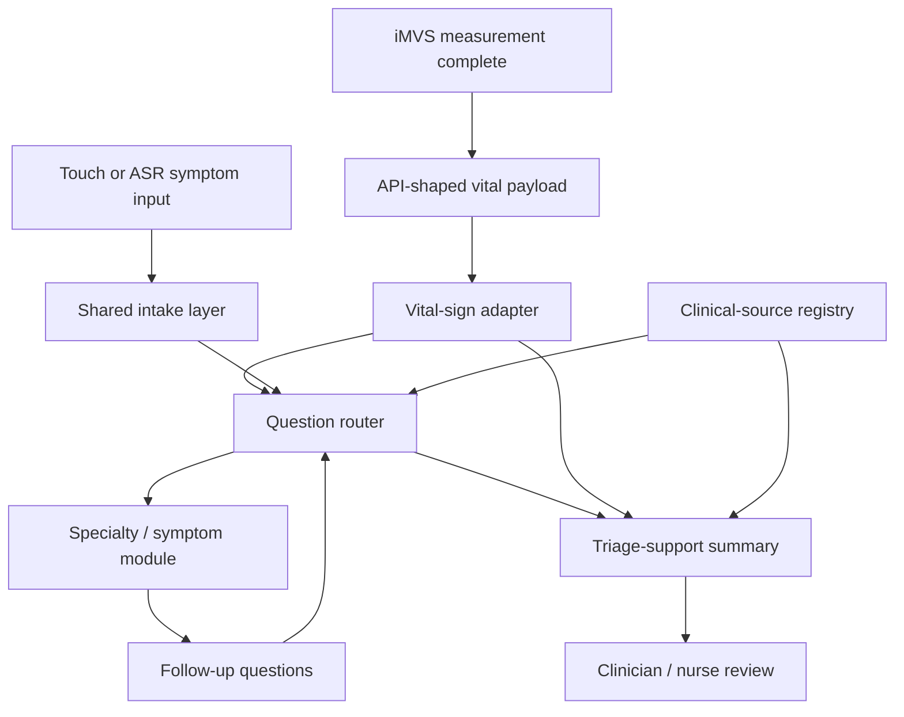

# Workstream 05 - Thursday Vital-Sign Research Gate

## Purpose

Company follow-up asks for initial research by Friday `2026-05-15` on:

- modular all-specialty AI triage methods;
- how physiological data can be added into analysis;
- examples from FDA or medical-society guidance showing how specific vital data
  affects analysis.

Internal deadline is stricter: complete the first rigorous package by Thursday
`2026-05-14 11:30` Asia/Taipei, because the Rao consultation starts at `13:00`
and Thursday afternoon cannot safely carry this work.

## Final-Pass Status - 2026-05-14

Status: meeting-ready for Friday feasibility discussion.

Final-pass result:

- Primary use file is `handoff/2026-05-15-friday-discussion-brief.md`.
- Meeting-control file is
  `handoff/2026-05-15-imedtac-need-fit-meeting-execution-plan.md`.
- Source-governance baseline is
  `handoff/2026-05-15-vital-aware-triage-feasibility-source-governance.md`.
- Hallucination / claim-boundary audit is
  `handoff/2026-05-15-hallucination-and-source-grounding-audit.md`.
- Registry validation passed with
  `python3 scripts/check_governance_registries.py`.

Use the package as a feasibility and source-governance answer, not as a
prototype, clinical algorithm, FDA memo, or customer-facing claim set. The
remaining open items are intentional Friday decisions: target SKU / guaranteed
fields, synthetic-payload permission, output wording owner, clinical sign-off
owner, and comparator product or `510(k)` reference.

## Core Judgment

The right first deliverable is not a prototype build and not a broad FDA memo.
It should be a compact feasibility and source-governance artifact that answers:

> If iMVS already measures vital signs, where can those values enter an
> AI-assisted triage workflow, and what kinds of question-routing or
> review-level changes can be justified from authoritative sources?

FDA should be used for intended-use, CDS, software-risk, transparency, and
independent-review boundaries. It should not be treated as the source for the
patient symptom questionnaire. Triage/question logic should come from emergency
medicine frameworks, specialty society guidance, public-health guidance, and
clinician/company protocols.

Friday meeting constraint:

- Main discussion should answer the company email's requested questions only:
  modular all-specialty AI triage method, physiological-data integration, and
  FDA / medical-society examples for vital-data impact.
- `510(k)` scan, go/no-go checklist, data lifecycle, human handoff, and
  prototype implementation stay in supplemental notes unless 慧誠 or Prof. Wu
  raises them.
- Finish only the meeting-ready package: `60-90` second opening answer,
  five-section talking track, vital-sign-to-question matrix, 多寶 clinical
  calibration, six company questions, and 多寶 invite/logistics. Do not expand
  into full prototype, broad regulatory package, invented thresholds,
  production clinical rules, or all-specialty completion claims.

## Sources Checked For This Gate

Company / product sources:

- iMVS product spec v2.0.4:
  `source/2026-05-12-imedtac-company-ai-triage-sync/assets/2026-05-12-imvs-product-spec-v2.0.4.docx`
- iMVS API v1.4:
  `source/2026-05-12-imedtac-company-ai-triage-sync/assets/2026-05-12-imvs-api-v1.4-eng.pdf`
- iMVS product page:
  `https://www.imedtac.com/service/%e6%99%ba%e6%85%a7%e7%94%9f%e7%90%86%e9%87%8f%e6%b8%ac%e7%ab%99/`
- Company demo video:
  `https://www.youtube.com/watch?v=mlCrYgIGrIc`
- Comparator product:
  `https://www.careroute.ai/`

Regulatory / clinical-source starting points:

- FDA Releasable `510(k)` Database.
- FDA Content of a `510(k)`.
- FDA Clinical Decision Support Software final guidance, content current as of
  `2026-01-29`.
- FDA Digital Health Policy Navigator Step 6 on clinical decision support.
- Emergency Severity Index Handbook 5th Edition from ENA.
- American Heart Association high-blood-pressure emergency guidance, reviewed
  `2025-08-14`.

Interpretation:

- CareRoute is useful as a comparator for user journey, care-level routing, cost
  story, and consumer-facing positioning. It is not a clinical authority source.
- The YouTube demo is useful as a one-minute UX/product-flow cue. It is not a
  clinical authority source.
- iMVS documents are enough to shape an API-like synthetic payload and workflow
  insertion point, but not enough to justify triage thresholds.

## Required Thursday Package

Produce one concise artifact with these sections:

1. Executive answer:
   - vital signs should modify question priority, escalation framing, and
     clinician-review summary;
   - they should not produce autonomous diagnosis, treatment, or emergency
     orders in v0.
2. Architecture insertion:
   - iMVS login / measurement -> API-shaped vital payload -> AI triage adapter
     -> dynamic questions -> triage-support summary.
3. Modular method map:
   - shared intake layer;
   - vital-sign adapter;
   - symptom / specialty modules;
   - question router;
   - source provenance table;
   - clinician-reviewed summary output.
4. Vital-to-question impact matrix:
   - BP, SpO2, temperature, heart rate, BMI/height/weight, glucose.
5. Source-governance table:
   - which examples are source-backed;
   - which are source-family hypotheses;
   - which require clinician/company sign-off.
6. Open questions for 慧誠:
   - target SKU / OS;
   - link, iframe, same-app, API, or mocked handoff;
   - guaranteed vital fields;
   - accepted output wording;
   - clinical sign-off owner.
7. Supplemental notes, only if asked:
   - `510(k)` / product-scope scan method;
   - go/no-go checklist for clickable demo;
   - data lifecycle and human handoff guardrails;
   - prototype implementation boundary.

## Vital-To-Question Impact Matrix V0

This table is a research planning artifact. It is not production triage logic.

| Vital data | What it can change in v0 | Example source family | Thursday status |
| --- | --- | --- | --- |
| Blood pressure | If very high and paired with symptoms such as chest pain, dyspnea, neurologic symptoms, or vision/speech changes, prioritize red-flag questions and staff-review wording. | AHA hypertension emergency guidance; ESI danger-zone / high-risk framing. | Source-backed example for BP-plus-symptoms; exact product threshold needs clinician sign-off. |
| SpO2 | Prioritize respiratory/cardiopulmonary questions, shorten low-risk branches, and mark summary for clinician review when oxygenation looks concerning. | ESI / emergency medicine triage; respiratory guidance to verify. | Source-family hypothesis; needs exact guideline/source mapping. |
| Temperature | Route toward infection/systemic-risk questions, duration, exposure/source symptoms, dehydration, respiratory/urinary symptoms, and special-risk groups. | ESI / CDC / IDSA or local protocol sources. | Source-family hypothesis; needs source mapping and patient-population boundary. |
| Heart rate | Add physiologic instability context when combined with symptoms, BP, SpO2, temperature, distress, age, or medication context. | ESI / emergency medicine triage. | Source-family hypothesis; do not use as standalone decision rule. |
| BMI / height / weight | Add risk/context and summary information; do not use as a standalone urgent triage trigger in v0. | Chronic disease / metabolic guidance; clinician workflow. | Demo-context only unless a specialty module needs it. |
| Glucose | If available, route toward diabetes-related symptoms, confusion/weakness, medication/meal timing, and clinician-review wording. | ADA / emergency or urgent-care protocol sources to verify. | Source-family hypothesis; optional field in iMVS docs, so do not assume availability. |

## Modular Architecture Answer

The modular point is that all specialties should share the same infrastructure:
input normalization, vital-sign adapter, source provenance, question routing,
and summary format. Specialty modules should add scoped question sets and source
rules, not separate products.

## Output Wording Boundary

Recommended v0 phrases:

- "triage-support summary"
- "review level suggestion for clinician review"
- "vital-sign-aware follow-up questions"
- "source-backed red-flag prompts"
- "demo only; not diagnosis or autonomous medical advice"

Avoid:

- "diagnosis"
- "AI decides emergency level"
- "FDA-approved"
- "FDA-cleared"
- "`510(k)`-cleared demo"
- "predicate-equivalent demo"
- "clinical-grade triage"
- "automatic ED referral"
- "production HIS / EMR integration"

## Thursday Execution Schedule

Internal plan:

| Time | Output | Boundary |
| --- | --- | --- |
| Tue `2026-05-12` night | Source inventory and workplan skeleton. | No build. |
| Wed `2026-05-13` morning | Verify source roles: FDA vs clinical/question sources. | Do not overfit clinical rules. |
| Wed `2026-05-13` midday | Fill architecture and modular method map. | Use iMVS API-shaped synthetic payload only. |
| Wed `2026-05-13` afternoon | Fill vital-to-question matrix and source-governance table. | Label draft/source-backed/sign-off-needed. |
| Wed `2026-05-13` night | Draft the shareable Friday discussion artifact. | Keep patent-sensitive ASR / LLM detail out. |
| Thu `2026-05-14 09:00-11:30` | Final pass and handoff-ready summary. | Hard stop at `11:30`; preserve Rao `13:00`. |

## Capacity Cut Rule

This work is now a W20 must-output, but it is still a bounded research artifact.
It displaces optional conference attendance, optional Threads expansion, and any
nonessential polish. It does not displace:

- Rao consultation preparation and `13:00` meeting;
- Pikachu class/demo capture;
- Prof. Wu / 聯醫 ASR + LLM Friday freeze;
- already-prepared KBS portal submission window.

## Open Questions For 慧誠

- Which exact iMVS SKU is the June demo target: AIO, DKP, MOB, or another
  configuration?
- Is the June runtime Windows kiosk, Android tablet, web-only, or mixed?
- Should AI run after measurement but before hospital upload, after upload, or
  only as an embedded/link-out demo?
- Which fields are guaranteed in the target SKU: `NBP`, `SPO2`, `HR`, `Temp`,
  `Glucose`, `Height`, `Weight`?
- Can the first demo use synthetic values shaped like the API document?
- What output wording is safe for customer demonstration?
- Who signs off on clinical-source choices and vital-threshold interpretation?
- Does Friday require slides, memo, architecture diagram, or clickable demo?
- Supplemental only if FDA product scope comes up: what is the nearest US
  partner/customer product, competitor, or FDA `510(k)` reference for
  product-scope comparison?

## Bottom Line

The strongest Friday answer is:

> We can make 慧誠's kiosk more than a symptom checker by using measured vital
> signs to control dynamic questioning and clinician-review summaries. The first
> rigorous step is a source-governed architecture and vital-impact matrix, not a
> production clinical model. `510(k)` product-scope work stays supplemental
> unless they ask about FDA/comparator positioning.
