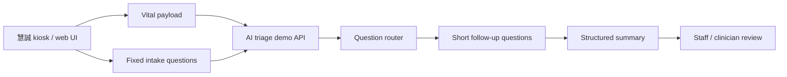

# June Demo Case And Integration Plan

## First Principle

- Scarce resource: execution bandwidth before the June customer demo.
- Canonical source: `source/2026-05-15-imedtac-second-sync-and-duobao-followup/`.
- Near-term output: a believable, synthetic, urgent-care intake demo.
- Boundary: clinician-review summary only; no diagnosis, treatment, test order,
  final triage level, or live patient deployment claim.

## Current Decision

The v0 demo should be:

```text
vital-sign kiosk context
  -> short guided intake
  -> vital-aware follow-up
  -> structured summary for staff
```

It should not be:

```text
all-specialty autonomous AI triage
  -> diagnosis
  -> treatment / order suggestion
  -> production EMR writeback
```

## Company Minutes Update

Johnny Fang's company-side minutes after the meeting are preserved at:

- `source/2026-05-15-imedtac-second-sync-and-duobao-followup/company-provided-meeting-minutes.md`

They confirm the June urgent-care demo frame, `3-5` cases, touch plus partial
voice input, an earlier `8-10` question-budget reference, and doctor-facing
chief-complaint summary. Current June design decision follows the later 慧誠 /
iMVS product-spec requirement: fewer than `8` visible patient-facing questions
per completed case flow.

They also create three items to confirm before implementation:

- `AI 資料訓練 study` should mean synthetic demo / model-feasibility study unless
  real data governance is separately approved.
- `比較完整的解讀結果` should be constrained to a clinician-review summary, not
  diagnosis, treatment, or final triage level.
- Case examples should be reconciled: 慧誠 listed trauma / chronic disease /
  allergy, while our clinical follow-up favored fever/respiratory,
  abdominal-pain/fever, tachycardia/chest tightness, and low SpO2.

## 2026-05-19 Product Spec / API Update

Johnny Fang sent a follow-up email and linked product specification:

- `source/2026-05-19-johnny-ai-triage-product-spec/`
- `docs/2026-05-19-ai-triage-product-spec-api-analysis.md`

The standalone PDF later found in Downloads,
`iMVS AI Triage 智慧檢傷分流系統_20260515.pdf`, is byte-identical to the archived
product-spec PDF. Treat this as confirmation of the same `V 1.0` spec, not a
separate new source version.

The update confirms that the company is now designing the technical
architecture, while the UI is still being planned. The June target remains a
customer demo. The email explicitly says that some future-state items, including
AI summary return into the HIS workflow, are not planned for this demo. Voice
input is also conditional on NYCU/Jason-side progress and should not be treated
as required for the first live demo.

The new hard requirement is an API contract for the demo loop:

```text
iMVS vital-sign payload
  -> NYCU typed question object + session key
  -> iMVS answer payload + session key
  -> NYCU next question or demo staff-summary result
```

Product-spec implications for the current runtime:

- AC06-AC10 align well with the current choice-first v0: dynamic OPQRST-style
  questions, progress display, single-choice, and multi-choice interaction.
  Current June calibration follows the 慧誠 / iMVS product-spec requirement:
  fewer than `8` visible patient-facing questions per completed case flow, with
  the first respiratory flow preferably staying around `5-7`.
- AC11 adds a pain/severity scale widget requirement that should be audited or
  added before the June demo if a pain case is shown.
- AC12 voice input should stay out of v0 unless separately approved, because it
  introduces audio, transcript-confirmation, noise-failover, privacy, and
  runtime reliability questions.
- AC14 supports a demo doctor-result page; implement as a staff-review summary,
  not as diagnosis.
- US15/US16 are future-state / reviewer-facing targets for SOAP, evidence
  mapping, and HIS display. For June, show the shape of the output only; do not
  implement real HIS/FHIR writeback.

Cut rule:

- Build the API/session contract and mock iMVS adapter before expanding cases.
- Use `summary`, `review_basis`, or `staff_review_summary` in payloads.
  Do not name the final field `diagnosis`.
- Ask 慧誠 for one synthetic/de-identified vital payload example, field names,
  UI insertion point, and who will join the technical sync.

## 2026-05-19 LINE Thursday Engineering Sync Update

Johnny followed up in the `慧誠智醫*智德萬` LINE group after sending the product
spec:

- engineers need an API design document;
- he asked when it can be provided;
- he asked whether Thursday is available for a quick progress sync;
- he will bring the engineering design team to discuss details;
- Jason added 許桓瑜（多寶） to the group.

Source:

- `source/2026-05-19-johnny-line-thursday-engineering-sync/source.md`
- `source/2026-05-19-duobao-line-thursday-engineering-sync/source.md`
- `source/2026-05-19-johnny-direct-line-thursday-engineering-sync/source.md`

Preparation:

- `handoff/2026-05-21-imedtac-engineering-sync-prep.md`
- `handoff/2026-05-21-imvs-nycu-api-design-v0.1.md`
- `handoff/2026-05-21-decision-defaults-and-owner-matrix.md`
- `docs/2026-05-19-two-phase-question-flow-design.md`
- `docs/2026-05-19-api-session-design-plain-explanation.md`
- `handoff/api-examples/`

Meeting implication:

- The LINE times are PM / afternoon. The Thursday sync was finalized for
  `2026-05-21 10:00` Asia/Taipei on Microsoft Teams. The meeting access details
  are preserved local-only in the LINE source.
- Thursday should freeze the API/session contract, not reopen broad product
  scope.
- 多寶's role should be clinical stop rule and safe wording, not product-owner
  responsibility for the whole triage system.
- Jason should prepare a one-page API design doc, one synthetic vital payload,
  one staff-review summary sample, and a decision checklist.
- Johnny clarified that the spec's triage standards and presentation logic were
  first discussed with AI and are adjustable. Treat those standards as draft
  input for clinical review, not locked protocol.

Current API design v0.1 now contains:

- two endpoints: start session and submit answer;
- field table for `session_key`, `progress`, typed questions, answer payload,
  and `staff_review_summary`;
- respiratory synthetic case request/response JSON examples;
- failure behavior and fallback wording;
- privacy and no-real-identifier rule;
- recommended delivery timeline: `2026-05-20` skeleton, `2026-05-21` sync,
  `2026-05-22` v0.2, `2026-05-25` first mock adapter.

Current owner-matrix prep now contains:

- recommended default decisions for `session_key`, output naming, voice, HIS
  writeback, first case, evidence refs, versioning, fallback, and done
  definition;
- must-close questions for Johnny, engineering, and 多寶;
- owner/date matrix: 慧誠 provides payload/UI/engineering owner, Jason provides
  API v0.2, 多寶 provides clinical wording review.

Plain-language implication:

- The session API turns the demo from a standalone URL into a connectable
  workflow contract.
- The first programming obligation is not a full AI product. It is a small mock
  API server, session state, deterministic question router, summary generator,
  validation, and fallback behavior for one synthetic respiratory case.

## 2026-05-19 多寶 Two-Phase Question Flow Update

Source and design:

- `source/2026-05-19-duobao-two-phase-vital-questioning/source.md`
- `docs/2026-05-19-two-phase-question-flow-design.md`

多寶's workflow insight should be treated as the preferred June demo flow:

```text
Phase 1: ask non-vital-dependent questions while iMVS is measuring
-> vitals-ready payload
-> Phase 2: use measured vital values to choose targeted follow-up
-> staff_review_summary
```

This is worth implementing because it uses the patient's measurement waiting
time and makes the system feel faster without creating a stronger clinical
claim. It also creates a cleaner engineering boundary: Phase 1 does not depend
on vital values; Phase 2 cannot begin until `vitals_ready=true`.

Implementation decision:

- Add `workflow_mode`, `measurement_state`, `vitals_ready`, `question_phase`,
  and `phase_reason` to API examples.
- Prefer a new vitals-ready endpoint:
  `POST /api/triage-demo/sessions/{session_key}/vitals`.
- Keep the original post-measurement-only flow as fallback if 慧誠's kiosk UI
  cannot safely show questions during measurement or if questions would affect
  measurement posture / signal quality.
- Runtime question metadata now separates `pre_vital_intake` from
  `post_vital_followup`.

## 2026-05-19 Expert Review Update

Source and derived plan:

- `source/2026-05-19-expert-review-scope-api-boundary/source.md`
- `docs/2026-05-19-expert-review-action-plan.md`
- `handoff/2026-05-22-api-v0.2-requirements-from-expert-review.md`

The expert reviewed the project packet and confirmed the current scope cut is
appropriate, with one sentence to protect:

```text
This is a synthetic-data vital-aware intake + staff-review summary demo,
not a clinical triage product.
```

This locks the June critical path as:

```text
iMVS synthetic vital-sign payload
-> NYCU structured / choice-based dynamic intake
-> staff_review_summary
-> staff / clinician review
```

Expert-required changes before API v0.2:

- add `session_expires_at`, `session_state`, `last_question_id`;
- add `request_id` and `idempotency_key`;
- add `measurement_timestamp`, `device_id`, `measurement_status`,
  `quality_flag`, and `missing_reason`;
- add `summary_visibility: "staff_only"`;
- add `handoff_required`, `handoff_reason_codes`, and stable `not_claimed`;
- replace risky `plan_support` wording with `review_action` and/or
  `staff_handoff_note`;
- replace `assessment_support` with `review_basis` unless a named clinical
  owner explicitly approves the older label;
- add question/flow/case/fixture/wording traceability fields;
- make error behavior explicit: `status=error`, stable `error.code`, and no
  fake summary.

Expert-confirmed respiratory case rule:

```text
Q1 chief complaint
Q2 dyspnea duration / severity
Q3 chest pain / pressure
Q4 chronic lung disease / baseline oxygen / medication context
-> staff_review_summary
```

Do not force the respiratory case to complete all eight questions. It should be
an early staff-review handoff.

Thursday closeout now must include:

- 慧誠 engineering: payload field dictionary, required/optional rules,
  missing/failure representation, UI insertion point, demo environment;
- Johnny / product: customer-demo date, audience, success standard, single
  engineering POC;
- 多寶: respiratory case approval, stop rule, forbidden wording, safe summary
  wording;
- Jason / NYCU: API v0.2 with sample JSON and error behavior by `2026-05-22`,
  one-case mock/static rehearsal by `2026-05-25`;
- privacy/security owner: no real identifiers, no raw audio, no production
  endpoint by `2026-05-22`.

## 多寶 Case Draft Update

多寶 sent the first case draft after the meeting:

- `source/2026-05-15-imedtac-second-sync-and-duobao-followup/duobao-demo-case-draft.md`

The draft contains four diagnosis-labeled clinical scenarios:

- acute cholecystitis: fever + RUQ abdominal pain, draft level `3`;
- AfRVR: palpitation + chest tightness with HR `150`, draft level `2`;
- pneumonia: dyspnea + fever + SpO2 `92%`, draft level `2`;
- URI: fever + cough + runny nose, draft level `5`.

Use these labels for internal design only. The demo should show how measured
vitals and short answers become a clinician-review summary, not system diagnosis
or final triage-level output.

## Implementation Shape



## Work Packages

| Package | Owner | First concrete output |
| --- | --- | --- |
| Case pack v0 | Jason + 多寶 | `3-5` synthetic cases with vitals, question path, and output boundary. |
| Kiosk question flow | Jason | One fixed-question phase and one vital-aware follow-up phase. |
| Clinical stop rule | 多寶 | What the kiosk may ask vs what must be left to clinicians. |
| API bridge sketch | Jason + 慧誠 tech | JSON fields and call sequence for vital payload and summary return. |
| UI integration path | 慧誠 + Jason | Decide same-app, iframe/link, external backend, or demo-only screen handoff. |
| Demo compute path | Jason + 慧誠 | Confirm networked external compute is acceptable for June. |
| Literature matrix | Jason | Question-first evidence table for AI-triage, ASR, vital-sign routing, human review, and intended-use boundaries. |

## Literature Matrix Rule

Use `docs/literature-matrix-workflow.md` before adding more literature,
guidelines, or comparator products to the demo rationale.

The matrix must answer shared questions:

- whether AI triage reduces clinician workload;
- whether ASR fits a kiosk / urgent-care intake setting;
- whether BP, SpO2, temperature, HR, BMI, or glucose change routing or only
  decorate the input;
- where hallucination / unsupported-generation controls live;
- where human review is mandatory;
- what evidence level supports each claim;
- what intended use or product claim is actually safe.

Do not treat a paper summary as progress unless it changes the case pack,
source registry, output boundary, or next evidence gap.

## First 48-Hour Path

1. Jason creates the source bundle, action plan, and case-pack starter.
2. 多寶 writes simple clinical case drafts and question stop rules.
3. Jason turns the first case into:
   - a synthetic vital payload;
   - a guided question sequence;
   - a clinician-facing summary template.
4. Jason sends 慧誠 a technical question list:
   - target device and UI entry point;
   - API payload shape;
   - demo room network;
   - acceptable external-compute path;
   - output display format.
5. Jason asks 慧誠 to clarify whether `AI 資料訓練 study` means synthetic demo /
   feasibility work and whether the first cases should include trauma / chronic
   disease / allergy.
6. Jason and 多寶 review whether the first case feels medically plausible but
   still safely non-diagnostic.
7. Jason starts the literature matrix only after the first case and technical
   ask are clear, so reading stays tied to demo decisions rather than becoming a
   separate broad review.

## 2026-05-20 多寶 Structured Case / Question Design Update

Source and review:

- `source/2026-05-20-duobao-demo-cases-question-design/source.md`
- `docs/2026-05-20-duobao-demo-design-consistency-review.md`
- `handoff/2026-05-20-duobao-normalized-june-case-pack-v1.md`

多寶's new files should become the clinical-design inventory for future case
expansion. They add a broad symptom map, four structured demo cases, vital
follow-up triggers, and a SOAP-shaped output template.

Use the content through the existing demo boundary:

- keep diagnosis-shaped labels such as acute cholecystitis, AfRVR, and
  pneumonia as internal scenario labels only;
- do not collect real names in the runtime demo;
- convert `Assessment` / `Plan` into `review_basis`, `review_action`, and
  `staff_handoff_note`;
- do not output potential triage level, suggested acuity, disposition,
  recommended department, or immediate actions without explicit owner approval;
- treat all vital thresholds as clinical-signoff-needed until a company /
  clinical owner freezes source, units, and `>` / `>=` semantics;
- use the updated June question budget: fewer than `8` visible patient-facing
  questions per completed case flow, not counting hidden routing metadata,
  vital payload fields, or staff-summary sections;
- keep the first implementation path narrow: one respiratory early-handoff
  flow, then add abdominal-pain and tachycardia flows after v0.2 passes
  demo-ready checks.

The normalized case pack is the current bridge from 多寶's clinical draft to
runtime work. It records the design reasoning, the `<8` question budget per
case, the two-phase split, safe staff-summary language, and the exact questions
to send back to 多寶 for clinical review.

Implementation status on `2026-05-20`:

- Case 1 is now runnable in the kiosk as
  `respiratory-low-spo2-early-handoff`.
- The runtime starts this case in measurement-in-progress mode, asks only
  pre-vital questions, and exposes a `Vitals ready` transition before post-vital
  follow-up.
- The case is restricted to `7` visible patient-facing questions, matching the
  current 慧誠 / iMVS question-budget decision.
- The visible runtime question ids now map back through
  `data/api_question_mapping.csv`, `data/question_registry.csv`, and
  `FLOW-RESPIRATORY-EARLY-HANDOFF`.
- `npm run demo:ready` and `python3 scripts/check_governance_registries.py`
  are the current gates before meeting use.

## What To Build Next

Completed first runnable case:

```text
Fever + dyspnea + low SpO2
```

Why:

- It naturally uses temperature and SpO2.
- It fits urgent care better than a pure emergency-room scenario.
- It can be summarized without making a diagnosis.
- It can run through fixed questions while vitals are being measured.

Then add:

```text
Abdominal pain + fever
Chest tightness / palpitations + very fast HR
Low-acuity URI contrast case
```

Next priority should be abdominal pain + fever if 多寶 wants broader symptom
coverage for the meeting, or chest tightness / palpitations if 慧誠 wants the
vital-aware dynamic-ranking story to be more dramatic. The tachycardia case
should use conservative handoff language because it may become an urgent
staff-review case rather than a normal kiosk-only flow.

## Output Template

Each case should produce only:

```text
Chief complaint:
Measured vitals:
Key intake answers:
Concerning signals:
Suggested staff action:
Not shown / not claimed:
```

Allowed language:

- "Needs staff review"
- "Review vital signs and reported symptoms"
- "Patient reports..."
- "Kiosk summary for clinician review"

Avoid:

- "diagnosed as..."
- "treat with..."
- "order..."
- "ESI level is..."
- "safe to go home..."

## Next Company Ask

Ask 慧誠 for the smallest technical packet needed to wire the demo:

- Current kiosk UI flow screenshots or screen order.
- Vital-sign payload field names and example values.
- Where the AI screen can be inserted.
- Whether June demo can call an external server / laptop API.
- Who from 慧誠's software team should join the next technical sync.

## Planning Boundary

Planning repo should only record:

- meeting completed;
- canonical source path;
- current decision;
- next owner/action;
- capacity impact.

All detailed source, case design, and architecture work stays in this repo.
